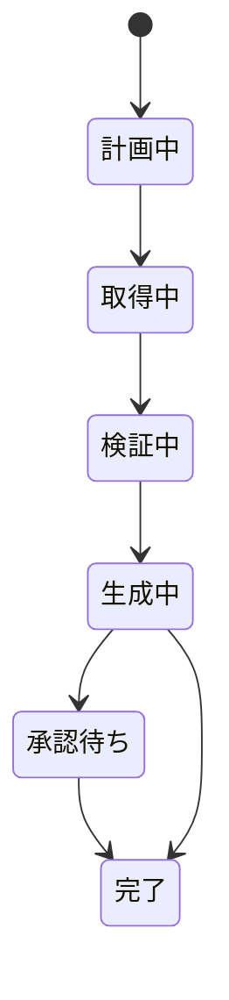

# A-3 Streaming Progress（進捗ストリーミング）

## 概要

最終結果だけでなく、計画・ツール実行状況・検証・承認待ちなどの進捗を逐次提示する。

## 設計

「計画中 → 取得中 → 検証中 → 生成中 → 承認待ち」等の状態を出す。生のchain-of-thoughtでなく、監査可能なステップ名・要約・根拠リンクを表示する。

## 解決する課題

- 長時間処理中の不安・ブラックボックス性
- 重複リクエスト
- ユーザー離脱

## ユースケース

- 調査AI
- 生成AIアプリ
- コードエージェント
- B2B SaaSのエージェント機能

## 向き

UXが重要な対話型・作業型エージェントに適する。

## 不向き

内部バッチや、途中状態を見せる必要のない処理には不要である。

## 要素技術

- **通信**：SSE、WebSocket
- **データ形式**：event stream
- **要約**：trace summarizer
- **状態管理**：progress state machine

## 関連パターン

- [A-1 Request-to-Job Gateway](a1-request-to-job-gateway.md) — 非同期ジョブの進捗通知
- [A-2 Durable Agent Session](a2-durable-session.md) — セッション状態からの進捗抽出
- [K-1 Agent Workbench](../k-human/k1-agent-workbench.md) — 進捗を表示するUI
- [I-1 Agent Trace & Observability](../i-observability/i1-trace-observability.md) — トレースの要約表示
