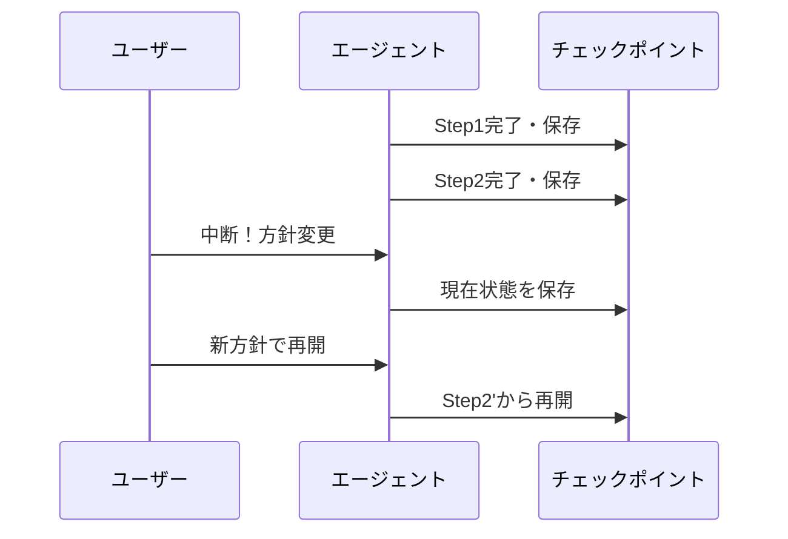

# A-4 Interruptible Agent（中断・方針変更）

## 概要

実行中にユーザー/システムが処理を止め、方針を修正して再開できる。

## 設計

各ステップ後にチェックポイントを作り、以下の操作を受け付ける。

- 止める
- 方針変更
- 「このツールは使うな」
- ここから再開

A-2（Durable Agent Session）の上に構築する。

## 解決する課題

- 開始時の指示が不完全
- 途中で意図が変わった
- 暴走しかけた

## ユースケース

- 資料作成
- コード生成
- 分析・設計レビュー
- 営業提案

## 向き

長時間・探索的なタスクに適する。

## 不向き

原子的に完了すべき決済・予約確定・契約締結には不向きである。

## 要素技術

- **永続化**：checkpoint
- **制御**：pause/resume
- **通信**：WebSocket
- **記録**：event log、human feedback API
- **シグナル**：Temporal signal

## 関連パターン

- [A-2 Durable Agent Session](a2-durable-session.md) — チェックポイントの基盤
- [K-2 Editable Plan](../k-human/k2-editable-plan.md) — 方針変更の具体的UI
- [A-3 Streaming Progress](a3-streaming-progress.md) — 中断判断のための進捗表示
- [F-5 Human Approval Checkpoint](../f-reliability/f5-human-approval.md) — 承認ゲートでの一時停止
