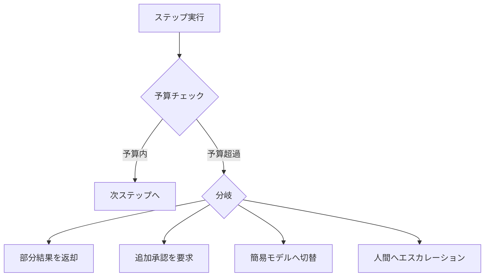

# A-5 Time-Budgeted Agent Loop（予算制御ループ）

## 概要

思考・探索・ツール実行に時間・回数・トークン・金額の予算を課し、暴走と予算超過を止める。

## 設計

セッションに以下の予算パラメータを持たせる。

- `max_steps`：最大ステップ数
- `max_tool_calls`：最大ツール呼び出し回数
- `max_cost_usd`：最大コスト（金額）
- `deadline_at`：期限（絶対時刻）
- `max_retry`：最大リトライ回数

各ステップ実行時に消費量を追跡し、いずれかの予算を超過した時点で以下のいずれかに分岐する。

予算超過は「失敗」ではなく「分岐点」として扱う。部分結果を返却する、追加承認を要求する、簡易モデルへ切り替える、人間へエスカレーションする、のいずれかへ遷移する。

「進捗していないループ」の検知も重要である。同一ツール・同一引数の反復、スコア無改善のN回連続などを検出し、デッドマンスイッチを引く。

## 解決する課題

以下のエージェント特性に応える。

- 無限ループ・過剰探索
- 高額API利用（月末の請求事故）
- 外部ツール連打
- ループ・暴走の可能性

予算制御はステップ4（[「程度」の選定基準](../../selection/degree-criteria.md)）のすべてのパラメータ（タイムアウト・リトライ・カスケード・アンサンブル）の上位制約として機能する。

## ユースケース

- Deep Research（長時間・多段階の調査）
- 複数API連携タスク
- コード修正・テストの反復
- マルチテナントSaaSのコスト管理

## 向き

高コストLLMを使う場面、自律性の高いエージェントに適する。特にタスク種別ごとに上限を分けて持つ（FAQ＝数ステップ、Deep Research＝数十ステップ）運用が効果的である。

## 不向き

途中打ち切りが許されない単発ミッションクリティカル処理には不向きである。そのような処理では予算制御より事前見積もりを重視する。

## 要素技術

- **トークン会計**：token accounting
- **コスト計測**：cost meter
- **予算管理**：budget manager
- **期限伝播**：deadline propagation
- **暴走防止**：circuit breaker、トークンバケット

## 関連パターン

- [A-1 Request-to-Job Gateway](a1-request-to-job-gateway.md) — 非同期ジョブとして予算を管理する基盤
- [H-4 Graceful Degradation & Fallback](../h-cost-performance/h4-graceful-degradation.md) — 予算超過時の縮退先
- [H-1 Cost-Aware Model Router](../h-cost-performance/h1-cost-aware-router.md) — コスト予算に基づくモデル選択
- [K-3 Agent-to-Human Escalation](../k-human/k3-human-escalation.md) — 予算超過時のエスカレーション先
