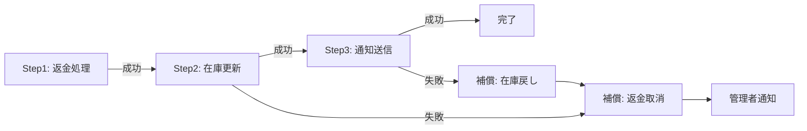

# A-6 Agent Saga（補償トランザクション）

## 概要

副作用付きツールの連鎖を分散トランザクションでなくSagaとして管理し、途中失敗時に補償処理で巻き戻す。

## 設計

各ツール実行を `step` とし、成功時の次処理と失敗時の補償（compensating action）を定義する。長セッション中にRDBトランザクションを開き続けない。

例えば「返金 → 在庫更新 → 通知」の途中で在庫更新が失敗した場合、返金取消の補償処理を実行し、管理者へ通知する。各ステップには冪等キー（idempotency key）を付与し、リトライ時の二重実行を防ぐ。

## 解決する課題

以下のエージェント特性に応える。

- 非決定論的主体が外部世界に副作用を起こす「中途半端な状態」
- 長時間処理と整合性の両立

エージェントがツールを連鎖的に呼び出す際、途中で失敗すると不整合な状態が残る。Sagaパターンはこの問題を補償処理で解決する。

## ユースケース

- 注文変更・返金処理
- 予約の確保と解放
- 請求・契約処理
- 在庫管理
- 顧客通知の連鎖

## 向き

副作用が金銭・物理に直結する業務に適する。複数の外部システムへの書き込みを伴い、部分的な完了が許されない場面で効果が高い。

## 不向き

強いACIDが必須で補償・承認では許容できない処理や、不可逆操作（物理的破壊など）には向かない。補償処理自体が定義できない操作には適用できない。

## 要素技術

- **Sagaオーケストレーション**：Saga orchestration
- **冪等性管理**：idempotency key
- **イベント配信**：outbox pattern
- **補償ハンドラ**：compensation handler
- **ワークフローエンジン**：Temporal、Step Functions

## 関連パターン

- [A-2 Durable Agent Session](a2-durable-session.md) — チェックポイントによる状態永続化が前提
- [B-1 Deterministic Backbone](../b-composition/b1-deterministic-backbone.md) — Sagaはバックボーン上で管理する
- [D-1 Tool Gateway](../d-tools-mcp/d1-tool-gateway.md) — ツール呼び出しの一元管理と冪等性制御
- [F-5 Human Approval Checkpoint](../f-reliability/f5-human-approval.md) — 高リスクステップでの人間承認
