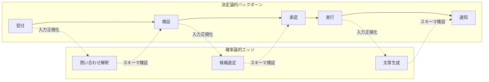

# B-1 Deterministic Backbone, Probabilistic Edge（決定論的バックボーン×確率論的エッジ）

## 概要

ワークフローの骨格と中核業務ロジックは決定論的コード/ワークフローエンジンが管理し、曖昧処理・生成・探索だけをエージェントノードに委ねる。

## 設計

「受付 → 検証 → 承認 → 実行 → 通知」のフローや、料金計算・権限判定・在庫引当・状態遷移は通常コードで実装する。エージェントは「問い合わせ解釈」「文章生成」「候補選定」「例外処理」に限定する。

エージェント出力は決定論的な殻（入力正規化＋出力スキーマ検証）で包み、システムはLLM生出力に直接触れない。

この設計により、LLMの非決定論性が業務ロジック本体に波及しない。エージェントノードが故障・誤答しても、バックボーンの検証・承認ステップで阻止できる。

## 解決する課題

全委任で失われる再現性・監査性・法的説明責任・安全性に応える。具体的には、フォーマット不安定さとハルシネーションの下流流出を防ぐ。LLMの確率的な出力をシステム全体の信頼性低下に直結させない構造を提供する。

## ユースケース

- 金融・医療・法務・人事・EC・在庫・契約などの基幹業務
- B2B SaaS
- 制御性と監査性が求められるあらゆる本番組み込み

## 向き

制御性・監査性が重要なほぼすべての本番組み込みに適する。業務ロジックが明確に定義可能で、エージェントに委ねるべき曖昧処理が特定できる場合に効果が高い。

## 不向き

フロー自体が毎回変わる探索的研究や自由創作には向かない。このような用途では殻の制約を緩め、エージェントの自律性を高める必要がある。

## 要素技術

- **ワークフローエンジン**：Temporal、Step Functions、BPMN
- **ドメインサービス**：domain service、rule/policy engine
- **スキーマ検証**：JSON Schema、Pydantic、Zod、Instructor
- **構造化出力**：OpenAI Structured Outputs

## 関連パターン

- [C-2 Structured Output Contract](../c-io-contract/c2-structured-output-contract.md) — 出力が契約化されて初めて殻で包める
- [C-1 Natural Language Boundary Adapter](../c-io-contract/c1-nl-boundary-adapter.md) — 境界での入力構造化を担う
- [A-6 Agent Saga](../a-execution/a6-agent-saga.md) — バックボーン上の補償トランザクション
- [B-2 Planner–Executor–Reviewer](b2-planner-executor-reviewer.md) — エージェントノード内部の分担構造
