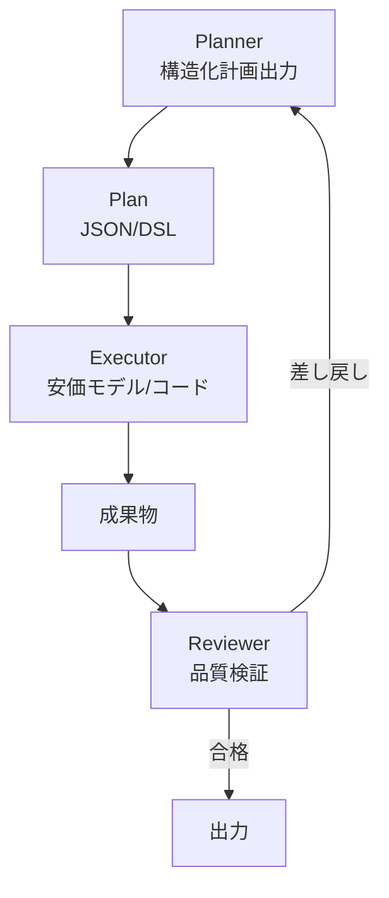

# B-2 Planner–Executor–Reviewer（計画・実行・検証の分離）

## 概要

計画する頭脳、実行する手足、検証する目を別ロールに分け、必要に応じ修正ループを回す。

## 設計

Plannerが構造化計画（DAG/ステップ列）を出力する。Executorが安価モデル/決定論コードで実行する。Reviewerが成果物・根拠・安全性を検証する。想定外はPlannerへ差し戻し（re-plan）。

計画を機械可読アーティファクト（JSON/DSL）として固定するのが鍵である。

## 解決する課題

- 単一エージェントは自分の誤りに気づきにくい
- 高コストモデル呼び出し回数削減
- テスト容易化
- 説明性向上

## ユースケース

- コード生成
- 文書生成
- 分析
- 意思決定支援
- 設計レビュー

## 向き

複数ステップ・複数ツールを要する複雑タスクに適する。

## 不向き

低レイテンシ必須・コスト制約が強い処理や、計画が無意味なほど短いタスクには不向きである。

## 要素技術

- **オーケストレーション**：multi-agent orchestration
- **フレームワーク**：Plan-and-Execute、ReWOO
- **プロンプト**：role prompt
- **検証**：structured critique、LLM-as-a-judge
- **計画表現**：JSON DSL

## 関連パターン

- [K-2 Editable Plan](../k-human/k2-editable-plan.md) — Plannerの計画を人間が編集する
- [F-3 Verifier Agent](../f-reliability/f3-verifier-agent.md) — Reviewerロールの詳細
- [B-1 Deterministic Backbone](b1-deterministic-backbone.md) — バックボーン上で構成する
- [B-3 Supervisor & Specialist](b3-supervisor-specialist.md) — Executorとして専門エージェントを使う
