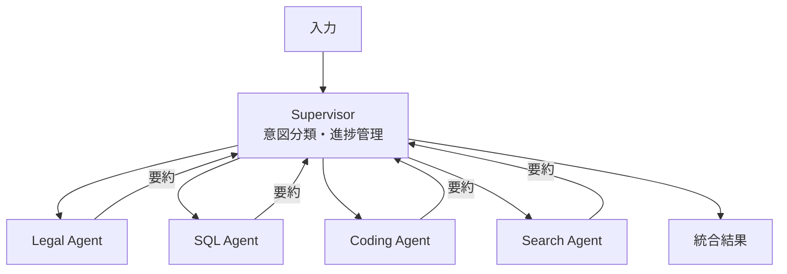

# B-3 Supervisor & Specialist（階層委譲・意図ルーティング）

## 概要

Supervisorが全体を統括し意図を分類、専門サブエージェントへ委譲（handoff）して結果を統合する。入力種別による経路振り分け（Intent Router）もここに内包する。

## 設計

Supervisorがintent・制約・進捗を管理し、Legal/SQL/Coding/Search/Support等の専門エージェントへ分配する。第1段は軽量分類器（embedding/小型モデル/ルール）で意図判定し、確信度が低ければ安全な既定経路へフォールバック。サブエージェントは独自コンテキスト窓を持ち、要約のみ親へ返す（窓の節約）。失敗サブタスクは再割当・再計画。

## 解決する課題

- 単一プロンプトに全知識・全ツール・全ポリシーを詰め込む複雑化と誤作動
- コンテキスト窓・能力限界
- 全件最上位モデル処理の過剰コスト

## ユースケース

- 複数業務領域・複数ツール・複数権限の企業向けエージェント
- リサーチ
- 大規模コード改修
- 多機能アシスタント

## 向き

広範囲・多専門にまたがる複雑タスク、入力種別が多様なシステムに適する。

## 不向き

単純なFAQ・分類・要約（オーケストレーション過剰）、極端な低レイテンシ/低コスト要件、誤分類コストが致命的な領域には不向きである。

## 要素技術

- **ルーティング**：agent router、Semantic Router
- **委譲**：handoff、task decomposition
- **プロンプト**：specialized prompts
- **管理**：capability registry
- **フレームワーク**：LangGraph、CrewAI、AutoGen、OpenAI Agents SDK

## 関連パターン

- [J-3 Agent Capability Registry](../j-abstraction/j3-capability-registry.md) — 委譲先の選定根拠
- [B-2 Planner–Executor–Reviewer](b2-planner-executor-reviewer.md) — 計画と検証の分離
- [H-1 Cost-Aware Model Router](../h-cost-performance/h1-cost-aware-router.md) — モデルレベルのルーティング
- [B-5 Blackboard Coordination](b5-blackboard.md) — 分散型の代替アプローチ
