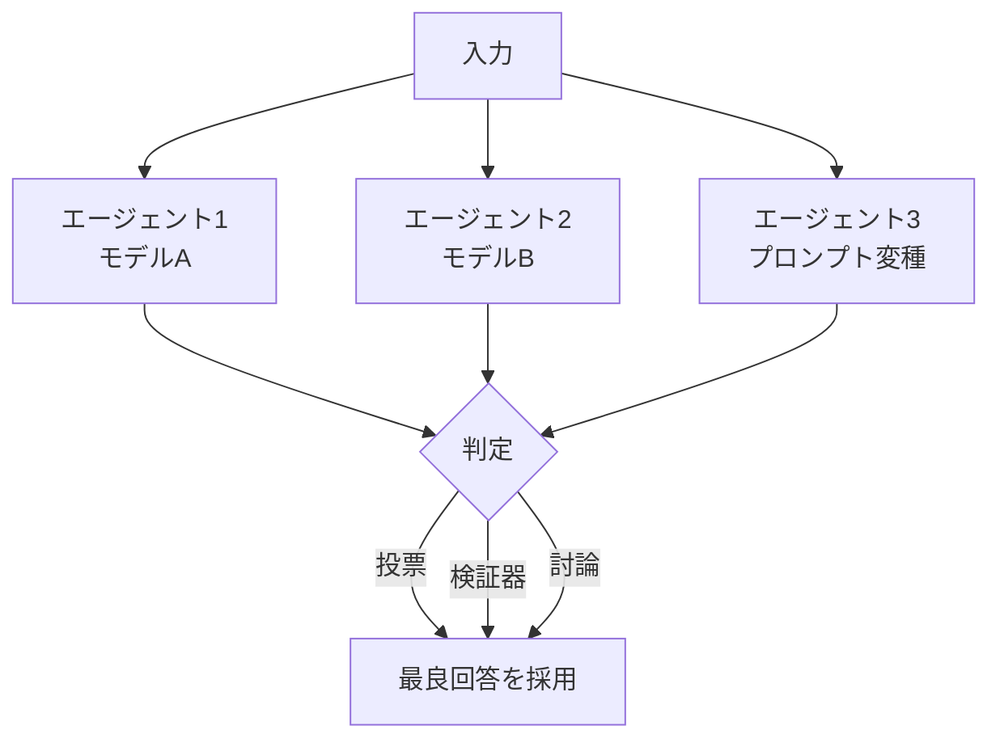

# B-4 Agent Ensemble & Debate（合議・討論）

## 概要

複数モデル/プロンプト/戦略に同じ問題を解かせ、投票・採点・討論で品質と頑健性を高める。

## 設計

N個の独立サンプルを生成し、以下のいずれかの方式で最終結果を決定する。

1. **Self-consistency**：一致度の高い答えを採用する
2. **Best-of-N選抜**：検証器でN個から最良を選ぶ
3. **討論**：提案者・反対者・審判による構造化議論

コストはN倍になるため、難問のみNを増やす適応制御が現実的である。

## 解決する課題

以下のエージェント特性に応える。

- 確率性・モデル依存・単発回答の不安定さ
- 単一視点バイアスと見落とし

## ユースケース

- 高価値な意思決定支援
- 難しい推論タスク
- コードレビュー
- リスク判定
- 安全性レッドチーミング

## 向き

正誤が判定可能で誤りのコストが高い判断に適する。検証器やルーブリックで品質を測定できる場面で効果が大きい。

## 不向き

コスト・レイテンシが厳しい処理には不向きである。正解が一意に定まらない創作にも適さない（判定基準がないため）。

## 要素技術

- **一貫性検査**：self-consistency
- **多様性生成**：multi-sample decoding
- **品質判定**：LLM-as-a-judge、ranker
- **討論**：multi-agent debate
- **アンサンブル**：model ensemble

## 関連パターン

- [F-3 Verifier Agent](../f-reliability/f3-verifier-agent.md) — best-of-N選抜における検証器
- [H-1 Cost-Aware Model Router](../h-cost-performance/h1-cost-aware-router.md) — 難易度に応じたN数の適応制御
- [B-2 Planner–Executor–Reviewer](b2-planner-executor-reviewer.md) — Reviewerによる品質判定
- [A-5 Time-Budgeted Agent Loop](../a-execution/a5-time-budgeted-loop.md) — N倍コストの予算制約
