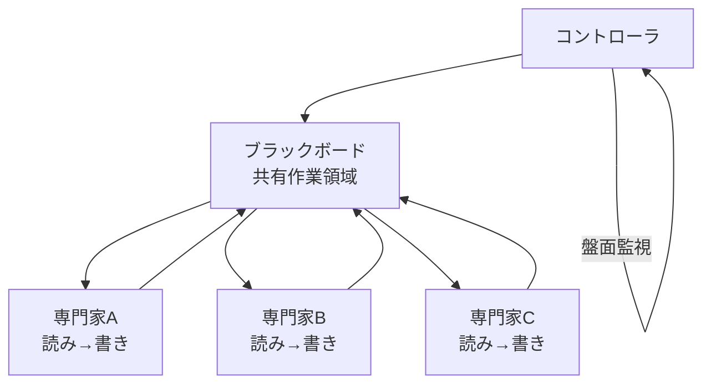

# B-5 Blackboard Coordination（ブラックボード型協調）

## 概要

複数エージェントが中央の共有作業領域（ブラックボード）を介して非同期に協調する。各エージェントは盤面を読み、自分の専門に基づき書き込む。直接通信を排し疎結合化する。

## 設計

中央コントローラが盤面状態から「次に起動する専門家」を決める。エージェント間通信はすべて盤面経由とし、楽観ロック/バージョニングで競合制御する。漸進的に解を組み立てる探索タスクに向く。

## 解決する課題

- エージェント間の通信トポロジ複雑化
- どの専門家がいつ必要かが動的に変わるタスク

## ユースケース

- 複雑な診断・設計問題
- 漸進的に解を構築する探索的タスク

## 向き

解の構築が漸進的で、必要な専門家が動的に決まる場合に適する。

## 不向き

単純な逐次フロー（盤面のオーバーヘッドが無駄）、競合制御が複雑化しすぎる規模には不向きである。

## 要素技術

- **共有状態**：Redis、DB
- **イベント**：盤面更新イベント（イベント駆動）
- **競合制御**：楽観ロック
- **制御**：controller

## 関連パターン

- [B-3 Supervisor & Specialist](b3-supervisor-specialist.md) — 集中型の代替アプローチ
- [B-2 Planner–Executor–Reviewer](b2-planner-executor-reviewer.md) — 計画ベースの代替
- [E-1 Layered Memory](../e-memory/e1-layered-memory.md) — 共有メモリとしてのブラックボード
- [B-1 Deterministic Backbone](b1-deterministic-backbone.md) — バックボーンとの使い分け
