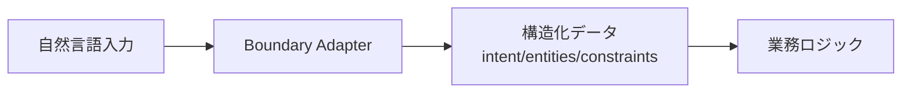

# C-1 Natural Language Boundary Adapter（自然言語境界アダプタ）

## 概要

自然言語をそのまま業務ロジックに渡さず、境界で構造化（intent / slots / constraints）してから渡す。

## 設計

入力を以下の構造に変換する。

- `intent`：意図
- `entities`：エンティティ
- `constraints`：制約
- `risk_level`：リスクレベル
- `missing_information`：不足情報

業務ロジックは構造化データのみ受け取る。

## 解決する課題

自然言語の曖昧さ（命令・希望・条件・雑談・攻撃の混在）を解消する。

## ユースケース

- チャットUI
- 社内AIアシスタント
- 問い合わせ受付
- 業務依頼受付

## 向き

自然言語入口を持つ業務システム全般に適する。

## 不向き

自由対話そのものが目的のアプリには不要である。

## 要素技術

- **分類**：intent classifier
- **抽出**：slot filling
- **スキーマ**：JSON Schema
- **バリデーション**：Pydantic、Zod
- **API**：function calling

## 関連パターン

- [C-2 Structured Output Contract](c2-structured-output-contract.md) — 出力側の構造化
- [B-1 Deterministic Backbone](../b-composition/b1-deterministic-backbone.md) — 構造化データを受け取るバックボーン
- [C-4 Ambiguity Negotiation](c4-ambiguity-negotiation.md) — 不足情報の確認
- [L-2 Anti-Corruption Layer](../l-adoption/l2-anti-corruption-layer.md) — レガシーとの境界変換
