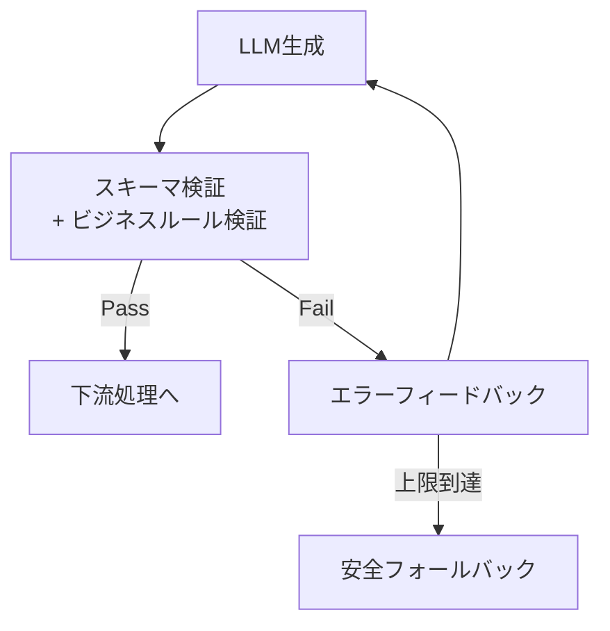

# C-2 Structured Output Contract & Self-Correction（構造化出力契約＋自己修正）

## 概要

LLM出力をスキーマで契約化し、検証失敗時はエラーをフィードバックして自己修正させる。

## 設計

出力は必ず `schema_version` 付きJSONとする。パーサ（Pydantic等）がスキーマおよびビジネスルール（例：「割引率20%以下」「実在商品IDか」）を検証する。Pass なら下流へ送り、Fail ならエラー内容をLLMに返して再生成させる。リトライ上限到達時は安全フォールバック（テンプレート応答・人間エスカレーション）へ遷移する。

自己修正ループにおいて重要なのは、エラーメッセージを具体的にLLMへ返すことである。「フィールドXが不正」ではなく「フィールドXの値'abc'はenum ['a','b','c']に含まれない」のように、修正に必要な情報を渡す。

## 解決する課題

以下のエージェント特性に応える。

- フォーマット崩れ（不完全JSON、閉じ括弧不足）
- 存在しないenumやフィールド
- ビジネスルール逸脱（範囲外の数値、未登録ID）
- 下流パースエラー

LLMの非決定論的出力を、決定論的システムが安全に受け取れる「契約」に変換する。

## ユースケース

- 構造化データ（JSON/SQL）生成
- 基幹データ入力・更新
- ワークフロー遷移の制御
- UI生成（構造化コンポーネントデータ）

## 向き

正確性・型整合が求められる連携処理に適する。下流に決定論的システムがあり、入力データの品質が処理の成否を左右する場面で効果が高い。

## 不向き

創作・雑談など、リトライ遅延がUXを損なう用途には不向きである。また、出力の正しさをスキーマで定義しにくい自由形式の生成にも適さない。

## 要素技術

- **スキーマ定義**：JSON Schema
- **バリデーション**：Pydantic、Instructor、Zod
- **構造化出力API**：OpenAI Structured Outputs
- **制約付きデコーディング**：Outlines
- **スキーマ管理**：schema registry

## 関連パターン

- [B-1 Deterministic Backbone](../b-composition/b1-deterministic-backbone.md) — 出力が契約化されて初めて決定論的バックボーンで包める
- [C-1 Natural Language Boundary Adapter](c1-nl-boundary-adapter.md) — 入力側の構造化を担う
- [C-3 Inverted Structured Output](c3-inverted-structured-output.md) — LLMに最終アクションでなく中間判断を出させる
- [F-3 Verifier Agent](../f-reliability/f3-verifier-agent.md) — スキーマ検証を超えた意味的検証
