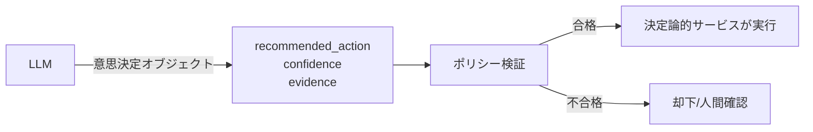

# C-3 Inverted Structured Output（意思決定オブジェクト）

## 概要

LLMに最終アクションを実行させず、「通常コードが使う中間判断」を出させる。

## 設計

LLMは以下を返す。

- `recommended_action`：推奨アクション
- `confidence`：確信度
- `evidence`：根拠
- `missing_inputs`：不足情報
- `requires_human_approval`：人間承認の要否

最終実行は決定論的サービスがポリシー検証のうえ行う。

## 解決する課題

LLMが直接アクション実行することによる誤判断の被害拡大（excessive agency）を防ぐ。

## ユースケース

- 審査・承認
- 分類・ルーティング
- リスク判定

## 向き

判断は任せたいが実行責任はシステムに残したい処理に適する。

## 不向き

自由生成自体が成果物の場合には不向きである。

## 要素技術

- **データ構造**：decision object
- **検証**：policy validation
- **判定**：confidence threshold
- **承認**：approval workflow

## 関連パターン

- [C-2 Structured Output Contract](c2-structured-output-contract.md) — 出力の契約化
- [F-5 Human Approval Checkpoint](../f-reliability/f5-human-approval.md) — 人間承認との統合
- [B-1 Deterministic Backbone](../b-composition/b1-deterministic-backbone.md) — 決定論的サービスでの実行
- [D-3 Dry-Run First Execution](../d-tools-mcp/d3-dry-run-execution.md) — 実行前のシミュレーション
