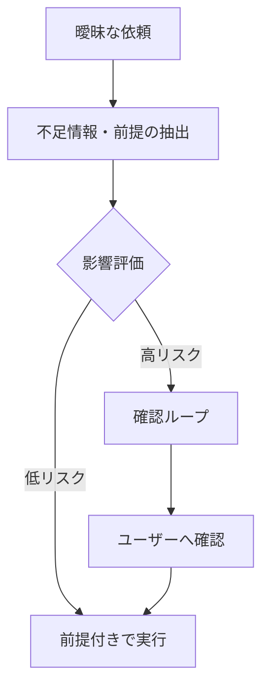

# C-4 Ambiguity Negotiation（曖昧性交渉）

## 概要

曖昧な依頼を即実行せず、不足情報と前提を明示して確認する。

## 設計

`missing_information` と `assumptions` を抽出し、安全・コスト・業務影響が大きい場合は実行前に確認（clarification loop）する。

## 解決する課題

- 意図と異なる実行
- 誤発注・誤送信

## ユースケース

- 予約・発注
- メール送信
- データ更新
- 契約処理

## 向き

誤実行の影響が大きい処理に適する。

## 不向き

多少間違っても問題ない探索的タスクには不向きである（確認が摩擦になる）。

## 要素技術

- **交渉**：clarification loop
- **評価**：risk scoring
- **UI**：confirmation UI
- **記録**：assumption logging

## 関連パターン

- [C-1 Natural Language Boundary Adapter](c1-nl-boundary-adapter.md) — 入力の構造化との連携
- [F-5 Human Approval Checkpoint](../f-reliability/f5-human-approval.md) — 承認ゲートとの統合
- [D-3 Dry-Run First Execution](../d-tools-mcp/d3-dry-run-execution.md) — 実行前のシミュレーション
- [K-3 Agent-to-Human Escalation](../k-human/k3-human-escalation.md) — 曖昧すぎる場合のエスカレーション
