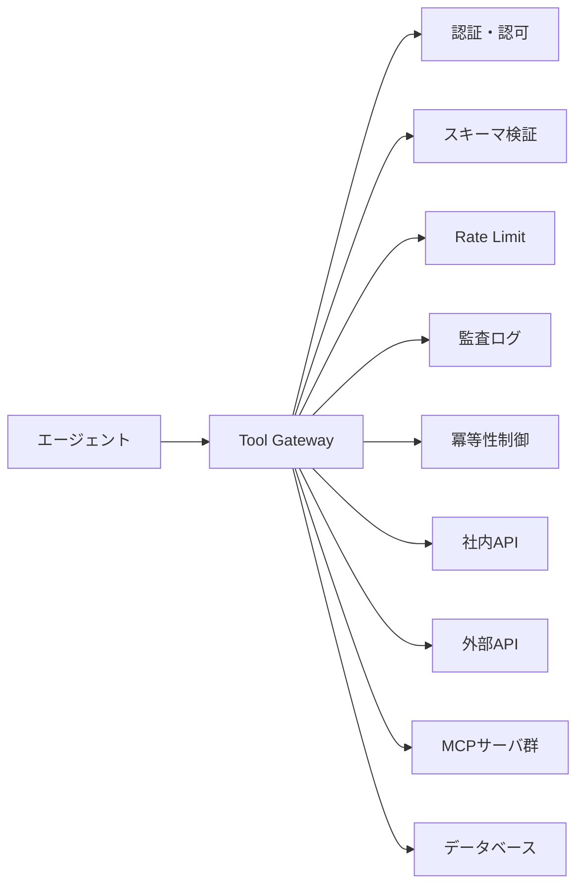

# D-1 Tool Gateway（ツールゲートウェイ）

## 概要

エージェントが直接社内API/DBを叩かず、すべてのツール呼び出しをゲートウェイに集約する。

## 設計

Gateway で以下を一元適用する。

- 認証・認可
- rate limit
- 引数スキーマ検証
- 監査ログ
- idempotency（冪等性制御）
- dry-run

ツールカタログ（スキーマ・権限・コスト）を管理し、追加/廃止/版を運用から制御する。MCPサーバ群もここに束ねる。

ツール呼び出しが一点に集まることで、権限管理・監査・版管理・コスト追跡が構造的に可能になる。

## 解決する課題

以下のエージェント特性に応える。

- 直接の強権限付与による誤実行・過剰実行・情報漏洩
- ツール乱立のガバナンス崩壊
- 認証情報の散在

ツール/MCPで副作用を起こすエージェントの、最重要リスク境界を統制する。

## ユースケース

- 企業システム連携
- 複数MCP/外部APIの利用
- 複数エージェントでのツール共有

## 向き

多数のツール・副作用ツールを持つ本番エージェントに適する。ツールの追加・変更が頻繁な環境で特に効果が高い。

## 不向き

読み取り専用の軽量ツールが1〜2個の小規模PoCには過剰である。

## 要素技術

- **ゲートウェイ**：API Gateway
- **MCP**：MCP server/client
- **認証**：OAuth、サービスアカウント
- **ポリシー**：OPA
- **制御**：rate limiter、audit log、idempotency key

## 関連パターン

- [D-2 Least-Privilege Tool Binding](d2-least-privilege-binding.md) — Gatewayで権限の最小化を実施する
- [D-3 Dry-Run First Execution](d3-dry-run-execution.md) — Gatewayでdry-run機能を提供する
- [D-5 MCP Adapter Isolation](d5-mcp-adapter-isolation.md) — MCPサーバの信頼境界分離
- [I-1 Agent Trace & Observability](../i-observability/i1-trace-observability.md) — Gatewayでの監査ログがトレースに統合される
