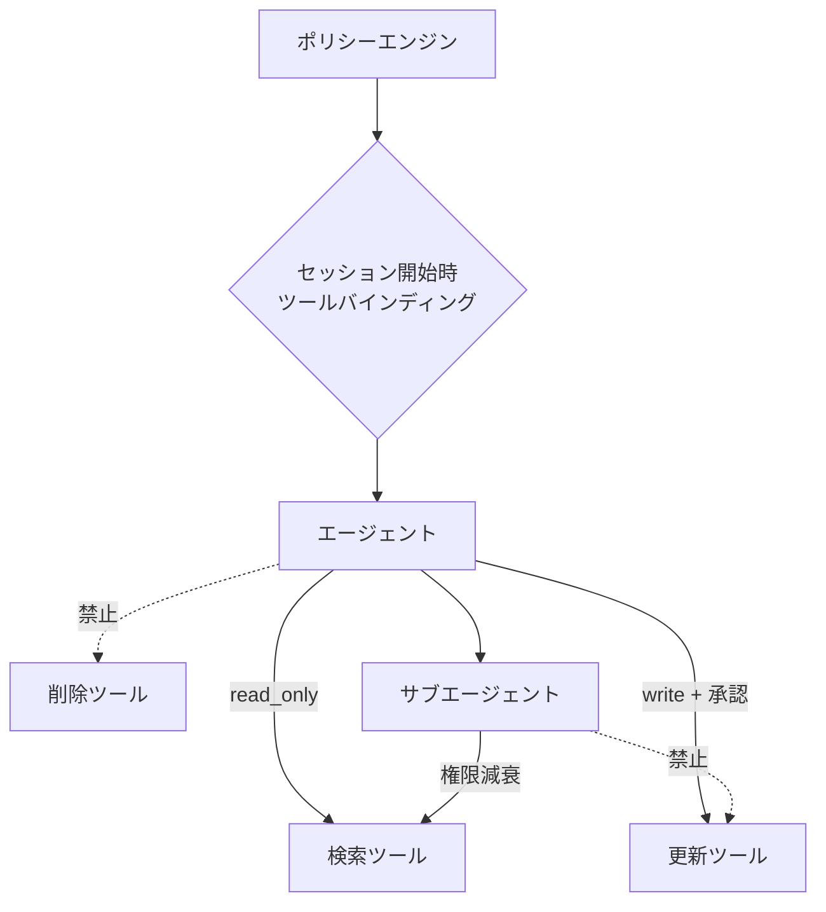

# D-2 Least-Privilege Tool Binding（最小権限ツールバインディング）

## 概要

エージェント/ユーザー/セッションごとに利用可能ツールと権限を最小化し、スコープ・期限付きで動的付与する。

## 設計

Tool Registry に各ツールの属性を付与する。

- `read_only` / `write` / `destructive`
- `external_network`
- `pii_access`

セッション開始時にポリシーで利用可能ツールだけをバインディングする。委譲時は権限を減衰（attenuate）させ、親より強い権限を子が持てないようにする。

## 解決する課題

以下のエージェント特性に応える。

- OWASPの excessive agency / insecure plugin design / sensitive information disclosure
- 乗っ取り時の被害範囲（blast radius）の限定
- 過剰な自律性の制御

## ユースケース

- 社内AIアシスタント
- SaaS管理画面のエージェント
- 顧客データを扱うエージェント
- マルチエージェント構成

## 向き

副作用ツールを多数持つ環境、機密データを扱う環境に適する。マルチエージェント構成で権限の委譲が発生する場面では必須となる。

## 不向き

完全に閉じたsandbox内の実験では過剰である。

## 要素技術

- **アクセス制御**：RBAC、ABAC
- **ポリシーエンジン**：OPA/Rego、Cedar、AWS IAM
- **トークン**：ケイパビリティトークン、短命クレデンシャル
- **MCP**：MCP permissions、scope token

## 関連パターン

- [D-1 Tool Gateway](d1-tool-gateway.md) — 権限適用の実装点
- [G-1 Confused-Deputy Damage Limitation](../g-security/g1-confused-deputy-limitation.md) — 被害半径限定の上位設計
- [F-4 Policy-as-Code Guardrail](../f-reliability/f4-policy-as-code.md) — ポリシーのコード化
- [L-3 Agent Constitution](../l-adoption/l3-agent-constitution.md) — 権限設計の統治的背骨
