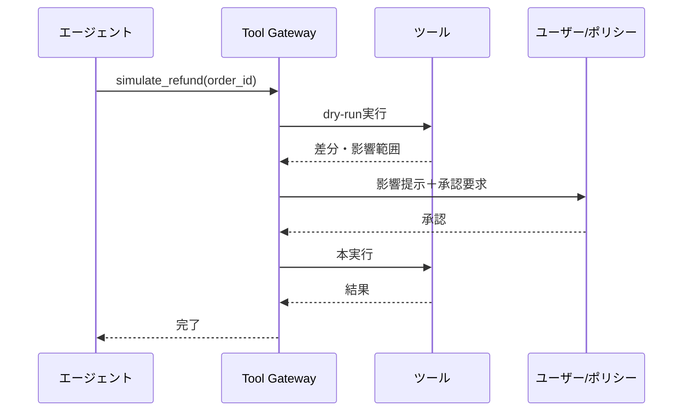

# D-3 Dry-Run First Execution（ドライラン先行実行）

## 概要

副作用のあるツールは、まず影響をシミュレートしてから本実行する二段階方式。

## 設計

`refund_order` 等の副作用ツールに対し、最初に `simulate_*` を実行する。差分・影響範囲・リスクをユーザー/ポリシーエンジンに提示し、承認後に本実行する（two-phase execution）。

## 解決する課題

AIの誤判断による不可逆操作を防ぐ。エージェントが副作用ツールを呼び出す際、意図しない結果を事前に確認できる安全層を提供する。

## ユースケース

- 削除操作
- 送金・返金
- 発注・契約
- メール一斉送信
- インフラ変更

## 向き

不可逆・高影響の書き込み操作に適する。誤実行のコストが高い操作ほど効果が大きい。

## 不向き

読み取り専用・低リスクな生成処理には不要である。dry-run自体のコストが本実行と同等になる場合も効果が薄い。

## 要素技術

- **シミュレーション**：dry-run API
- **差分エンジン**：diff engine
- **承認**：approval workflow
- **ポリシー**：policy check

## 関連パターン

- [D-1 Tool Gateway](d1-tool-gateway.md) — dry-run機能の実装点
- [F-5 Human Approval Checkpoint](../f-reliability/f5-human-approval.md) — 承認ゲートとの統合
- [D-2 Least-Privilege Tool Binding](d2-least-privilege-binding.md) — 権限制御との併用
- [A-6 Agent Saga](../a-execution/a6-agent-saga.md) — dry-runで防げなかった場合の補償
