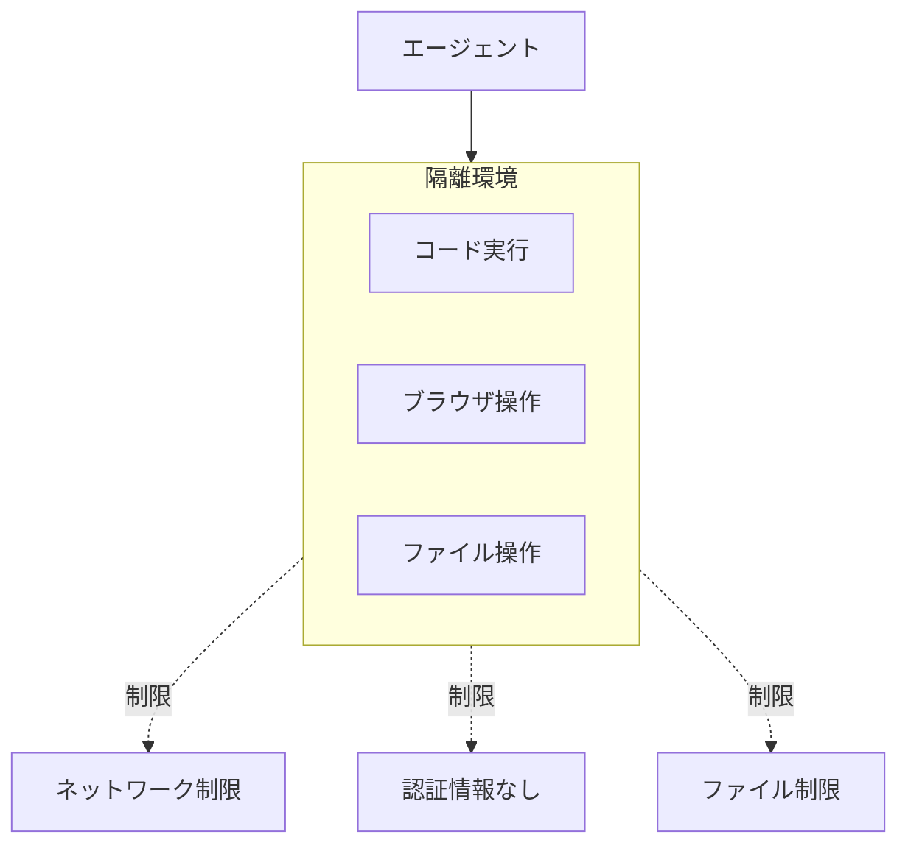

# D-4 Sandboxed Tool Runtime（サンドボックス実行）

## 概要

コード実行・ブラウザ操作・ファイル操作などを隔離環境で実行し、ネットワーク・認証情報・ファイルを制限する。

## 設計

生成コードやブラウザ操作はcontainer / micro-VM / browser sandbox内で実行する。ephemeralクレデンシャル、network policy、seccompで制限する。

## 解決する課題

- プロンプトインジェクションやツール誤用による任意コード実行
- 情報漏洩
- 破壊的操作

## ユースケース

- コードインタープリタ
- ブラウザエージェント
- データ分析
- ファイル変換

## 向き

副作用や任意コードを伴うツールに適する。

## 不向き

低レイテンシ・低コスト最優先の単純処理や、読み取り専用検索のみの構成には過剰である。

## 要素技術

- **コンテナ**：Docker、Firecracker、gVisor、WASM
- **オーケストレーション**：Kubernetes Job
- **セキュリティ**：seccomp、network policy
- **認証**：ephemeral credentials

## 関連パターン

- [D-1 Tool Gateway](d1-tool-gateway.md) — サンドボックスへのアクセス制御
- [G-1 Confused-Deputy Damage Limitation](../g-security/g1-confused-deputy-limitation.md) — 被害半径の限定
- [D-2 Least-Privilege Tool Binding](d2-least-privilege-binding.md) — 権限の最小化
- [D-5 MCP Adapter Isolation](d5-mcp-adapter-isolation.md) — MCP接続の隔離
