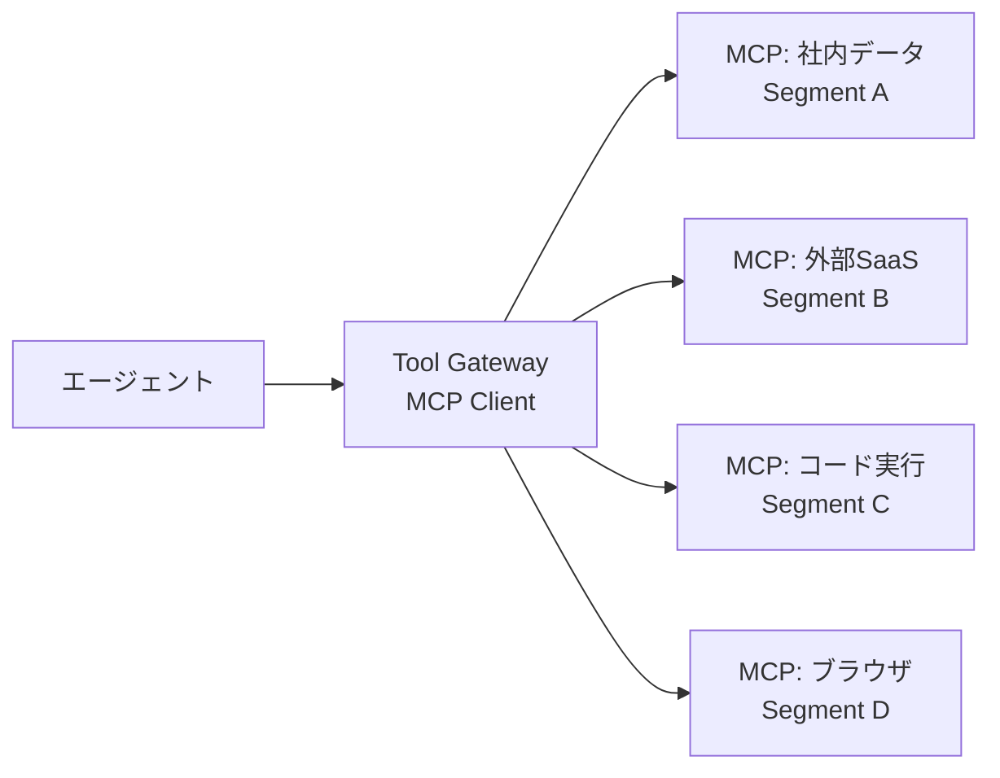

# D-5 MCP Adapter Isolation（MCP境界分離）

## 概要

MCPサーバを信頼境界ごとに分離し、エージェントから直接フルアクセスさせない。

## 設計

社内データ・外部SaaS・ローカルファイル・ブラウザ・コード実行を別MCPサーバ/namespace/network segmentに分け、Tool GatewayがMCP clientとして接続しポリシー適用後に公開する。

## 解決する課題

MCP導入で増える攻撃面・権限管理・監査の複雑化を解決する。

## ユースケース

- 企業内MCP基盤
- 複数チーム共用のエージェント環境

## 向き

多数のMCP接続を持つ組織基盤に適する。

## 不向き

個人ローカル用途の軽量MCP利用には過剰である。

## 要素技術

- **MCP**：MCP server/client
- **分離**：network isolation
- **管理**：tool registry、secret manager
- **監査**：audit trail

## 関連パターン

- [D-1 Tool Gateway](d1-tool-gateway.md) — MCPサーバ群を束ねるゲートウェイ
- [D-4 Sandboxed Tool Runtime](d4-sandboxed-runtime.md) — 実行環境の隔離
- [D-2 Least-Privilege Tool Binding](d2-least-privilege-binding.md) — MCP権限の最小化
- [G-1 Confused-Deputy Damage Limitation](../g-security/g1-confused-deputy-limitation.md) — 信頼境界の設計
