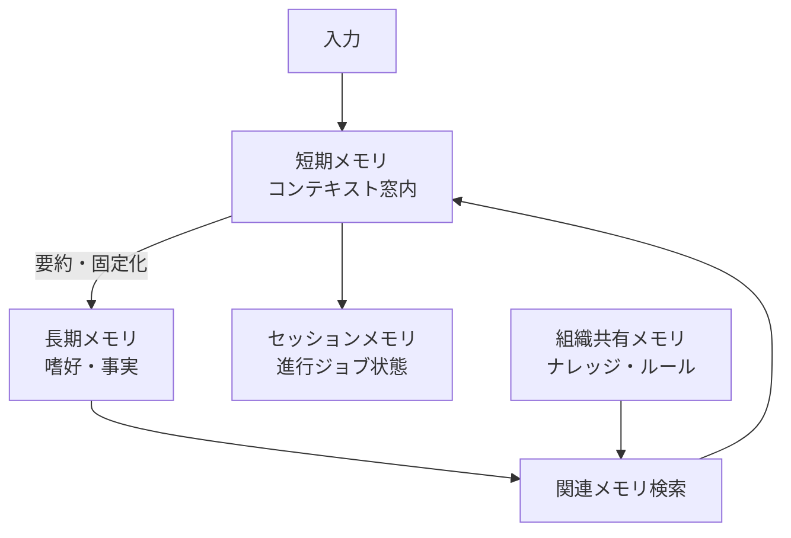

# E-1 Layered Memory（階層メモリ）

## 概要

記憶を短期（推論用）・セッション（進行ジョブ用）・長期（嗜好/事実）・組織共有（ナレッジ/ルール）に分離する。

## 設計

短期メモリはコンテキスト窓内で管理する。窓が溢れる前に要約して長期メモリへ固定化（consolidation）する。検索時は関連メモリだけを呼び戻し注入する。複数エージェントが同一メモリを参照しコンテキストを共有できる。

## 解決する課題

- コンテキスト窓の有限性
- セッションを跨いだ記憶喪失
- 長期パーソナライズ
- エージェント間サイロ化

## ユースケース

- パーソナルアシスタント
- 長期プロジェクト伴走AI
- マルチエージェント環境

## 向き

継続的に同じユーザー/プロジェクトと関わるエージェントに適する。

## 不向き

一問一答で完結する使い捨てツールには過剰である。

## 要素技術

- **KVストア**：Redis、PostgreSQL
- **ベクトルDB**：Qdrant、Milvus、pgvector
- **グラフDB**：Neo4j（GraphRAG）
- **メモリフレームワーク**：Mem0、Zep、Letta
- **その他**：embedding、TTL、namespace、access control

## 関連パターン

- [E-2 Context Pack](e2-context-pack.md) — メモリをコンテキストパックとして構成する
- [E-3 Memory Write Gate](e3-memory-write-gate.md) — 長期メモリへの書き込み制御
- [E-4 Forgetting & Expiration](e4-forgetting-expiration.md) — メモリの失効管理
- [G-3 Tenant-Isolated Runtime](../g-security/g3-tenant-isolated-runtime.md) — テナントごとのメモリ分離
