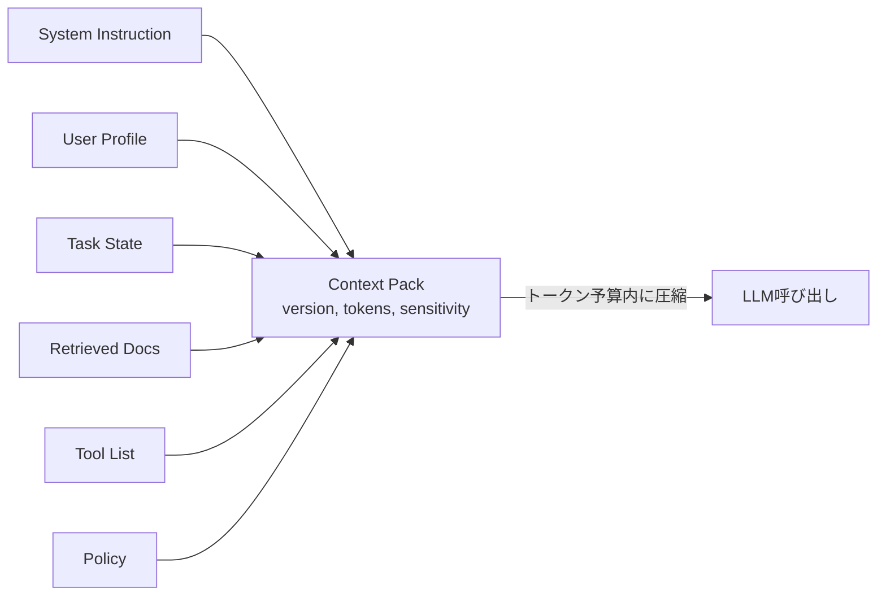

# E-2 Context Pack（コンテキストパック）

## 概要

エージェントに渡すコンテキストを、その場で組み立てる再現可能な「パッケージ」として扱う。

## 設計

以下の要素をpackとして構成し、version・作成根拠・トークン数・機密度を付与する。

- system instruction
- user profile
- task state
- retrieved docs
- tool list
- policy
- budget
- output schema

関連度でランキングし、トークン予算内に圧縮・整形する。

## 解決する課題

- プロンプトの肥大化・属人化
- 「何を渡したか」の再現不能
- コンテキスト窓の非効率な利用

## ユースケース

- 本番エージェント全般
- マルチテナントSaaS

## 向き

渡す情報が動的で多様なシステムに適する。

## 不向き

毎回ほぼ同一の単純LLM呼び出しには過剰である。

## 要素技術

- **テンプレート**：prompt template
- **構築**：context builder
- **検索**：RAG
- **計測**：token counter
- **管理**：prompt registry、context hash

## 関連パターン

- [E-1 Layered Memory](e1-layered-memory.md) — メモリからのコンテキスト取得元
- [F-1 Evidence-First Answer](../f-reliability/f1-evidence-first.md) — 検索結果のパック化
- [H-3 Prompt-Cache Optimized Context](../h-cost-performance/h3-prompt-cache-context.md) — キャッシュ効率を考慮した構成
- [I-1 Agent Trace & Observability](../i-observability/i1-trace-observability.md) — パックの内容をトレースに記録
