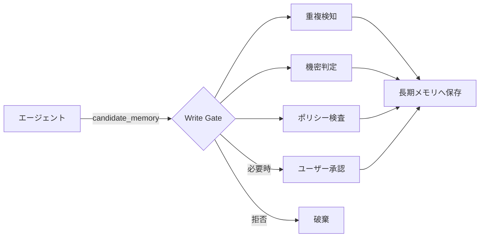

# E-3 Memory Write Gate（書き込みゲート）

## 概要

エージェントが勝手に長期メモリへ保存しないよう、保存前に検査・承認を通す。

## 設計

長期書き込みは `candidate_memory` として出力し、ポリシー・重複検知・機密判定・（必要なら）ユーザー承認を通してから保存する。

## 解決する課題

- 誤った/古い記憶の固定化
- プライバシー侵害
- 意図しない保存

## ユースケース

- 個人化AI
- 社内ナレッジAI
- 顧客対応AI

## 向き

長期メモリを書き込むエージェントに適する。

## 不向き

一時セッションのみのAIには不要である。

## 要素技術

- **分類**：memory classifier
- **プライバシー**：PII detector
- **重複排除**：deduplication
- **UI**：approval UI
- **ポリシー**：retention policy

## 関連パターン

- [E-1 Layered Memory](e1-layered-memory.md) — 書き込み先の階層メモリ
- [E-4 Forgetting & Expiration](e4-forgetting-expiration.md) — 保存後の失効管理
- [G-2 Data Boundary Firewall](../g-security/g2-data-boundary-firewall.md) — 機密データの検出
- [F-5 Human Approval Checkpoint](../f-reliability/f5-human-approval.md) — 承認ゲートの一般形
