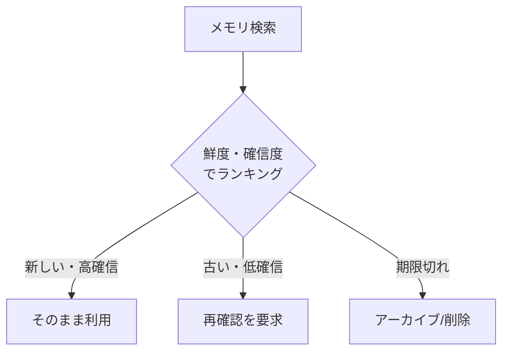

# E-4 Forgetting & Expiration（忘却・失効）

## 概要

メモリにTTL・失効条件・鮮度を持たせ、古い情報を使い続けないようにする。

## 設計

memory item に以下の属性を持たせる。

- `expires_at`：有効期限
- `confidence`：確信度
- `source`：情報源
- `last_verified_at`：最終確認日時
- `sensitivity`：機密度

古い情報は検索順位を下げるか、再確認を要求する。

## 解決する課題

AIが古い情報をもっともらしく使い続ける問題を解決する。

## ユースケース

- 人事・組織情報
- 価格・料金情報
- 契約条件
- 顧客状態
- プロジェクト状態

## 向き

時間で変化する事実を扱うメモリに適する。

## 不向き

不変のドメイン知識（数学的定理、物理法則など）には不要である。

## 要素技術

- **失効管理**：TTL index
- **時間考慮検索**：temporal retrieval
- **鮮度評価**：source freshness scoring
- **圧縮**：memory compaction

## 関連パターン

- [E-1 Layered Memory](e1-layered-memory.md) — 失効管理の対象となるメモリ階層
- [E-3 Memory Write Gate](e3-memory-write-gate.md) — 書き込み時の鮮度情報付与
- [F-1 Evidence-First Answer](../f-reliability/f1-evidence-first.md) — 根拠の鮮度管理
- [E-2 Context Pack](e2-context-pack.md) — 鮮度を考慮したコンテキスト構成
