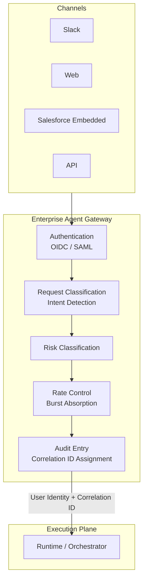

# EX-1 Enterprise Agent Gateway (Unified Front Door)

## Overview

Whether an employee talks to an agent via Slack, uses a web portal, or invokes it from within a Salesforce screen, all requests pass through a single entry point. Because identity verification, risk scoring, rate control, and audit log creation are all handled at this one point, security and governance quality do not degrade as channels multiply. This gateway also absorbs the burst traffic of tens of thousands of employees all starting work at the same time during morning peak hours.

## Business Problem

As enterprise AI is called from multiple channels (Slack, web, SaaS embedded, API), entry points become fragmented and governance, auditing, and capacity management break down. When each channel uses a different authentication method, completeness of permission checks cannot be guaranteed, and audit logs become fragmented, hindering post-incident investigations. When individual agents try to absorb burst traffic from tens of thousands of users during business hours, back-end systems become overloaded. Furthermore, implementing separate governance logic per channel causes maintenance costs to multiply and creates governance gaps. A single entry point structurally addresses all of these problems at once.

!!! tip "Minimum Viable Implementation"
    Accept all channel requests through a single reverse proxy and implement three things: OIDC authentication, correlation ID attachment, and audit log output. Risk classification and rate control can be added in later phases.

## Value Hypothesis

Establishing a company-wide unified entry point reduces the cost for employees to reach agents to near zero, increasing utilization and retention rates. Higher utilization directly speeds value realization across all use cases and also reduces security costs by eliminating shadow AI.

## Solution and Design

Position the Gateway as the "sole passage to the execution plane" and perform all governance controls there in one place. Individual agents do not need to implement authentication, risk scoring, or audit entry creation — they simply receive the guaranteed user identity and correlation ID from the Gateway. Adding a new agent or channel requires no re-implementation of governance logic.

Absorb channels (Slack, web, SaaS-embedded) and propagate user identity and correlation ID downstream. The Gateway is a control point and serves as the first PEP ([ID-6](../id-identity/id6-zero-trust-pdp-pep.md)) that executes authentication, classification, risk scoring, rate control, and audit.

## Applicability

| Good Fit | Poor Fit |
|---|---|
| Multiple channels with large-scale organization-wide deployment | Single-channel PoC |
| Environments with governance and audit requirements | Fully isolated experimental environments |
| Need to separate workforce and customer channels | Small-scale deployments with only one channel |
| — | Deterministic RPA or form-processing fixed workflows (AI agent adoption itself is unnecessary) |

## Technology and Integration

- **API Gateway**: Kong, Apigee, AWS API Gateway
- **Authentication**: OIDC, SAML 2.0
- **Risk classification**: Risk Scoring, intent classifier
- **Correlation ID**: OpenTelemetry Trace ID
- **Rate control**: Token Bucket, burst absorption

## Pitfalls and Selection Criteria

!!! warning "Passthrough Proxy Anti-Pattern"
    Making the Gateway a passthrough proxy that delegates authorization and auditing to downstream components is the greatest pitfall. The entry point is a control point — authentication, risk classification, and audit entry creation must be executed here, reliably.

- Separate workforce and customer channels with a trust boundary, following [ID-1 Dual-Plane Separation](../id-identity/id1-workforce-customer-split.md).
- Execute Token Exchange ([ID-2 OBO](../id-identity/id2-identity-federation-obo.md)) at the Gateway and pass OBO tokens to downstream components.
- Integrate rate control with [IN-3 Rate/Quota Broker](../in-integration/in3-rate-quota-broker.md) and account for SaaS-side rate limits as well.

## Related Patterns

- [EX-2 Business-Embedded + Independent Workbench (Channel Placement)](ex2-embedded-vs-portal.md) — Complementary: determines the UI delivery form under the Gateway
- [EX-3 Channel-Agnostic Front Door](ex3-channel-agnostic-frontdoor.md) — Complementary: handles channel-difference absorption before reaching the Gateway
- [ID-1 Workforce/Customer Dual-Plane Separation](../id-identity/id1-workforce-customer-split.md) — Complementary: prerequisite for separating trust boundaries at the entry point
- [ID-2 Identity Federation & OBO](../id-identity/id2-identity-federation-obo.md) — Complementary: implementation of Token Exchange at the Gateway
- [ID-6 Zero-Trust PDP/PEP](../id-identity/id6-zero-trust-pdp-pep.md) — Similar: the Gateway functions as the first PEP
- [OB-1 Observability Lake](../ob-observability/ob1-observability-lake.md) — Complementary: destination for audit entry submissions
