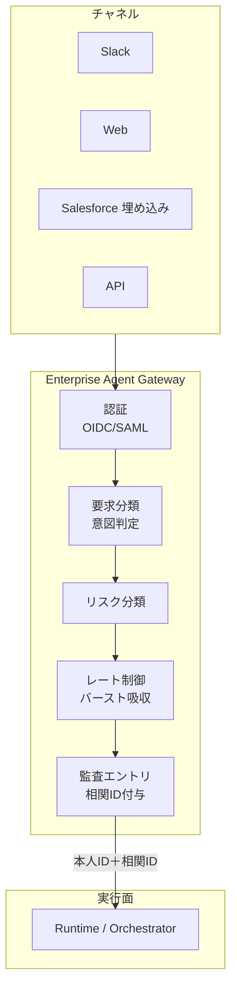

# EX-1 Enterprise Agent Gateway（統一フロントドア）

## 概要

従業員が Slack からエージェントに話しかけても、Web ポータルから使っても、Salesforce の画面内で呼び出しても、すべてのリクエストが通る「たった1つの入口」を置きます。この入口で本人確認・リスク判定・流量制御・監査ログの記録をまとめて処理します。チャネルが増えてもセキュリティと統制の品質が落ちないのは、この一元化があるからです。数万人が一斉に使う朝のピーク時のバースト吸収も、このゲートウェイが担います。

## 解決する企業課題

エンタープライズ AI が複数チャネル（Slack/Web/SaaS 埋め込み/API）から呼ばれるようになると、入口が分散して統制・監査・容量管理が崩れていきます。チャネルごとに認証方式が異なれば、権限チェックの網羅性を保証できません。監査ログも分断されるため、事後調査が難しくなります。数万人規模のバースト（業務時間帯の全社一斉利用）を個々のエージェントで吸収しようとすれば、バックエンドに過負荷がかかります。チャネルごとに個別の統制ロジックを実装すると、保守コストが乗数的に増え、ガバナンスの穴も生じやすいです。単一入口を置くことで、これらの問題を構造的にまとめて封じられます。

!!! tip "最小成立条件（MVP）"
    単一のリバースプロキシで全チャネルのリクエストを受け、OIDC 認証・相関 ID 付与・監査ログ出力の3点を実装します。リスク分類やレート制御は後段階で追加すればよいです。

## 価値仮説

全社統一入口を設けることで従業員のエージェント到達コストをゼロに近づけ、利用率と定着率を高めます。利用率の向上はあらゆるユースケースの価値実現速度に直結し、シャドーAI排除によるセキュリティコスト削減にも寄与します。

## 解決策と設計

Gateway を「実行面への唯一の通路」として位置づけ、すべての統制をここで一括実施します。個別エージェントは認証・リスク判定・監査エントリを持たなくてよいです。Gateway が保証した本人 ID と相関 ID を受け取るだけで動けます。新しいエージェントやチャネルが追加されても、統制ロジックを再実装する必要はありません。

Gateway はチャネル（Slack/Web/SaaS埋め込み）からのリクエストをすべて受け付け、本人 ID と相関 ID を後段へ伝播します。認証・分類・リスク判定・レート制御・監査を一手に引き受け、実行面への最初の PEP（[ID-6](../id-identity/id6-zero-trust-pdp-pep.md)）として機能します。



## 向き／不向き

| 向き | 不向き |
|---|---|
| 複数チャネル・大規模な全社展開 | 単一 PoC で1チャネルのみ |
| 統制・監査要件がある環境 | 完全閉域の実験環境 |
| 従業員/顧客チャネルの分離が必要 | チャネルが1つだけの小規模利用 |
| — | 決定論的な RPA やフォーム処理で完結する定型業務（AI エージェント化自体が不要） |

## 要素技術・既存システム連携

- **API Gateway**：Kong、Apigee、AWS API Gateway
- **認証**：OIDC、SAML 2.0
- **リスク分類**：Risk Scoring、意図分類器
- **相関 ID**：OpenTelemetry Trace ID
- **レート制御**：Token Bucket、バースト吸収

## 落とし穴／選定の勘所

!!! warning "素通しプロキシ化"
    Gateway を素通しプロキシにして認可・監査を後段任せにするのは最大の落とし穴です。入口は統制点であり、ここで認証・リスク分類・監査エントリを確実に実行します。

- 従業員チャネルと顧客チャネルは [ID-1 二面分離](../id-identity/id1-workforce-customer-split.md) に従い、信頼境界で分けます。
- Token Exchange（[ID-2 OBO](../id-identity/id2-identity-federation-obo.md)）は Gateway で実行し、後段には OBO トークンを渡します。
- レート制御は [IN-3 Rate/Quota Broker](../in-integration/in3-rate-quota-broker.md) と連携し、SaaS 側のレート上限も考慮します。

## Interfaces

以下はこのパターンを実装する際の主要インターフェイスです。コーディングエージェントはこの定義からスタブコードを生成できます。

```yaml
interfaces:
  - name: Authentication & Risk Classification
    description: "Validates OIDC/SAML identity tokens, classifies request intent and risk tier, and assigns a correlation ID before forwarding to the backend runtime."
    input:
      request: object
    output:
      response: object
    errors:
      - code: GENERAL_ERROR
        description: "Authentication & Risk Classification の処理中にエラーが発生"
    protocol: "REST / gRPC"
    implementation_hints:
      - "詳細は本文の「解決策と設計」節を参照"
    code_examples:
      typescript: |
        interface AuthenticationRiskClassificationRequest {
          idToken: string;
          channel: string;
          requestPayload: object;
        }
        interface AuthenticationRiskClassificationResponse {
          principalId: string;
          correlationId: string;
          riskTier: number;
          intent: string;
        }
        interface AuthenticationRiskClassification {
          authenticationRiskClassification(req: AuthenticationRiskClassificationRequest): Promise<AuthenticationRiskClassificationResponse>;
        }
      python: |
        @dataclass
        class AuthenticationRiskClassificationRequest:
            id_token: str
            channel: str
            request_payload: dict
        
        @dataclass
        class AuthenticationRiskClassificationResponse:
            principal_id: str
            correlation_id: str
            risk_tier: int
            intent: str
        
        class AuthenticationRiskClassification(Protocol):
            async def authentication_risk_classification(self, req: AuthenticationRiskClassificationRequest) -> AuthenticationRiskClassificationResponse: ...
  - name: Rate Control & Burst Absorption
    description: "Token-bucket rate limiter that absorbs enterprise-wide peak bursts and coordinates with IN-3 Rate/Quota Broker for SaaS-side quota limits."
    input:
      request: object
    output:
      response: object
    errors:
      - code: GENERAL_ERROR
        description: "Rate Control & Burst Absorption の処理中にエラーが発生"
    protocol: "REST / gRPC"
    implementation_hints:
      - "詳細は本文の「解決策と設計」節を参照"
    code_examples:
      typescript: |
        interface RateControlBurstAbsorptionRequest {
          agentId: string;
          saasTarget: string;
          requestCount: number;
        }
        interface RateControlBurstAbsorptionResponse {
          allowed: boolean;
          remainingQuota: number;
          retryAfterMs: number;
        }
        interface RateControlBurstAbsorption {
          rateControlBurstAbsorption(req: RateControlBurstAbsorptionRequest): Promise<RateControlBurstAbsorptionResponse>;
        }
      python: |
        @dataclass
        class RateControlBurstAbsorptionRequest:
            agent_id: str
            saas_target: str
            request_count: int
        
        @dataclass
        class RateControlBurstAbsorptionResponse:
            allowed: bool
            remaining_quota: int
            retry_after_ms: int
        
        class RateControlBurstAbsorption(Protocol):
            async def rate_control_burst_absorption(self, req: RateControlBurstAbsorptionRequest) -> RateControlBurstAbsorptionResponse: ...
  - name: Audit Entry Point
    description: "Emits a structured audit record per request (actor ID, channel, intent, risk tier, correlation ID) to OB-1 Observability Lake."
    input:
      request: object
    output:
      response: object
    errors:
      - code: GENERAL_ERROR
        description: "Audit Entry Point の処理中にエラーが発生"
    protocol: "REST / gRPC"
    implementation_hints:
      - "詳細は本文の「解決策と設計」節を参照"
    code_examples:
      typescript: |
        interface AuditEntryPointRequest {
          actorId: string;
          agentId: string;
          correlationId: string;
          action: string;
          resource: string;
        }
        interface AuditEntryPointResponse {
          auditId: string;
          recordedAt: Date;
        }
        interface AuditEntryPoint {
          auditEntryPoint(req: AuditEntryPointRequest): Promise<AuditEntryPointResponse>;
        }
      python: |
        @dataclass
        class AuditEntryPointRequest:
            actor_id: str
            agent_id: str
            correlation_id: str
            action: str
            resource: str
        
        @dataclass
        class AuditEntryPointResponse:
            audit_id: str
            recorded_at: datetime
        
        class AuditEntryPoint(Protocol):
            async def audit_entry_point(self, req: AuditEntryPointRequest) -> AuditEntryPointResponse: ...
```

## 関連パターン

- [EX-2 業務埋め込み＋独立ワークベンチ（チャネル配置）](ex2-embedded-vs-portal.md) — 補完：Gateway 配下のUI提供形態を決定するパターン
- [EX-3 チャネル非依存フロントドア](ex3-channel-agnostic-frontdoor.md) — 補完：Gateway に到達する前のチャネル差吸収を担う
- [ID-1 Workforce/Customer 二面分離](../id-identity/id1-workforce-customer-split.md) — 補完：入口での信頼境界を分離する前提条件
- [ID-2 Identity Federation & OBO](../id-identity/id2-identity-federation-obo.md) — 補完：Gateway での Token Exchange の実装
- [ID-6 Zero-Trust PDP/PEP](../id-identity/id6-zero-trust-pdp-pep.md) — 類似：Gateway が最初の PEP として機能する
- [OB-1 Observability Lake](../ob-observability/ob1-observability-lake.md) — 補完：監査エントリの送信先

## Decision Summary

```yaml
decision_summary:
  pattern: EX-1
  participates_in:
    - decision: TO-8
      role: enabler
    - decision: DC-1
      role: enforcer
  recommended_if:
    - "複数チャネルからエージェントにアクセスする"
    - "統一的な認証・レート制限・監査入口が必要"
  avoid_if:
    - "単一アプリ内蔵型で外部アクセスが不要"
  combines_with: [EX-2, EX-3, ID-6, GV-1, OB-2]
  conflicts_with: []
  value_outcome:
    drivers: [employee_efficiency, audit_compliance]
    kpis: [エージェント利用率, 平均応答時間, 認証失敗率]
  mvp: "単一チャネルで認証・レート制限・監査ログを統合"
  cost: M
```
