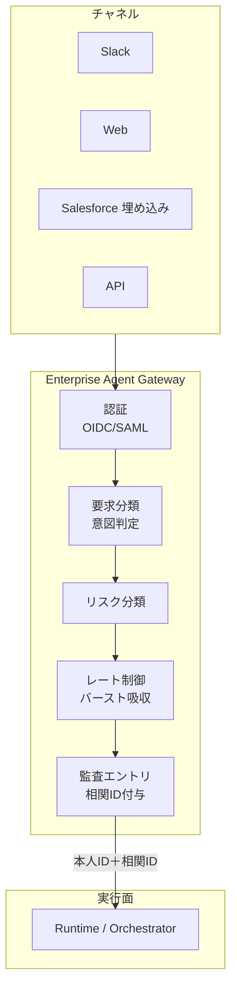

# EX-1 Enterprise Agent Gateway（統一フロントドア）

## 概要

従業員が Slack からエージェントに話しかけても、Web ポータルから使っても、Salesforce の画面内で呼び出しても、すべてのリクエストが通る「たった1つの入口」を置く。この入口で本人確認・リスク判定・流量制御・監査ログの記録をまとめて済ませるため、チャネルが増えてもセキュリティと統制の品質が下がらない。数万人が一斉に使う朝のピーク時のバースト吸収も、このゲートウェイが引き受ける。

## 解決する企業課題

エンタープライズ AI が複数チャネル（Slack/Web/SaaS 埋め込み/API）から呼ばれるようになると、入口が分散し統制・監査・容量管理が崩れていく。チャネルごとに認証方式が異なれば権限チェックの網羅性を保証できないし、監査ログも分断されて事後調査が難しくなる。数万人規模のバースト（業務時間帯の全社一斉利用）を個々のエージェントで吸収しようとすれば、バックエンドに過負荷がかかる。チャネルごとに個別の統制ロジックを実装すると保守コストが乗数的に増大し、ガバナンスの穴も生じやすい。単一入口を置くことで、これらの問題を構造的にまとめて封じる。

!!! tip "最小成立条件（MVP）"
    単一のリバースプロキシで全チャネルのリクエストを受け、OIDC 認証・相関 ID 付与・監査ログ出力の3点を実装する。リスク分類やレート制御は後段階で追加すればよい。

## 価値仮説

全社統一入口を設けることで従業員のエージェント到達コストをゼロに近づけ、利用率と定着率を高める。利用率の向上はすべてのユースケースの価値実現速度に直結し、シャドーAI排除によるセキュリティコスト削減にも効く。

## 解決策と設計

Gateway を「実行面への唯一の通路」として位置づけ、すべての統制をここで一括実施する。個別エージェントは認証・リスク判定・監査エントリを持たず、Gateway が保証した本人 ID と相関 ID を受け取るだけでよい。新しいエージェントやチャネルが追加されても、統制ロジックを再実装する必要はない。

Gateway はチャネル（Slack/Web/SaaS埋め込み）からのリクエストをすべて吸収し、本人 ID と相関 ID を後段へ伝播する。認証・分類・リスク判定・レート制御・監査を一手に引き受け、実行面への最初の PEP（[ID-6](../id-identity/id6-zero-trust-pdp-pep.md)）として機能する。



## 向き／不向き

| 向き | 不向き |
|---|---|
| 複数チャネル・大規模な全社展開 | 単一 PoC で1チャネルのみ |
| 統制・監査要件がある環境 | 完全閉域の実験環境 |
| 従業員/顧客チャネルの分離が必要 | チャネルが1つだけの小規模利用 |
| — | 決定論的な RPA やフォーム処理で完結する定型業務（AI エージェント化自体が不要） |

## 要素技術・既存システム連携

- **API Gateway**：Kong、Apigee、AWS API Gateway
- **認証**：OIDC、SAML 2.0
- **リスク分類**：Risk Scoring、意図分類器
- **相関 ID**：OpenTelemetry Trace ID
- **レート制御**：Token Bucket、バースト吸収

## 落とし穴／選定の勘所

!!! warning "素通しプロキシ化"
    Gateway を素通しプロキシにして認可・監査を後段任せにするのは最大の落とし穴。入口は統制点であり、ここで認証・リスク分類・監査エントリを確実に実行する。

- 従業員チャネルと顧客チャネルは [ID-1 二面分離](../id-identity/id1-workforce-customer-split.md) に従い、信頼境界で分ける。
- Token Exchange（[ID-2 OBO](../id-identity/id2-identity-federation-obo.md)）は Gateway で実行し、後段には OBO トークンを渡す。
- レート制御は [IN-3 Rate/Quota Broker](../in-integration/in3-rate-quota-broker.md) と連携し、SaaS 側のレート上限も考慮する。

## Interfaces

以下はこのパターンを実装する際の主要インターフェイスである。コーディングエージェントはこの定義からスタブコードを生成できる。

```yaml
interfaces:
  - name: Authentication & Risk Classification
    description: "Validates OIDC/SAML identity tokens, classifies request intent and risk tier, and assigns a correlation ID before forwarding to the backend runtime."
    input:
      request: object
    output:
      response: object
    errors:
      - code: GENERAL_ERROR
        description: "Authentication & Risk Classification の処理中にエラーが発生"
    protocol: "REST / gRPC"
    implementation_hints:
      - "詳細は本文の「解決策と設計」節を参照"
  - name: Rate Control & Burst Absorption
    description: "Token-bucket rate limiter that absorbs enterprise-wide peak bursts and coordinates with IN-3 Rate/Quota Broker for SaaS-side quota limits."
    input:
      request: object
    output:
      response: object
    errors:
      - code: GENERAL_ERROR
        description: "Rate Control & Burst Absorption の処理中にエラーが発生"
    protocol: "REST / gRPC"
    implementation_hints:
      - "詳細は本文の「解決策と設計」節を参照"
  - name: Audit Entry Point
    description: "Emits a structured audit record per request (actor ID, channel, intent, risk tier, correlation ID) to OB-1 Observability Lake."
    input:
      request: object
    output:
      response: object
    errors:
      - code: GENERAL_ERROR
        description: "Audit Entry Point の処理中にエラーが発生"
    protocol: "REST / gRPC"
    implementation_hints:
      - "詳細は本文の「解決策と設計」節を参照"
```

## 関連パターン

- [EX-2 業務埋め込み＋独立ワークベンチ（チャネル配置）](ex2-embedded-vs-portal.md) — 補完：Gateway 配下のUI提供形態を決定するパターン
- [EX-3 チャネル非依存フロントドア](ex3-channel-agnostic-frontdoor.md) — 補完：Gateway に到達する前のチャネル差吸収を担う
- [ID-1 Workforce/Customer 二面分離](../id-identity/id1-workforce-customer-split.md) — 補完：入口での信頼境界を分離する前提条件
- [ID-2 Identity Federation & OBO](../id-identity/id2-identity-federation-obo.md) — 補完：Gateway での Token Exchange の実装
- [ID-6 Zero-Trust PDP/PEP](../id-identity/id6-zero-trust-pdp-pep.md) — 類似：Gateway が最初の PEP として機能する
- [OB-1 Observability Lake](../ob-observability/ob1-observability-lake.md) — 補完：監査エントリの送信先
