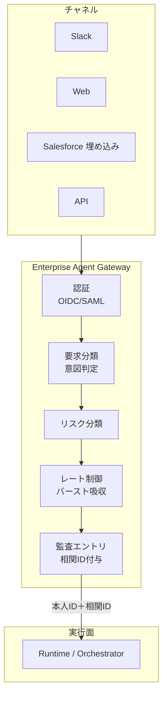

# EX-1 Enterprise Agent Gateway（統一フロントドア）

## 概要

すべてのエージェント要求が通る単一の入口。テナント/ユーザー認証、要求分類、リスク分類、レート制御、監査エントリを一元適用する。

## 設計

チャネル（Slack/Web/SaaS埋め込み）を吸収し、本人 ID と相関 ID を後段へ伝播する。Gateway は統制点であり、認証・分類・リスク判定・レート制御・監査を実行する最初の PEP（[ID-6](../id-identity/id6-zero-trust-pdp-pep.md)）でもある。

## 解決する企業課題

入口が分散すると統制・監査・容量管理が崩れる。数万人規模のバースト吸収、チャネルごとの認証差、監査の欠落——これらを単一入口で構造的に防ぐ。

## 向き／不向き

| 向き | 不向き |
|---|---|
| 複数チャネル・大規模な全社展開 | 単一 PoC で1チャネルのみ |
| 統制・監査要件がある環境 | 完全閉域の実験環境 |
| 従業員/顧客チャネルの分離が必要 | チャネルが1つだけの小規模利用 |

## 要素技術・既存システム連携

- **API Gateway**：Kong、Apigee、AWS API Gateway
- **認証**：OIDC、SAML 2.0
- **リスク分類**：Risk Scoring、意図分類器
- **相関 ID**：OpenTelemetry Trace ID
- **レート制御**：Token Bucket、バースト吸収

## 落とし穴／選定の勘所

!!! warning "素通しプロキシ化"
    Gateway を素通しプロキシにして認可・監査を後段任せにするのは最大の落とし穴。入口は統制点であり、ここで認証・リスク分類・監査エントリを確実に実行する。

- 従業員チャネルと顧客チャネルは [ID-1 二面分離](../id-identity/id1-workforce-customer-split.md) に従い、信頼境界で分ける。
- Token Exchange（[ID-2 OBO](../id-identity/id2-identity-federation-obo.md)）は Gateway で実行し、後段には OBO トークンを渡す。
- レート制御は [IN-3 Rate/Quota Broker](../in-integration/in3-rate-quota-broker.md) と連携し、SaaS 側のレート上限も考慮する。

## 関連パターン

- [EX-2 業務埋め込み vs 独立ポータル](ex2-embedded-vs-portal.md) — Gateway 配下のUI提供形態
- [EX-3 チャネル非依存フロントドア](ex3-channel-agnostic-frontdoor.md) — チャネル差を吸収する設計
- [ID-1 Workforce/Customer 二面分離](../id-identity/id1-workforce-customer-split.md) — 入口での信頼境界分離
- [ID-2 Identity Federation & OBO](../id-identity/id2-identity-federation-obo.md) — Gateway での Token Exchange
- [ID-6 Zero-Trust PDP/PEP](../id-identity/id6-zero-trust-pdp-pep.md) — Gateway が最初の PEP
- [OB-1 Observability Lake](../ob-observability/ob1-observability-lake.md) — 監査エントリの送信先
