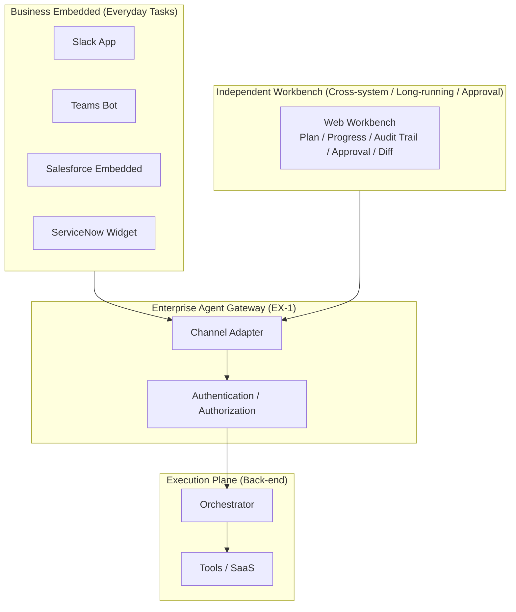

# EX-2 Business-Embedded + Independent Workbench (Channel Placement)

## Overview

"Ask the agent a question in Slack and get an answer" and "open a dedicated browser window and conduct a long investigation" demand completely different experiences — even from the same agent. This pattern uses embedding in everyday business apps (Slack, Teams, Salesforce screens) for short daily inquiries, and provides an independent workbench — where plans, rationale, and approvals are visible on a single screen — for cross-system research, approval flows, and long-running tasks. It avoids the failure mode of building a portal that nobody opens, by delivering the agent where the work actually happens.

## Business Problem

When an agent is provided as "open a separate portal to use it," the flow of daily work is interrupted and it stops being used. Context-switching friction — regardless of the agent's functional quality — is the greatest inhibitor of adoption. Front-line employees want to complete their work without leaving Slack or Salesforce screens. Unless the agent is placed along that workflow, it becomes "AI in name only" — deployed in many places but used rarely. On the other hand, having no independent portal at all means cross-system work requires navigating multiple screens back and forth, and managing approval audit trails becomes difficult. Using both approaches according to the situation achieves both adoption rates and governance.

!!! tip "Minimum Viable Implementation"
    Set up one embedding in the most-used business tool (e.g., Slack) and a shared back-end via the EX-1 Gateway. Add the independent workbench when approval workflows become necessary.

## Value Hypothesis

Minimize the cost of switching business context and improve employee efficiency. Embedding in business screens reduces friction for agent use, improving retention and continued-use rates.

## Solution and Design

Business embedding and the independent portal are not an either/or choice — use each according to the nature of the task. Both go through the same [EX-1 Enterprise Agent Gateway](ex1-enterprise-agent-gateway.md) and use the same back-end runtime. Channel differences are absorbed by channel adapters ([EX-3](ex3-channel-agnostic-frontdoor.md)).



In business-embedded mode, the agent operates by picking up the context the user already has open (a deal page, a ticket screen, etc.). In the independent workbench, it provides long-running execution progress streaming, approval actions, and a diff view of outputs — all on one screen.

## Applicability

| Good Fit | Poor Fit |
|---|---|
| Organizations where Slack / Teams / Salesforce are the central daily tools | Organizations with too many disparate business tools to unify (too many embedding targets) |
| Many workflows involving cross-system, long-running, or approval flows | All tasks are short-lived and self-contained in a single system (independent portal unnecessary) |
| Taking a staged UI expansion approach (start with embedding, add workbench later) | PoC stages where UI form should not be locked in |

## Technology and Integration

- **Slack App**: Slack Bolt SDK, Block Kit (UI components)
- **Microsoft Teams Bot**: Bot Framework, Adaptive Cards
- **Salesforce embedding**: Lightning Web Components (LWC), Embedded Service
- **ServiceNow extension**: Service Portal Widget, UI Actions
- **Independent workbench**: React/Vue SPA, streaming progress via Server-Sent Events (SSE)
- **Channel adapter**: Normalizes each platform's event format and forwards to the Gateway

## Pitfalls and Selection Criteria

!!! warning "The Independent-Portal-Only Failure Mode"
    Building only an independent portal as "the place where everything can be done" is the leading cause of agents being cut off from daily work. Prioritize embedding in business tools for everyday tasks, and limit the independent portal to cross-system, long-running, and approval use cases.

- Implementing embedded UI and the independent portal to call different endpoints causes permissions, history, and auditing to diverge. Make it a principle that both go through the same Gateway.
- Storing access tokens for embedded UI locally is dangerous. Follow the principles of [ID-5 JIT Scoped Credentials](../id-identity/id5-jit-scoped-credentials.md) — obtain short-lived tokens per call.
- Implementing approval flows through chat only makes it difficult to reproduce approval audit trails. Manage approval actions and audit trails together in the independent workbench.

## Interfaces

The following are the key interfaces for implementing this pattern. Coding agents can generate stub code from these definitions.

```yaml
interfaces:
  - name: Embedded UI (Business Tool)
    description: "Lightweight widget injected into Slack, Teams, or Salesforce that inherits the current business context and submits requests to EX-1 Gateway."
    input:
      request: object
    output:
      response: object
    errors:
      - code: GENERAL_ERROR
        description: "Error occurred during Embedded UI (Business Tool) processing"
    protocol: "REST / gRPC"
    implementation_hints:
      - "See the Solution and Design section for details"
    code_examples:
      typescript: |
        interface EmbeddedUiRequest {
          businessContext: object;
          userQuery: string;
          channel: string;
        }
        interface EmbeddedUiResponse {
          sessionId: string;
          gatewayUrl: string;
        }
        interface EmbeddedUi {
          embeddedUi(req: EmbeddedUiRequest): Promise<EmbeddedUiResponse>;
        }
      python: |
        @dataclass
        class EmbeddedUiRequest:
            business_context: dict
            user_query: str
            channel: str
        
        @dataclass
        class EmbeddedUiResponse:
            session_id: str
            gateway_url: str
        
        class EmbeddedUi(Protocol):
            async def embedded_ui(self, req: EmbeddedUiRequest) -> EmbeddedUiResponse: ...
  - name: Standalone Workbench
    description: "React/Vue SPA providing streaming progress, approval actions, and diff view for long-running or cross-system tasks."
    input:
      request: object
    output:
      response: object
    errors:
      - code: GENERAL_ERROR
        description: "Error occurred during Standalone Workbench processing"
    protocol: "REST / gRPC"
    implementation_hints:
      - "See the Solution and Design section for details"
    code_examples:
      typescript: |
        interface StandaloneWorkbenchRequest {
          taskId: string;
          userId: string;
        }
        interface StandaloneWorkbenchResponse {
          streamUrl: string;
          approvalActions: string[];
          diffView: object;
        }
        interface StandaloneWorkbench {
          standaloneWorkbench(req: StandaloneWorkbenchRequest): Promise<StandaloneWorkbenchResponse>;
        }
      python: |
        @dataclass
        class StandaloneWorkbenchRequest:
            task_id: str
            user_id: str
        
        @dataclass
        class StandaloneWorkbenchResponse:
            stream_url: str
            approval_actions: list[str]
            diff_view: dict
        
        class StandaloneWorkbench(Protocol):
            async def standalone_workbench(self, req: StandaloneWorkbenchRequest) -> StandaloneWorkbenchResponse: ...
  - name: Channel Adapter
    description: "Normalizes each platform's event format and forwards to EX-1 Gateway; absorbs UI differences so the backend remains channel-agnostic."
    input:
      request: object
    output:
      response: object
    errors:
      - code: GENERAL_ERROR
        description: "Error occurred during Channel Adapter processing"
    protocol: "REST / gRPC"
    implementation_hints:
      - "See the Solution and Design section for details"
    code_examples:
      typescript: |
        interface ChannelAdapterRequest {
          channelToken: string;
          channelType: string;
          rawPayload: object;
        }
        interface ChannelAdapterResponse {
          unifiedSessionId: string;
          normalizedInput: object;
          principalId: string;
        }
        interface ChannelAdapter {
          channelAdapter(req: ChannelAdapterRequest): Promise<ChannelAdapterResponse>;
        }
      python: |
        @dataclass
        class ChannelAdapterRequest:
            channel_token: str
            channel_type: str
            raw_payload: dict
        
        @dataclass
        class ChannelAdapterResponse:
            unified_session_id: str
            normalized_input: dict
            principal_id: str
        
        class ChannelAdapter(Protocol):
            async def channel_adapter(self, req: ChannelAdapterRequest) -> ChannelAdapterResponse: ...
```

## Related Patterns

- [EX-1 Enterprise Agent Gateway](ex1-enterprise-agent-gateway.md) — Complementary: the unified entry point through which all channels pass and the shared foundation for embedding and portal
- [EX-3 Channel-Agnostic Front Door](ex3-channel-agnostic-frontdoor.md) — Complementary: absorbs channel differences between embedded and portal and unifies sessions
- [RT-4 Human Approval Chain](../rt-runtime/rt4-human-approval-chain.md) — Complementary: combine with approval flow integration in the independent workbench
