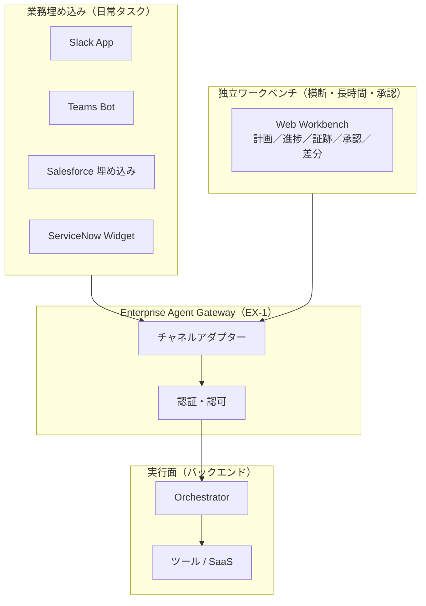

# EX-2 業務埋め込み vs 独立ポータル

## 概要

エージェントのUI提供形態は「業務埋め込み」と「独立ポータル（ワークベンチ）」の二通りに整理できる。日常業務で繰り返し発生する短い問い合わせや軽量操作は、Slack/Teams/Salesforce/ServiceNow の中に直接埋め込む。一方、複数システムにまたがる横断業務・長時間タスク・承認フローを含む業務には、計画・進捗・証跡・承認・差分を一画面で確認できる独立ワークベンチを用意する。

## 設計

業務埋め込みと独立ポータルはどちらかを選ぶのではなく、タスクの性質に応じて使い分ける。両者は同一の [EX-1 Enterprise Agent Gateway](ex1-enterprise-agent-gateway.md) を経由し、同一のバックエンドランタイムを利用する。UIの差はチャネルアダプターが吸収する（[EX-3](ex3-channel-agnostic-frontdoor.md)）。

業務埋め込みでは、エージェントはユーザーが既に開いているコンテキスト（商談ページ、チケット画面など）を引き継いで動作する。独立ワークベンチでは、長時間実行の進捗ストリーミング、承認アクション、出力の差分ビューを一画面で提供する。

## 解決する企業課題

エージェントを「別のポータルを開いて使う」ものとして提供すると、日常業務の中で使われなくなる。ツール切り替え摩擦（コンテキストスイッチ）が非採用の直接原因になる。一方で独立ポータルを一切持たないと、横断業務で複数画面の往復が発生し、承認証跡の管理も困難になる。この二通りを使い分けることで、採用率と統制の両立を実現する。

## 向き／不向き

| 向き | 不向き |
|---|---|
| Slack/Teams/Salesforce が日常の中心ツールである組織 | 業務ツールが乱立し統一されていない組織（埋め込み先が多すぎる） |
| 横断・長時間・承認フローを含む業務が多い | 全タスクが短時間・単一システム完結（独立ポータル不要） |
| 段階的な UI 拡張（まず埋め込み、後でワークベンチ追加）を取る場合 | PoC でUI形態を固定化したくない段階 |

## 要素技術・既存システム連携

- **Slack App**：Slack Bolt SDK、Block Kit（UI コンポーネント）
- **Microsoft Teams Bot**：Bot Framework、Adaptive Cards
- **Salesforce 埋め込み**：Lightning Web Components（LWC）、Embedded Service
- **ServiceNow 拡張**：Service Portal Widget、UI Actions
- **独立ワークベンチ**：React/Vue 製 SPA、Server-Sent Events（SSE）によるストリーミング進捗
- **チャネルアダプター**：各プラットフォームのイベント形式を正規化し Gateway へ転送

## 落とし穴／選定の勘所

!!! warning "独立ポータル一本化の失敗"
    独立ポータルだけを作り「そこを開けば何でもできる」とするのは、日常業務からエージェントが切り離される最大の要因である。日常タスクは業務ツールへの埋め込みを優先し、独立ポータルは横断・長時間・承認用途に限定する。

- 埋め込みUIと独立ポータルで異なるエンドポイントを呼ぶ実装にすると、権限・履歴・監査が乖離する。両者は同一の Gateway を経由することを原則とする。
- 埋め込みUI のアクセストークンをローカルに保存するのは危険である。トークンの取り回しは [ID-5 JIT Scoped Credentials](../id-identity/id5-jit-scoped-credentials.md) の原則に従い、呼び出しごとに短命トークンを取得する。
- 承認フローをチャットのみで実装すると、承認証跡の再現が困難になる。独立ワークベンチで承認アクションと証跡を一体管理する。

## 関連パターン

- [EX-1 Enterprise Agent Gateway](ex1-enterprise-agent-gateway.md) — 全チャネルが通る統一入口
- [EX-3 チャネル非依存フロントドア](ex3-channel-agnostic-frontdoor.md) — チャネル差の吸収とセッション統一
- [RT-4 Human Approval Chain](../rt-runtime/rt4-human-approval-chain.md) — 独立ワークベンチでの承認統合
