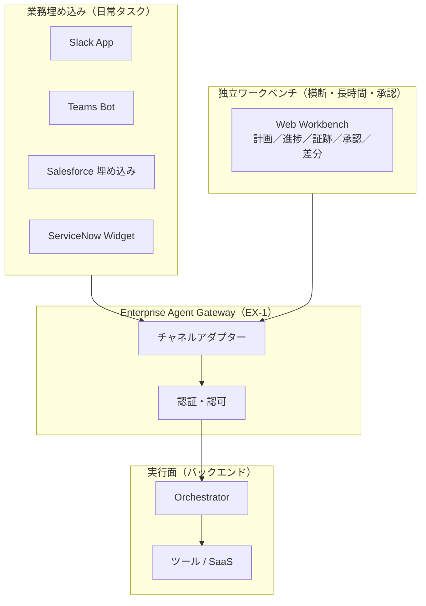

# EX-2 業務埋め込み＋独立ワークベンチ（チャネル配置）

## 概要

「Slack で質問したら答えてくれる」のと「ブラウザで専用画面を開いて長い調査をする」のは、同じエージェントでも求められる体験がまったく異なる。このパターンは、日常の短い問い合わせは業務アプリ（Slack・Teams・Salesforce 画面）に埋め込み、横断調査・承認フロー・長時間タスクは計画・根拠・承認を一画面で確認できる独立ワークベンチで提供する——と使い分ける考え方である。ポータルだけ作って誰も開かない失敗を避け、仕事のある場所にエージェントを届ける。

## 解決する企業課題

エージェントを「別のポータルを開いて使う」ものとして提供すると、日常業務の流れが断ち切られて使われなくなる。ツール切り替えの摩擦（コンテキストスイッチ）は、AI の機能品質に関わらず採用率を下げる最大の要因だ。現場担当者は Slack や Salesforce の画面を離れることなく業務を完結したい——この動線に沿ってエージェントを置かなければ、展開数のわりに利用率が低い「名前だけの AI」になってしまう。

一方、独立ポータルをまったく持たないと、横断業務で複数画面を往復することになり、承認証跡の管理も難しくなる。この二通りを使い分けることで、採用率と統制を両立させる。

!!! tip "最小成立条件（MVP）"
    最も利用者が多い業務ツール（例：Slack）への埋め込み1つと、EX-1 Gateway 経由の共通バックエンドを用意する。独立ワークベンチは承認フローが必要になった段階で追加する。

## 価値仮説

業務コンテキストの切り替えコストを最小化し、従業員効率を向上させる。業務画面に埋め込むことでエージェント利用のフリクションが下がり、定着率・継続利用率が高まる。

## 解決策と設計

業務埋め込みと独立ポータルはどちらかを選ぶのではなく、タスクの性質に応じて使い分ける。両者は同一の [EX-1 Enterprise Agent Gateway](ex1-enterprise-agent-gateway.md) を経由し、同一のバックエンドランタイムを利用する。UI の差はチャネルアダプターが吸収する（[EX-3](ex3-channel-agnostic-frontdoor.md)）。



業務埋め込みでは、エージェントはユーザーが既に開いているコンテキスト（商談ページ、チケット画面など）を引き継いで動作する。独立ワークベンチでは、長時間実行の進捗ストリーミング・承認アクション・出力の差分ビューを一画面にまとめて提供する。

## 向き／不向き

| 向き | 不向き |
|---|---|
| Slack/Teams/Salesforce が日常の中心ツールである組織 | 業務ツールが乱立し統一されていない組織（埋め込み先が多すぎる） |
| 横断・長時間・承認フローを含む業務が多い | 全タスクが短時間・単一システム完結（独立ポータル不要） |
| 段階的な UI 拡張（まず埋め込み、後でワークベンチ追加）を取る場合 | PoC でUI形態を固定化したくない段階 |

## 要素技術・既存システム連携

- **Slack App**：Slack Bolt SDK、Block Kit（UI コンポーネント）
- **Microsoft Teams Bot**：Bot Framework、Adaptive Cards
- **Salesforce 埋め込み**：Lightning Web Components（LWC）、Embedded Service
- **ServiceNow 拡張**：Service Portal Widget、UI Actions
- **独立ワークベンチ**：React/Vue 製 SPA、Server-Sent Events（SSE）によるストリーミング進捗
- **チャネルアダプター**：各プラットフォームのイベント形式を正規化し Gateway へ転送

## 落とし穴／選定の勘所

!!! warning "独立ポータル一本化の失敗"
    独立ポータルだけを作り「そこを開けば何でもできる」とするのは、日常業務からエージェントが切り離される最大の要因になる。日常タスクは業務ツールへの埋め込みを優先し、独立ポータルは横断・長時間・承認用途に絞る。

- 埋め込み UI と独立ポータルで異なるエンドポイントを呼ぶ実装は避けたい。権限・履歴・監査が乖離するためだ。両者は同一の Gateway を経由させることを原則とする。
- 埋め込み UI のアクセストークンをローカルに保存するのは危険だ。[ID-5 JIT Scoped Credentials](../id-identity/id5-jit-scoped-credentials.md) の原則に従い、呼び出しごとに短命トークンを取得する。
- 承認フローをチャットのみで実装すると、承認証跡の再現が困難になる。独立ワークベンチで承認アクションと証跡を一体管理することを勧める。

## Interfaces

以下はこのパターンを実装する際の主要インターフェイスである。コーディングエージェントはこの定義からスタブコードを生成できる。

```yaml
interfaces:
  - name: Embedded UI (Business Tool)
    description: "Lightweight widget injected into Slack, Teams, or Salesforce that inherits the current business context and submits requests to EX-1 Gateway."
    input:
      request: object
    output:
      response: object
    errors:
      - code: GENERAL_ERROR
        description: "Embedded UI (Business Tool) の処理中にエラーが発生"
    protocol: "REST / gRPC"
    implementation_hints:
      - "詳細は本文の「解決策と設計」節を参照"
  - name: Standalone Workbench
    description: "React/Vue SPA providing streaming progress, approval actions, and diff view for long-running or cross-system tasks."
    input:
      request: object
    output:
      response: object
    errors:
      - code: GENERAL_ERROR
        description: "Standalone Workbench の処理中にエラーが発生"
    protocol: "REST / gRPC"
    implementation_hints:
      - "詳細は本文の「解決策と設計」節を参照"
  - name: Channel Adapter
    description: "Normalizes each platform's event format and forwards to EX-1 Gateway; absorbs UI differences so the backend remains channel-agnostic."
    input:
      request: object
    output:
      response: object
    errors:
      - code: GENERAL_ERROR
        description: "Channel Adapter の処理中にエラーが発生"
    protocol: "REST / gRPC"
    implementation_hints:
      - "詳細は本文の「解決策と設計」節を参照"
```

## 関連パターン

- [EX-1 Enterprise Agent Gateway](ex1-enterprise-agent-gateway.md) — 補完：全チャネルが通る統一入口であり、埋め込みとポータルの共通基盤
- [EX-3 チャネル非依存フロントドア](ex3-channel-agnostic-frontdoor.md) — 補完：埋め込みとポータルのチャネル差を吸収してセッションを統一する
- [RT-4 Human Approval Chain](../rt-runtime/rt4-human-approval-chain.md) — 補完：独立ワークベンチでの承認フロー統合に組み合わせる
