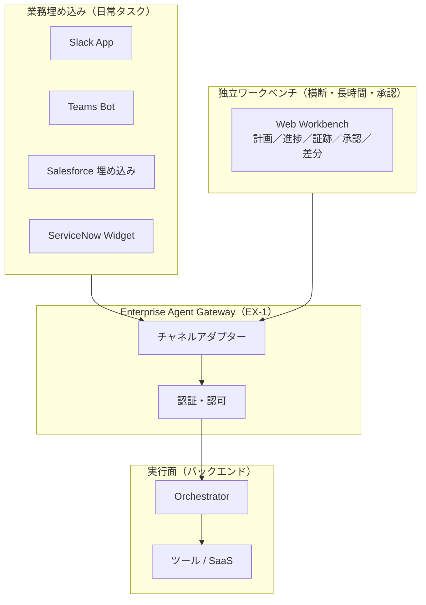

# EX-2 業務埋め込み vs 独立ポータル

## 概要

「Slack で質問したら答えてくれる」のと「ブラウザで専用画面を開いて長い調査をする」のは、同じエージェントでも求められる体験がまったく異なる。このパターンは、日常の短い問い合わせは業務アプリ（Slack・Teams・Salesforce 画面）に埋め込み、横断調査・承認フロー・長時間タスクは計画・根拠・承認を一画面で確認できる独立ワークベンチで提供する——と使い分ける考え方である。ポータルだけ作って誰も開かない失敗を避け、仕事のある場所にエージェントを届ける。

## 解決する企業課題

エージェントを「別のポータルを開いて使う」ものとして提供すると、日常業務の流れが断ち切られて使われなくなる。ツール切り替え摩擦（コンテキストスイッチ）は、AI の機能品質に関わらず採用率の最大の阻害要因になる。現場担当者は Slack や Salesforce の画面を離れることなく業務を完結したい——この動線に沿ってエージェントを配置しなければ、展開数に反して利用率が低い「名前だけのAI」になる。一方で、独立ポータルを一切持たないと、横断業務で複数画面の往復が発生し、承認証跡の管理も困難になる。この二通りを使い分けることで、採用率と統制の両立を実現する。

## 解決策と設計

業務埋め込みと独立ポータルはどちらかを選ぶのではなく、タスクの性質に応じて使い分ける。両者は同一の [EX-1 Enterprise Agent Gateway](ex1-enterprise-agent-gateway.md) を経由し、同一のバックエンドランタイムを利用する。UIの差はチャネルアダプターが吸収する（[EX-3](ex3-channel-agnostic-frontdoor.md)）。

業務埋め込みでは、エージェントはユーザーが既に開いているコンテキスト（商談ページ、チケット画面など）を引き継いで動作する。独立ワークベンチでは、長時間実行の進捗ストリーミング、承認アクション、出力の差分ビューを一画面で提供する。

## 向き／不向き

| 向き | 不向き |
|---|---|
| Slack/Teams/Salesforce が日常の中心ツールである組織 | 業務ツールが乱立し統一されていない組織（埋め込み先が多すぎる） |
| 横断・長時間・承認フローを含む業務が多い | 全タスクが短時間・単一システム完結（独立ポータル不要） |
| 段階的な UI 拡張（まず埋め込み、後でワークベンチ追加）を取る場合 | PoC でUI形態を固定化したくない段階 |

## 要素技術・既存システム連携

- **Slack App**：Slack Bolt SDK、Block Kit（UI コンポーネント）
- **Microsoft Teams Bot**：Bot Framework、Adaptive Cards
- **Salesforce 埋め込み**：Lightning Web Components（LWC）、Embedded Service
- **ServiceNow 拡張**：Service Portal Widget、UI Actions
- **独立ワークベンチ**：React/Vue 製 SPA、Server-Sent Events（SSE）によるストリーミング進捗
- **チャネルアダプター**：各プラットフォームのイベント形式を正規化し Gateway へ転送

## 落とし穴／選定の勘所

!!! warning "独立ポータル一本化の失敗"
    独立ポータルだけを作り「そこを開けば何でもできる」とするのは、日常業務からエージェントが切り離される最大の要因である。日常タスクは業務ツールへの埋め込みを優先し、独立ポータルは横断・長時間・承認用途に限定する。

- 埋め込みUIと独立ポータルで異なるエンドポイントを呼ぶ実装にすると、権限・履歴・監査が乖離する。両者は同一の Gateway を経由することを原則とする。
- 埋め込みUI のアクセストークンをローカルに保存するのは危険である。トークンの取り回しは [ID-5 JIT Scoped Credentials](../id-identity/id5-jit-scoped-credentials.md) の原則に従い、呼び出しごとに短命トークンを取得する。
- 承認フローをチャットのみで実装すると、承認証跡の再現が困難になる。独立ワークベンチで承認アクションと証跡を一体管理する。

## 関連パターン

- [EX-1 Enterprise Agent Gateway](ex1-enterprise-agent-gateway.md) — 補完：全チャネルが通る統一入口であり、埋め込みとポータルの共通基盤
- [EX-3 チャネル非依存フロントドア](ex3-channel-agnostic-frontdoor.md) — 補完：埋め込みとポータルのチャネル差を吸収してセッションを統一する
- [RT-4 Human Approval Chain](../rt-runtime/rt4-human-approval-chain.md) — 補完：独立ワークベンチでの承認フロー統合に組み合わせる
