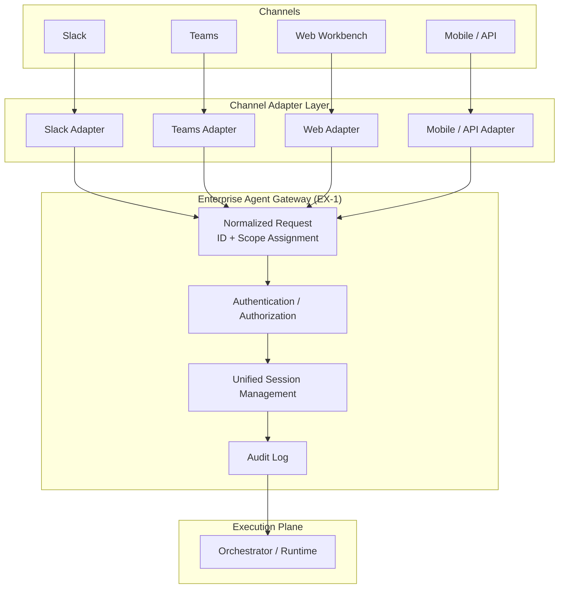

# EX-3 Channel-Agnostic Front Door

## Overview

Starting a conversation in Slack and continuing it on the web — with context, permissions, and progress all carried over seamlessly. Channel adapters absorb the input differences of Slack, Teams, web, and mobile, and beyond that point every channel goes through exactly the same execution path, permission checks, and audit logs. There is no need to build a separate agent for each channel, and inconsistencies like "works in Slack but not on the web" cannot occur.

## Business Problem

When agents are implemented separately per channel, permission-decision logic, session history, and audit logs become fragmented. Operations permitted in one channel can pass through undefined and unchecked in another channel — creating security gaps. History is isolated per channel, so "starting work in Slack and continuing on the web" type of business continuity is impossible, and users must re-explain the same context repeatedly. The cost of re-implementing permissions and audit design every time a new channel is added is also non-trivial. A channel-agnostic structure prevents all of these structurally and reduces the marginal cost of adding new channels.

!!! tip "Minimum Viable Implementation"
    A single channel adapter normalizes input, assigns a unified session ID and user identity, and forwards to the Gateway. The validation criterion is that adding a second channel requires no changes to the back-end.

## Value Hypothesis

Employees can reach agents through their familiar channels (Slack, Teams, email, etc.), lowering adoption barriers and accelerating retention. Zero learning cost for new UIs contributes to realizing quick wins in early deployment phases.

## Solution and Design

Separate channel adapters as a layer dedicated to input normalization; do not put business logic or permission decisions inside adapters. Adapters normalize input, assign session ID and user identity, and forward to the [EX-1 Enterprise Agent Gateway](ex1-enterprise-agent-gateway.md). The back-end from the Gateway onward has no awareness of channels. Sessions can continue across channels (e.g., work started in Slack can be continued in the web workbench).



The normalization performed by channel adapters covers three things: (1) converting input format, (2) converting channel-specific authentication tokens to a unified identity, and (3) carrying over or issuing a new session ID.

## Applicability

| Good Fit | Poor Fit |
|---|---|
| Organizations that progressively add more channels | Environments that permanently use only a single channel |
| Workflows that span channels (e.g., starting in Slack and continuing on the web) | Independent workflows where session sharing across channels is unnecessary |
| Wanting centralized management of permissions, history, and auditing | Organizations where each channel is managed as a completely independent separate service |

## Technology and Integration

- **Channel adapters**: Slack Bolt SDK, Bot Framework (Teams), REST/gRPC adapters
- **Unified session management**: Redis session store, JWT session claims
- **Identity integration**: OIDC federation, convert channel-specific tokens to a unified identity with [ID-2 OBO Delegation](../id-identity/id2-identity-federation-obo.md)
- **Unified audit log**: Cross-channel operation tracking with [OB-2 Unified Audit & Lineage](../ob-observability/ob2-unified-audit-lineage.md)

## Pitfalls and Selection Criteria

!!! warning "Identity Handoff Breakdown Across Channels"
    A common accident is that when crossing channels, authentication is not re-executed and the previous channel's session is carried over to a different user's context. Adapters must always convert channel-specific tokens to a unified identity, and session handoffs must include re-authentication or signature verification.

!!! warning "Do Not Relax Permissions to Normalize Channel Differences"
    When one channel restricts OAuth scopes, "widening to match other channels" is the wrong fix. Align to the most-restricted side, or separate the use cases.

- Embedding business logic in channel adapters causes channel-specific behavioral differences to recur. Adapters handle only input normalization; delegate all decisions to the Gateway and beyond.
- Token storage risk is high in mobile/API channels. Design using [ID-5 JIT Scoped Credentials](../id-identity/id5-jit-scoped-credentials.md) to obtain short-lived tokens per call.

## Interfaces

The following are the key interfaces for implementing this pattern. Coding agents can generate stub code from these definitions.

```yaml
interfaces:
  - name: Channel Adapter
    description: "Converts channel-specific authentication tokens to a unified identity, normalizes input format, and forwards with a unified session ID to EX-1 Gateway."
    input:
      request: object
    output:
      response: object
    errors:
      - code: GENERAL_ERROR
        description: "Error occurred during Channel Adapter processing"
    protocol: "REST / gRPC"
    implementation_hints:
      - "See the Solution and Design section for details"
  - name: Unified Session Store
    description: "Redis-backed session store that enables cross-channel session continuity; session handoff requires re-authentication or signature verification."
    input:
      request: object
    output:
      response: object
    errors:
      - code: GENERAL_ERROR
        description: "Error occurred during Unified Session Store processing"
    protocol: "REST / gRPC"
    implementation_hints:
      - "See the Solution and Design section for details"
  - name: Unified Audit Logger
    description: "Ensures cross-channel operations appear in a single audit trail (OB-2), preventing session fragmentation from hiding activity."
    input:
      request: object
    output:
      response: object
    errors:
      - code: GENERAL_ERROR
        description: "Error occurred during Unified Audit Logger processing"
    protocol: "REST / gRPC"
    implementation_hints:
      - "See the Solution and Design section for details"
```

## Related Patterns

- [EX-1 Enterprise Agent Gateway](ex1-enterprise-agent-gateway.md) — Complementary: the unified entry point to which adapters forward, and the shared control point for all channels
- [EX-2 Business-Embedded + Independent Workbench (Channel Placement)](ex2-embedded-vs-portal.md) — Complementary: determines the UI delivery form for channels, linked with adapter design
- [ID-2 Identity Federation & OBO](../id-identity/id2-identity-federation-obo.md) — Complementary: the mechanism for converting channel-specific tokens to a unified identity
- [OB-2 Unified Audit & Lineage](../ob-observability/ob2-unified-audit-lineage.md) — Complementary: unifies audit trails spanning across channels
