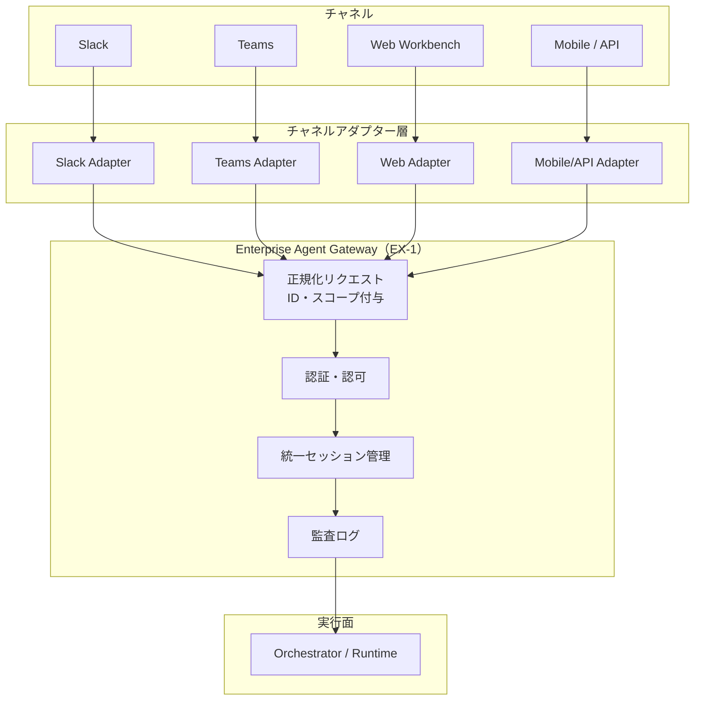

# EX-3 チャネル非依存フロントドア

## 概要

Slack/Teams/Web ワークベンチ/モバイル/API など複数チャネルから同一エージェントを呼び出せる構造。チャネルごとの入力形式・認証方式の差はチャネルアダプターが正規化する。アダプターより後段では ID・スコープ・セッション履歴・監査ログが統一されており、チャネルをまたいでも一貫した動作と権限が保証される。

## 設計

チャネルアダプターは入力を正規化してセッションIDと本人IDを付与し、[EX-1 Enterprise Agent Gateway](ex1-enterprise-agent-gateway.md) へ転送する。Gateway 以降のバックエンドはチャネルを意識しない。セッションはチャネルをまたいで継続できる（例：Slack で開始した作業を Web ワークベンチで続ける）。

チャネルアダプターが担う正規化の内容は、(1) 入力フォーマットの変換、(2) チャネル固有の認証トークンから統合 ID への変換、(3) セッション ID の引き継ぎまたは新規発行の3点である。

## 解決する企業課題

チャネルごとにエージェントを別々に実装すると、権限判定ロジック・セッション履歴・監査ログが分断する。あるチャネルでは許可されている操作が別チャネルでは未定義で素通しになる、といったセキュリティギャップが生じる。また履歴がチャネルごとに孤立するため、業務文脈の継続も困難になる。チャネル非依存構造はこれらを構造的に防ぐ。

## 向き／不向き

| 向き | 不向き |
|---|---|
| 複数チャネルを段階的に追加していく組織 | 恒久的に単一チャネルのみ使う環境 |
| Slack で開始した業務を Web で続けるなど跨ぎが発生する | チャネル間でセッションを共有する必要がない独立業務 |
| 権限・履歴・監査を一元管理したい | 各チャネルが完全に独立した別サービスとして管理される組織 |

## 要素技術・既存システム連携

- **チャネルアダプター**：Slack Bolt SDK、Bot Framework（Teams）、REST/gRPC アダプター
- **統一セッション管理**：Redis セッションストア、JWT セッションクレーム
- **ID統合**：OIDC フェデレーション、[ID-2 OBO 委譲](../id-identity/id2-identity-federation-obo.md)でチャネル固有トークンを統合 ID に変換
- **監査ログ統一**：[OB-2 統一監査・系譜](../ob-observability/ob2-unified-audit-lineage.md) でチャネルをまたいだ操作追跡

## 落とし穴／選定の勘所

!!! warning "チャネル間の ID ハンドオフ崩壊"
    チャネルをまたぐときに認証が再実行されず、前チャネルのセッションが別ユーザーのコンテキストに引き継がれる事故がある。アダプターは必ずチャネル固有トークンを統合 ID に変換し、セッション引き継ぎ時は再認証または署名検証を行う。

!!! warning "チャネル差を埋めるために権限を緩和しない"
    あるチャネルが OAuth スコープを制限している場合に「他チャネルに合わせて広げる」対処は誤りである。スコープは最も制限された側に合わせるか、用途を分離する。

- チャネルアダプターにビジネスロジックを書き込むと、チャネルごとの動作差が再発する。アダプターは入力の正規化のみを担い、判断は Gateway 以降に任せる。
- モバイル/API チャネルではトークンの保管リスクが高い。[ID-5 JIT Scoped Credentials](../id-identity/id5-jit-scoped-credentials.md) で短命トークンを都度取得する設計にする。

## 関連パターン

- [EX-1 Enterprise Agent Gateway](ex1-enterprise-agent-gateway.md) — アダプターが転送する統一入口
- [EX-2 業務埋め込み vs 独立ポータル](ex2-embedded-vs-portal.md) — チャネルのUI提供形態の使い分け
- [ID-2 Identity Federation & OBO](../id-identity/id2-identity-federation-obo.md) — チャネル固有トークンを統合 ID へ変換
- [OB-2 統一監査・系譜](../ob-observability/ob2-unified-audit-lineage.md) — チャネルをまたいだ監査証跡の統一
