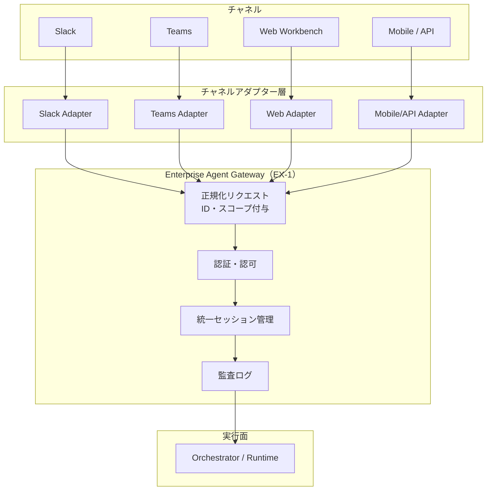

# EX-3 チャネル非依存フロントドア

## 概要

Slack で始めた会話を Web で続けても、途中経過も権限もそのまま引き継がれる——そんな体験を実現する設計である。チャネルアダプタが Slack・Teams・Web・モバイルの入力差を吸収し、その先はどのチャネルでもまったく同じ実行パス・権限チェック・監査ログを通る。チャネルごとにエージェントを別々に作る必要がなくなり、「Slack では動くが Web では動かない」といった不整合が起きない。

## 解決する企業課題

チャネルごとにエージェントを別々に実装すると、権限判定ロジック・セッション履歴・監査ログがバラバラになる。あるチャネルでは許可されている操作が別チャネルでは未定義のまま素通しになる、といったセキュリティギャップも生じやすい。履歴がチャネルごとに孤立するため、「Slack で開始した作業を Web で続ける」ような業務継続が実現できず、ユーザーは同じ文脈を何度も説明し直すことになる。チャネルが増えるたびに権限・監査の設計を再実装するコストも積み重なっていく。チャネル非依存構造はこれらを構造的に防ぎ、チャネルを増やすことの限界コストを下げる。

!!! tip "最小成立条件（MVP）"
    1つのチャネルアダプターが入力を正規化し、統合セッション ID と本人 ID を付与して Gateway へ転送する構成。2チャネル目の追加時にバックエンドを変更せず済むことが検証基準である。

## 価値仮説

従業員が使い慣れたチャネル（Slack・Teams・メール等）からエージェントに到達できるため、採用障壁を下げ定着を加速する。新規UIの学習コストがゼロになり、導入初期のクイックウィン実現に寄与する。

## 解決策と設計

チャネルアダプターを入力の正規化専用レイヤーとして分離し、ビジネスロジックや権限判定をアダプター内に書かない。アダプターは入力を正規化してセッションIDと本人IDを付与し、[EX-1 Enterprise Agent Gateway](ex1-enterprise-agent-gateway.md) へ転送する。Gateway 以降のバックエンドはチャネルを意識しない。セッションはチャネルをまたいで継続できる（例：Slack で開始した作業を Web ワークベンチで続ける）。



チャネルアダプターが担う正規化は3点ある。入力フォーマットの変換、チャネル固有の認証トークンから統合 ID への変換、そしてセッション ID の引き継ぎまたは新規発行だ。

## 向き／不向き

| 向き | 不向き |
|---|---|
| 複数チャネルを段階的に追加していく組織 | 恒久的に単一チャネルのみ使う環境 |
| Slack で開始した業務を Web で続けるなど跨ぎが発生する | チャネル間でセッションを共有する必要がない独立業務 |
| 権限・履歴・監査を一元管理したい | 各チャネルが完全に独立した別サービスとして管理される組織 |

## 要素技術・既存システム連携

- **チャネルアダプター**：Slack Bolt SDK、Bot Framework（Teams）、REST/gRPC アダプター
- **統一セッション管理**：Redis セッションストア、JWT セッションクレーム
- **ID統合**：OIDC フェデレーション、[ID-2 OBO 委譲](../id-identity/id2-identity-federation-obo.md)でチャネル固有トークンを統合 ID に変換
- **監査ログ統一**：[OB-2 統一監査・系譜](../ob-observability/ob2-unified-audit-lineage.md) でチャネルをまたいだ操作追跡

## 落とし穴／選定の勘所

!!! warning "チャネル間の ID ハンドオフ崩壊"
    チャネルをまたぐときに認証が再実行されず、前チャネルのセッションが別ユーザーのコンテキストに引き継がれる事故が起きやすい。アダプターはチャネル固有トークンを必ず統合 ID に変換し、セッション引き継ぎ時は再認証または署名検証を実施する。

!!! warning "チャネル差を埋めるために権限を緩和しない"
    あるチャネルが OAuth スコープを制限している場合に「他チャネルに合わせて広げる」対処は誤りだ。スコープは最も制限された側に合わせるか、用途自体を分離する。

- チャネルアダプターにビジネスロジックを書き込むと、チャネルごとの動作差が再発する。アダプターは入力の正規化だけを担い、判断は Gateway 以降に委ねること。
- モバイル/API チャネルではトークンの保管リスクが高い。[ID-5 JIT Scoped Credentials](../id-identity/id5-jit-scoped-credentials.md) を用いて短命トークンを都度取得する設計にする。

## Interfaces

以下はこのパターンを実装する際の主要インターフェイスである。コーディングエージェントはこの定義からスタブコードを生成できる。

```yaml
interfaces:
  - name: Channel Adapter
    description: "Converts channel-specific authentication tokens to a unified identity, normalizes input format, and forwards with a unified session ID to EX-1 Gateway."
    input:
      request: object
    output:
      response: object
    errors:
      - code: GENERAL_ERROR
        description: "Channel Adapter の処理中にエラーが発生"
    protocol: "REST / gRPC"
    implementation_hints:
      - "詳細は本文の「解決策と設計」節を参照"
  - name: Unified Session Store
    description: "Redis-backed session store that enables cross-channel session continuity; session handoff requires re-authentication or signature verification."
    input:
      request: object
    output:
      response: object
    errors:
      - code: GENERAL_ERROR
        description: "Unified Session Store の処理中にエラーが発生"
    protocol: "REST / gRPC"
    implementation_hints:
      - "詳細は本文の「解決策と設計」節を参照"
  - name: Unified Audit Logger
    description: "Ensures cross-channel operations appear in a single audit trail (OB-2), preventing session fragmentation from hiding activity."
    input:
      request: object
    output:
      response: object
    errors:
      - code: GENERAL_ERROR
        description: "Unified Audit Logger の処理中にエラーが発生"
    protocol: "REST / gRPC"
    implementation_hints:
      - "詳細は本文の「解決策と設計」節を参照"
```

## 関連パターン

- [EX-1 Enterprise Agent Gateway](ex1-enterprise-agent-gateway.md) — 補完：アダプターが転送する統一入口であり、全チャネルの共通統制点
- [EX-2 業務埋め込み＋独立ワークベンチ（チャネル配置）](ex2-embedded-vs-portal.md) — 補完：チャネルのUI提供形態を決定するパターンで、アダプター設計と連動する
- [ID-2 Identity Federation & OBO](../id-identity/id2-identity-federation-obo.md) — 補完：チャネル固有トークンを統合 ID へ変換する手段
- [OB-2 統一監査・系譜](../ob-observability/ob2-unified-audit-lineage.md) — 補完：チャネルをまたいだ監査証跡を統一する
