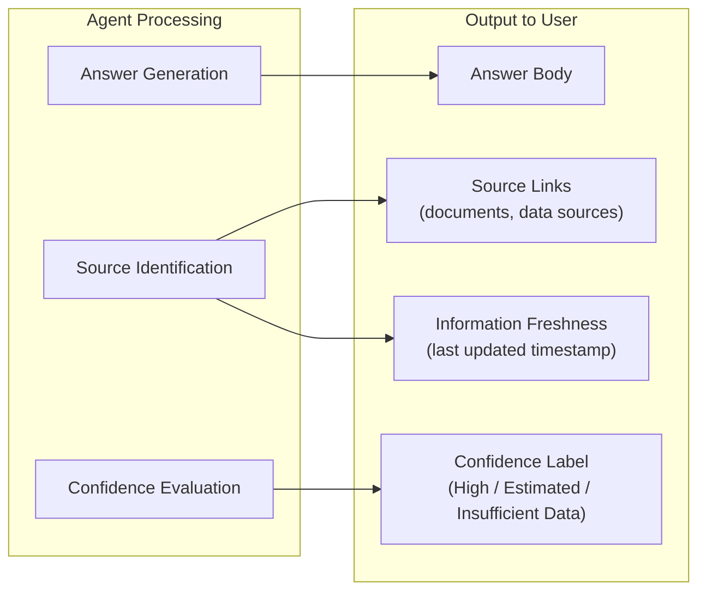

# EX-4 Trust and Value UX (Experience Design for Retention)

## Overview

By adding rationale and confidence levels to agent output, designing interactions where humans can easily intervene and correct, and immediately feeding back the time saved, this pattern builds user trust and increases retention rates.

## Business Problem

Even when a technically safe agent is built, usage will not continue if employees feel "I can't trust it" or "I'm not sure it's actually correct." The greatest failure mode of enterprise AI is not a technical obstacle — it is the retention failure of "built but not used." In particular, when agent output is opaque (it's unclear why that answer was given), mistakes are hard to correct, and value is not perceptible, drop-off rates after initial use are high.

## Value Hypothesis

Structurally designing user trust and perceived value increases adoption rates, continued-use rates, and retention. Improving retention rates is a prerequisite for all KPIs measured in GV-10 and increases the overall ROI of the agent investment.

## Solution and Design

Trust and value UX is built on three pillars.

### Pillar 1: Surfacing Rationale and Confidence Levels



- **Explicit sourcing**: Attach links to the documents and data sources that support the answer. Achieved by linking to KM-1 (Access-Controlled RAG) search results.
- **Confidence display**: Indicate confidence level using labels such as "High," "Estimated," or "Insufficient Data," based on data volume and consistency.
- **Information freshness**: Display the last-updated timestamp of referenced data so users can identify answers based on outdated information.

### Pillar 2: Interactions That Make Human Intervention and Correction Easy

- **Staged confirmation**: For high-risk operations (RT-3 Tier 2 and above), present the operation details before execution and ask for modification or approval.
- **Editable output**: Provide a UI where users can edit agent output (email drafts, reports, estimates, etc.) before finalizing.
- **Revocability**: Clearly communicate that cancellation or redo is possible within a certain period after execution (integrated with RT-7 Saga compensation operations).
- **Transparent progress display**: Show in real time what the agent is currently doing and how far it has progressed.

### Pillar 3: Immediate Value Feedback

- **Visualizing time savings**: Display "this task saved an estimated X minutes" on operation completion. Calculated by comparing against historical manual processing time.
- **Cumulative effect dashboard**: Present users with "total time saved through agent use" weekly and monthly.
- **Team comparison**: Show anonymized comparisons of agent utilization and savings within the same department to motivate usage.

## Applicability

| Good Fit | Poor Fit |
|---|---|
| Organization-wide deployment phase where retention is a challenge | PoC stages with only a small number of power users (over-investment) |
| Cases where agent output is used as a basis for business decisions (sales proposals, HR evaluations, etc.) | Fully automated back-end processing where humans never see the results |
| Early deployment stages where building employee trust is necessary | — |

## Technology and Integration

- RAG source tracking (KM-1 integration): Link document IDs and excerpts from search results to answers
- Confidence scoring: Estimate confidence using LLM log probabilities or source consistency checks
- Real-time WebSocket: Stream processing progress display (via EX-1 Gateway)
- Usage metrics collection (OB-1 integration): Record operation completion times for estimating time savings
- A/B testing infrastructure: Quantitatively measure UX improvement effects through GV-7 evaluation pipeline

## Pitfalls and Selection Criteria

!!! warning "Excessive Confidence Displays"
    Displaying "confidence: low" on every answer causes users to stop trusting the agent. Limit confidence displays to cases where "the user might change their decision based on this information," and avoid adding them to obvious facts (such as references to company policies).

!!! warning "Overestimating Time Savings"
    A display showing "saved 30 minutes" that does not match the user's actual experience becomes counterproductive. Set the estimation logic conservatively and maintain accuracy at a level where users feel "yes, about that much."

!!! warning "Over-Engineering the Correction UI"
    Adding sophisticated editing UI to all agent output becomes cost-excessive. Start with a minimal "approve / reject / comment" UI and add rich UI only to outputs where editing is frequent, based on usage data.

## Interfaces

The following are the key interfaces for implementing this pattern. Coding agents can generate stub code from these definitions.

```yaml
interfaces:
  - name: Citation & Confidence Layer
    description: "Attaches source document links, confidence labels (high/estimated/insufficient), and freshness timestamps to agent responses using KM-1 retrieval metadata."
    input:
      request: object
    output:
      response: object
    errors:
      - code: GENERAL_ERROR
        description: "Error occurred during Citation & Confidence Layer processing"
    protocol: "REST / gRPC"
    implementation_hints:
      - "See the Solution and Design section for details"
  - name: Progressive Confirmation UI
    description: "For RT-3 Tier-2+ operations, presents operation details before execution and requests user modification or approval."
    input:
      request: object
    output:
      response: object
    errors:
      - code: GENERAL_ERROR
        description: "Error occurred during Progressive Confirmation UI processing"
    protocol: "REST / gRPC"
    implementation_hints:
      - "See the Solution and Design section for details"
  - name: Value Feedback Dashboard
    description: "Displays estimated time saved per completed task and cumulative weekly/monthly savings, tied to GV-10 measurement data."
    input:
      request: object
    output:
      response: object
    errors:
      - code: GENERAL_ERROR
        description: "Error occurred during Value Feedback Dashboard processing"
    protocol: "REST / gRPC"
    implementation_hints:
      - "See the Solution and Design section for details"
```

## Related Patterns

- [EX-1 Enterprise Agent Gateway](ex1-enterprise-agent-gateway.md) — Include rationale and confidence metadata in Gateway responses
- [EX-2 Business Embedded vs Independent Portal](ex2-embedded-vs-portal.md) — Display value feedback within business context
- [KM-1 Access-Controlled RAG](../km-knowledge/km1-access-controlled-rag.md) — Technical foundation for source tracking
- [RT-3 Risk-Tiered Autonomy](../rt-runtime/rt3-risk-tiered-autonomy.md) — Risk tier determination for staged confirmation
- [RT-4 Human Approval Chain](../rt-runtime/rt4-human-approval-chain.md) — Integration with approval UI
- [GV-10 Three-Layer Value Measurement](../gv-governance/gv10-two-layer-value-measurement.md) — Source of time-savings and value measurement data
- [Adoption & Enablement](../../integration/adoption.md) — Trust-building UX is the technical foundation of the adoption strategy
