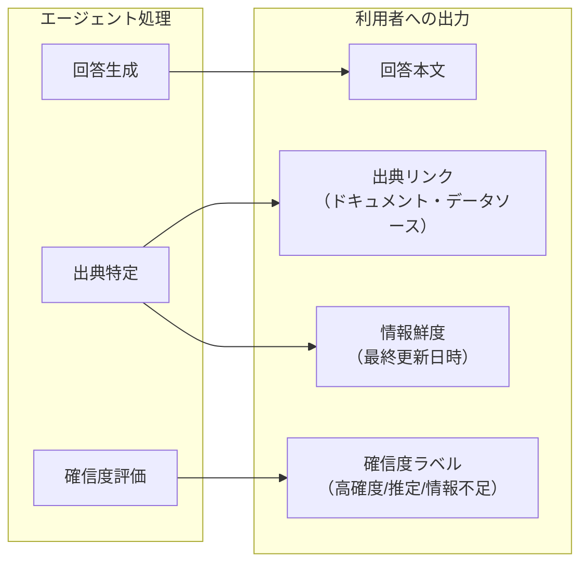

# EX-4 信頼と価値実感のUX（定着を支える体験設計）

## 概要

エージェントの出力に根拠と確信度を付与し、人間が介入・修正しやすいインタラクションを設計し、節約した時間を即座にフィードバックすることで、利用者の信頼を獲得し定着率を高めるパターンである。

## 解決する企業課題

技術的に安全なエージェントを構築しても、従業員が「信頼できない」「本当に正しいか分からない」と感じれば利用は続かない。エンタープライズ AI の最大の失敗要因は技術的障害ではなく「作ったが使われない」という定着の失敗だ。エージェントの出力が不透明で（なぜその回答になったか分からない）、間違いを修正しにくく、価値の実感も得られなければ、初期利用後の離脱率は高くなる。

## 価値仮説

利用者の信頼と価値実感を構造的に設計することで、採用率・継続利用率・定着率を向上させる。定着率の向上はGV-10で計測される全てのKPIの前提条件であり、エージェント投資全体のROIを底上げする。

## 解決策と設計

信頼と価値実感のUXは3つの柱で構成する。

### 柱1：根拠と確信度の提示



- **出典の明示**：回答の根拠となったドキュメント・データソースへのリンクを付与する。KM-1（権限認識RAG）の検索結果と紐づけることで実現する
- **確信度の表示**：情報量と一貫性に基づき「高確度」「推定」「情報不足」等のラベルで確からしさを示す
- **情報の鮮度**：参照データの最終更新日時を表示し、古い情報に基づく回答を利用者が識別できるようにする

### 柱2：人間が介入・修正しやすいインタラクション

- **段階的確認**：高リスク操作（RT-3 の Tier 2以上）は実行前に操作内容を提示し、修正・承認を求める。
- **編集可能な出力**：エージェントの出力（メールドラフト・レポート・見積等）をユーザーが編集してから確定できる UI を提供する。
- **撤回可能性**：実行後も一定期間内は取り消し・やり直しが可能だと明示する（RT-7 Saga の補償操作と連携）。
- **透明な進捗表示**：エージェントが今何をしているか、どのステップまで進んだかをリアルタイムに表示する。

### 柱3：価値の即時フィードバック

- **時間削減の可視化**：操作完了時に「この作業で推定○分を節約しました」を表示する。過去の手動処理時間との比較で算出する。
- **累積効果ダッシュボード**：週次・月次で「エージェント利用による累積節約時間」を利用者に示す。
- **チーム比較**：同部門内のエージェント活用度と節約効果を匿名で比較表示し、利用へのモチベーションを高める。

## 向き／不向き

| 向き | 不向き |
|---|---|
| 全社展開フェーズで定着率が課題になっている場合 | PoC段階でまだ少数のパワーユーザーしかいない場合（過剰投資） |
| エージェント出力を業務判断の根拠に使う場合（営業提案・人事評価等） | バックエンドの完全自動処理で人間が結果を見ない場合 |
| 導入初期で従業員の信頼獲得が必要な場合 | — |

## 要素技術・既存システム連携

- RAG出典トラッキング（KM-1連携）：検索結果のドキュメントIDと抜粋箇所を回答と紐づける
- 確信度スコアリング：LLMのログプロブ（log probabilities）またはソース一貫性チェックで確信度を推定
- リアルタイムWebSocket：処理進捗のストリーミング表示（EX-1 Gateway経由）
- 利用メトリクス収集（OB-1連携）：操作完了時間を記録し、節約時間の推定に利用
- A/Bテスト基盤：UX改善の効果をGV-7評価パイプラインで定量計測

## 落とし穴／選定の勘所

!!! warning "過剰な確信度表示"
    すべての回答に「確信度：低」と表示すると、利用者はエージェントを信頼しなくなる。確信度表示は「利用者が判断を変える可能性がある場面」に限定し、明白な事実（規程の参照結果等）には付与しない設計が望ましい。

!!! warning "時間削減の過大見積もり"
    「30分節約しました」という表示が実感とかけ離れると逆効果になる。推定ロジックは控えめに設定し、利用者が「確かにそのくらい」と感じられる精度を保つ。

!!! warning "修正UIの作り込み過ぎ"
    すべてのエージェント出力に高度な編集 UI を付けるのはコスト過剰だ。まずは「承認/却下/コメント」の最小 UI から始め、利用データを見ながら編集が多い出力にのみリッチ UI を追加する。

## Interfaces

以下はこのパターンを実装する際の主要インターフェイスである。コーディングエージェントはこの定義からスタブコードを生成できる。

```yaml
interfaces:
  - name: Citation & Confidence Layer
    description: "Attaches source document links, confidence labels (high/estimated/insufficient), and freshness timestamps to agent responses using KM-1 retrieval metadata."
    input:
      request: object
    output:
      response: object
    errors:
      - code: GENERAL_ERROR
        description: "Citation & Confidence Layer の処理中にエラーが発生"
    protocol: "REST / gRPC"
    implementation_hints:
      - "詳細は本文の「解決策と設計」節を参照"
  - name: Progressive Confirmation UI
    description: "For RT-3 Tier-2+ operations, presents operation details before execution and requests user modification or approval."
    input:
      request: object
    output:
      response: object
    errors:
      - code: GENERAL_ERROR
        description: "Progressive Confirmation UI の処理中にエラーが発生"
    protocol: "REST / gRPC"
    implementation_hints:
      - "詳細は本文の「解決策と設計」節を参照"
  - name: Value Feedback Dashboard
    description: "Displays estimated time saved per completed task and cumulative weekly/monthly savings, tied to GV-10 measurement data."
    input:
      request: object
    output:
      response: object
    errors:
      - code: GENERAL_ERROR
        description: "Value Feedback Dashboard の処理中にエラーが発生"
    protocol: "REST / gRPC"
    implementation_hints:
      - "詳細は本文の「解決策と設計」節を参照"
```

## 関連パターン

- [EX-1 Enterprise Agent Gateway](ex1-enterprise-agent-gateway.md) — 根拠・確信度メタデータをGatewayレスポンスに含める
- [EX-2 業務埋め込み vs 独立ポータル](ex2-embedded-vs-portal.md) — 業務コンテキスト内で価値フィードバックを表示
- [KM-1 Access-Controlled RAG](../km-knowledge/km1-access-controlled-rag.md) — 出典トラッキングの技術基盤
- [RT-3 Risk-Tiered Autonomy](../rt-runtime/rt3-risk-tiered-autonomy.md) — 段階的確認のリスクティア判定
- [RT-4 Human Approval Chain](../rt-runtime/rt4-human-approval-chain.md) — 承認UIとの統合
- [GV-10 Three-Layer Value Measurement](../gv-governance/gv10-two-layer-value-measurement.md) — 時間削減・価値計測データの源泉
- [定着・アダプション](../../integration/adoption.md) — 信頼獲得UXは定着戦略の技術的基盤
