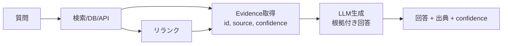

# F-1 Evidence-First Answer（根拠優先／RAGグラウンディング）

## 概要

回答より先に根拠取得を強制し、回答に出典・confidenceを紐づける。

## 設計

まず検索/DB/API/ドキュメントからevidenceを取得する。最終回答に evidence id・source・confidenceを付ける。引用必須化・ハイブリッド検索・リランクで検索品質を独立改善する。

回答生成時にevidenceの引用を必須化することで、LLMが内部知識のみで回答するハルシネーションを構造的に抑制する。検索品質はLLMとは独立に改善できるため、回答品質の改善ループが明確になる。

## 解決する課題

以下のエージェント特性に応える。

- ハルシネーション（根拠不明な断定）
- 古い記憶の利用
- 事実性の担保

## ユースケース

- 社内検索・ナレッジベース
- 法務・コンプライアンス調査
- 技術調査
- 顧客サポート
- 経営レポート

## 向き

事実性・鮮度が重要な用途に適する。回答の根拠を利用者が検証できることが求められる場面で効果が高い。

## 不向き

外部知識が不要な純推論・変換には過剰である。創作・ブレストなど正解が一意に定まらない用途にも不向きである。

## 要素技術

- **検索**：RAG、hybrid search（BM25＋ベクトル）
- **精度向上**：reranker
- **知識構造**：knowledge graph
- **出典管理**：citation store
- **効率化**：context compression

## 関連パターン

- [F-3 Verifier Agent](f3-verifier-agent.md) — 回答の事実性を独立に検証する
- [E-2 Context Pack](../e-memory/e2-context-pack.md) — 検索結果をコンテキストパックとして構成する
- [F-2 Guardrail Sidecar](f2-guardrail-sidecar.md) — 出力の安全検査
- [B-4 Agent Ensemble & Debate](../b-composition/b4-ensemble-debate.md) — 複数の回答を比較し品質を高める
