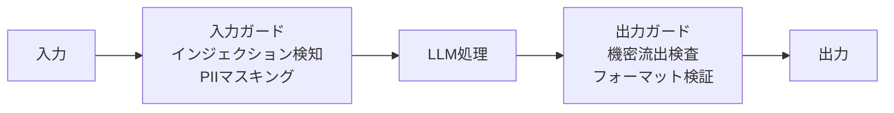

# F-2 Guardrail Sidecar（入出力ガードレール）

## 概要

入出力の安全検査（PII漏洩、毒性、ジェイルブレイク、トピック逸脱、機密語）を本体から独立した層として配置する。

## 設計

入力ガード（インジェクション検知・PIIマスキング・ポリシー違反検知）と出力ガード（機密流出・ハルシネーション疑い・フォーマット違反）の二段で構成する。サイドカー/プロキシ化で複数エージェント横断再利用・一元管理する。

## 解決する課題

- 自然言語入力の広い攻撃面
- 機密漏洩の下流流出
- コンプラ要件の集中管理

## ユースケース

- 規制業種
- 外部ユーザー向け対話システム

## 向き

外部に開かれたエージェント全般に適する。

## 不向き

レイテンシ予算が極端に厳しい用途では軽量ルールに絞る必要がある。

## 要素技術

- **ガードレールフレームワーク**：NeMo Guardrails、Guardrails AI、Llama Guard、Prompt Shields
- **分類器**：toxicity classifier、topic classifier
- **配置**：サービスメッシュのサイドカー

## 関連パターン

- [G-2 Data Boundary Firewall](../g-security/g2-data-boundary-firewall.md) — データ保護との連携
- [G-1 Confused-Deputy Damage Limitation](../g-security/g1-confused-deputy-limitation.md) — インジェクション対策
- [F-3 Verifier Agent](f3-verifier-agent.md) — 出力の意味的検証
- [F-4 Policy-as-Code Guardrail](f4-policy-as-code.md) — ポリシーベースの制御
