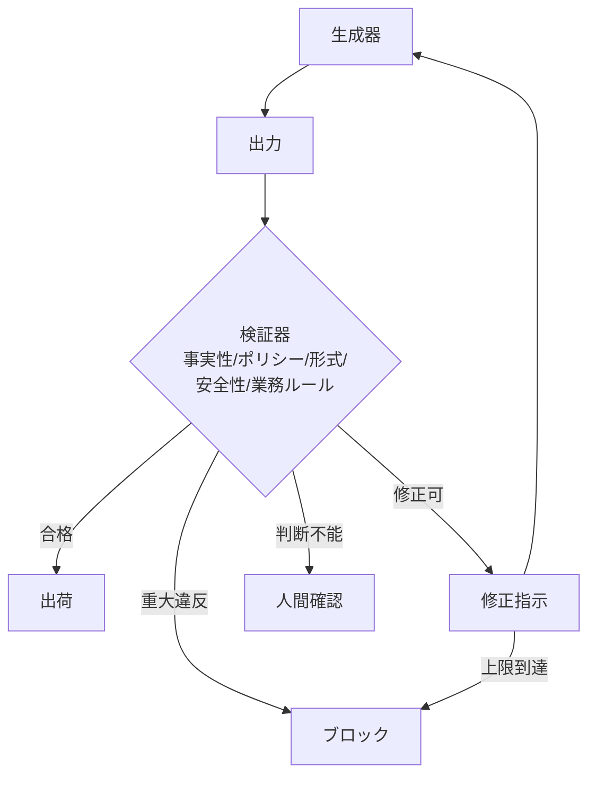

# F-3 Verifier Agent（検証エージェント／LLM-as-Judge）

## 概要

生成とは別に検証専用エージェント/サービスを置き、採用前にチェックする。生成は難しく検証は容易、という非対称性を活用する。

## 設計

最終出力を以下の観点で検査する。

- factuality（事実性）
- policy（ポリシー準拠）
- format（フォーマット）
- security（安全性）
- business rule（業務ルール）
- toxicity（有害性）
- PII（個人情報）

結果により修正・ブロック・人間確認へ分岐する。検証器は生成器と独立に、できれば決定論的に作る（自己採点は甘い）。反復は必ず上限つきとする。

## 解決する課題

以下のエージェント特性に応える。

- LLMの自己過信
- 業務ルール違反や危険出力の出荷前検出
- ハルシネーション・要件未達

## ユースケース

- 外部ユーザー向けAI
- 事実性が重要なRAG
- コード生成（テスト実行で検証）

## 向き

誤りのコストが高い用途、出力の正しさを機械検証できる用途に適する。決定論的な検証手段（コンパイラ・テスト・スキーマ検証）が使える場面で特に効果が高い。

## 不向き

検証コストが生成コストを大きく超える用途には不向きである。検証も主観頼みで収束しない用途（自由創作の良し悪し判定など）にも適さない。

## 要素技術

- **LLM検証**：LLM-as-a-judge
- **決定論的検証**：ユニットテスト、型チェック、コンパイラ
- **ルールエンジン**：rule engine
- **安全性**：moderation、PII detection
- **自己修正フレームワーク**：Reflexion、Self-Refine

## 関連パターン

- [C-2 Structured Output Contract](../c-io-contract/c2-structured-output-contract.md) — スキーマレベルの検証
- [F-1 Evidence-First Answer](f1-evidence-first.md) — 根拠の事実性検証
- [B-2 Planner–Executor–Reviewer](../b-composition/b2-planner-executor-reviewer.md) — Reviewerロールとしての検証
- [I-2 Evaluation CI/CD](../i-observability/i2-evaluation-cicd.md) — 検証をCIに組み込む
