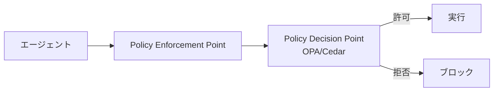

# F-4 Policy-as-Code Guardrail（ポリシー・アズ・コード）

## 概要

行動制約をプロンプトでなくコードとして管理し、LLMの判断とは独立に実行前後で判定する。

## 設計

「誰が・どのエージェントで・どのデータに・どのツールを・どの条件で」をコード化し、policy decision point（PDP）/ enforcement point（PEP）で強制する。

## 解決する課題

- プロンプトはセキュリティ境界にならないという根本問題
- NIST AI RMFが求めるリスク管理の体系化

## ユースケース

- 企業AI基盤
- マルチテナントSaaS
- 規制業界

## 向き

明確な統制が必要な組織に適する。

## 不向き

個人PoCには過剰である。

## 要素技術

- **ポリシーエンジン**：OPA/Rego、Cedar
- **クラウドIAM**：AWS IAM
- **アクセス制御**：ABAC
- **アーキテクチャ**：PDP/PEP

## 関連パターン

- [D-2 Least-Privilege Tool Binding](../d-tools-mcp/d2-least-privilege-binding.md) — ツール権限の実装
- [L-3 Agent Constitution](../l-adoption/l3-agent-constitution.md) — 統治の上位概念
- [F-5 Human Approval Checkpoint](f5-human-approval.md) — ポリシーに基づく承認制御
- [F-2 Guardrail Sidecar](f2-guardrail-sidecar.md) — 入出力レベルのガードレール
