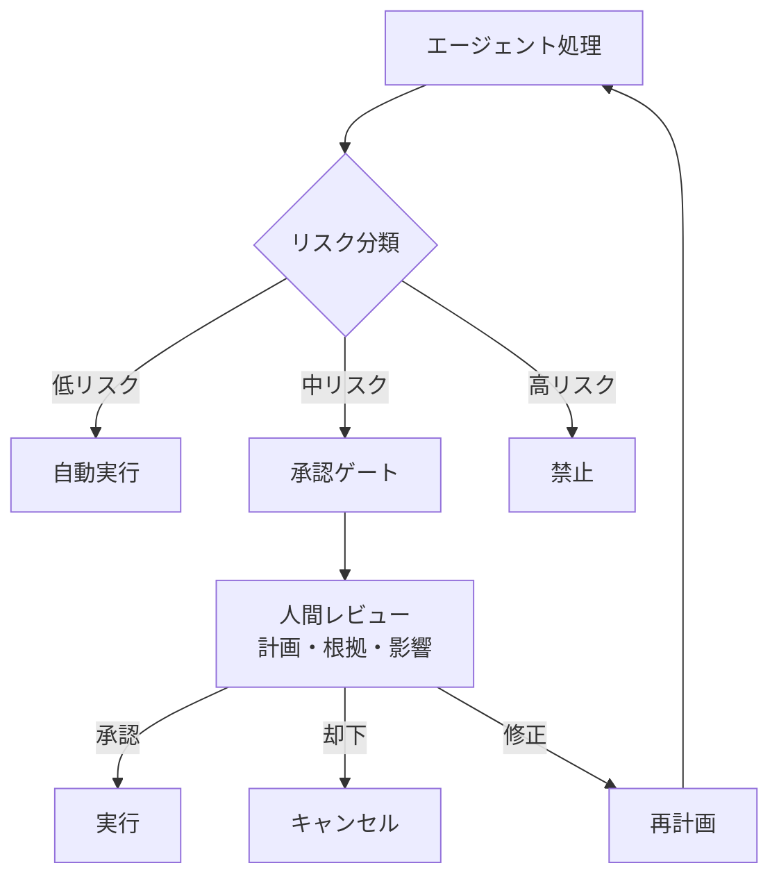

# F-5 Human Approval Checkpoint（人間承認ゲート／HITL）

## 概要

高リスク・不可逆アクションの直前に人間承認を挟む。エージェントは「提案」まで、「実行」は承認後。

## 設計

フローをDAG化し、クリティカルノード（決済・本番デプロイ・契約送信）で実行を一時停止する。コンテキストをシリアライズし、人間が以下をレビューする。

- 計画・影響範囲
- 根拠・リスク
- 代替案

人間は「承認 / 却下 / 修正」を選択する。承認後に状態を復元し再開する。

リスク分類器で「自動可 / 要承認 / 禁止」に振り分けることで、承認の範囲を適切に制御する。

## 解決する課題

以下のエージェント特性に応える。

- 取り返しのつかない誤実行
- ブラックボックス化
- 信頼の段階的獲得
- 規制対応（人間の最終判断義務）

## ユースケース

- 金融取引の承認
- インフラ管理（本番デプロイ）
- 法的文書の送信
- 人事評価の確定
- 重要データの更新

## 向き

失敗コストの高い領域に適する。導入初期は広めに承認を要求し、evalとトレースで安全性を確認しながら自動化範囲を段階拡大する。

## 不向き

人間介在で価値が消える高速・大量処理には不向きである。承認者がボトルネックになる用途でも、承認の粒度を見直す必要がある。

## 要素技術

- **耐久ワークフロー**：[A-2 Durable Agent Session](../a-execution/a2-durable-session.md)が前提
- **承認キュー**：approval queue
- **通知統合**：Slack/Teams/email approval
- **UI**：根拠提示UI
- **リスク評価**：リスクスコアリング、監査ログ

## 関連パターン

- [A-2 Durable Agent Session](../a-execution/a2-durable-session.md) — 承認待ち中の状態永続化が前提
- [D-3 Dry-Run First Execution](../d-tools-mcp/d3-dry-run-execution.md) — 承認前に影響をシミュレートする
- [L-1 Shadow Mode & Progressive Autonomy](../l-adoption/l1-shadow-progressive-autonomy.md) — 承認範囲を段階的に縮小する
- [K-3 Agent-to-Human Escalation](../k-human/k3-human-escalation.md) — 承認でなくエスカレーション（引き継ぎ）の場合
