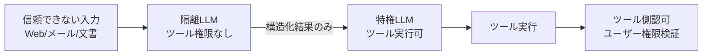

# G-1 Confused-Deputy Damage Limitation（混乱代理被害限定／Dual-LLM）

## 概要

プロンプトインジェクションの完全防止でなく被害半径の限定を目標とし、信頼できない入力を扱うLLMと特権操作を行うLLMを分離する。

## 設計

隔離LLM（Quarantined）が信頼できないデータ（Web・メール・文書）を処理するが、ツール権限を持たず構造化結果だけ返す。特権LLM（Privileged）はツールを実行できるが、信頼できない生データを直接見ない（不透明ハンドル経由）。

ツール側でユーザー権限・データ所有者・操作目的・承認状態を検証し、LLMの判断だけで高権限操作を許可しない。

## 解決する課題

- 直接/間接プロンプトインジェクション
- 悪意あるWeb/メール/文書による操作誘導
- 権限奪取・情報漏洩

## ユースケース

- 外部コンテンツを読むエージェント（メール・ブラウザ・社内文書アシスタント）

## 向き

信頼できない入力を扱い、かつ副作用ツールを持つエージェントに適する。

## 不向き

外部入力を一切扱わない閉域処理には不要である。

## 要素技術

- **アーキテクチャ**：Dual-LLM、CaMeL系の制御/データフロー分離
- **認可**：capability token、user-bound / tool-side authorization
- **信頼管理**：content trust labeling
- **隔離**：sandbox

## 関連パターン

- [D-2 Least-Privilege Tool Binding](../d-tools-mcp/d2-least-privilege-binding.md) — 権限の最小化
- [G-2 Data Boundary Firewall](g2-data-boundary-firewall.md) — データの検査・マスキング
- [F-2 Guardrail Sidecar](../f-reliability/f2-guardrail-sidecar.md) — 入出力の安全検査
- [D-4 Sandboxed Tool Runtime](../d-tools-mcp/d4-sandboxed-runtime.md) — ツール実行の隔離
