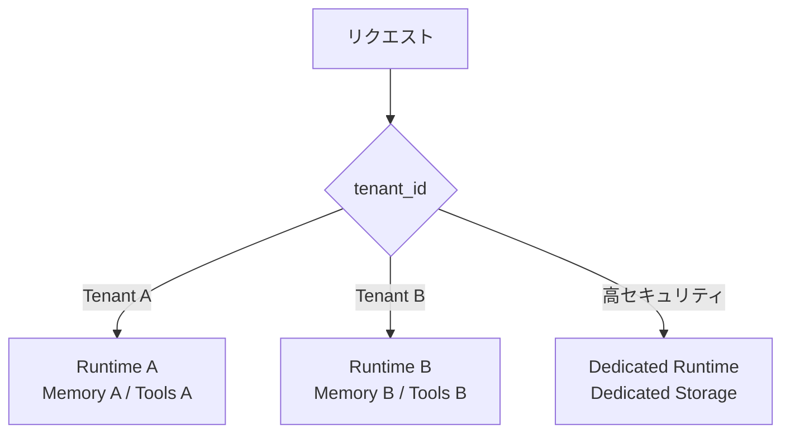

# G-3 Tenant-Isolated Runtime（テナント分離ランタイム）

## 概要

テナントごとに実行環境・メモリ・ツール権限・トレースを分離する。

## 設計

`tenant_id` をsession・memory・tool call・trace・vector indexすべてに付与する。高セキュリティ顧客はdedicated runtime / dedicated storageへ分離する。

## 解決する課題

- 他テナントのデータ混入
- メモリ漏洩
- ツール誤実行

## ユースケース

- B2B SaaS
- エンタープライズAI
- BYOC（Bring Your Own Cloud）

## 向き

複数テナントを抱えるサービスに適する。

## 不向き

単一ユーザーアプリには不要である。

## 要素技術

- **分離**：tenant namespace
- **データベース**：row-level security
- **ネットワーク**：dedicated VPC
- **暗号化**：KMS
- **検索**：vector index per tenant

## 関連パターン

- [G-2 Data Boundary Firewall](g2-data-boundary-firewall.md) — テナント内のデータ保護
- [E-1 Layered Memory](../e-memory/e1-layered-memory.md) — テナントごとのメモリ名前空間
- [D-2 Least-Privilege Tool Binding](../d-tools-mcp/d2-least-privilege-binding.md) — テナントごとのツール権限
- [I-1 Agent Trace & Observability](../i-observability/i1-trace-observability.md) — テナントごとのトレース分離
