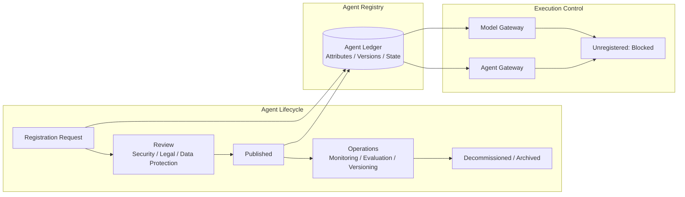

# GV-1 Enterprise Agent Control Plane (Registry / Lifecycle)

## Overview

"Who built this agent?" "What data does it touch?" — the inability to answer these questions on the spot becomes a serious problem once you have more than three agents. This pattern defines a control plane that registers every internal agent together with its owner, purpose, data scope, and risk tier, and centrally manages the entire lifecycle from review and versioning through decommissioning. Unregistered agents (shadow AI) are blocked at the gateway level — the rule "if it isn't registered, it can't run" stops rogue agents from proliferating.

## Enterprise Problem Solved

As agents multiply, "shadow AI" of unknown origin floods the organization — agents that no one knows built, running processes no one can account for. When an incident occurs, the absence of a clear owner prevents identifying a first responder and brings post-incident investigation to a halt. Multiple departments independently build equivalent capabilities, agents accumulate excessive permissions, and production data gets manipulated without approval. Without a change history, audit responses consume enormous effort. Once more than three agents are in use across multiple teams, governance without a registry becomes impossible — this is the starting point for needing a control plane.

!!! tip "Minimum Viable Requirements (MVP)"
    Create a single registry that assigns owner, purpose, and risk_tier to each agent, then add a mechanism to block unregistered agents at the Model Gateway. Review workflows and versioning can be added later, but the gate "it won't run unless registered" is the minimal starting point.

## Value Hypothesis

Full visibility and centralized management of agents enables the organization to balance deployment speed with governance at scale. Eliminating shadow AI prevents redundant investment, and accelerating the rollout of successful patterns maximizes return on investment.

## Solution and Design

Each agent is defined as a first-class object, and the control plane manages the entire lifecycle from registration to decommissioning. Registration acts as an execution permit gate; unregistered agents are physically blocked at the execution platform and Model Gateway ([GV-5](gv5-central-model-gateway.md)).

Each agent carries the following attributes.

| Attribute | Description |
|---|---|
| owner / owner_department | Owner and owning department |
| business_purpose | Business purpose |
| allowed_users / allowed_projects | Permitted users and projects |
| allowed_tools / data_domains | Permitted tools and data domains |
| risk_tier | Risk tier |
| approval_policy | Approval policy |
| audit_policy | Audit policy |
| cost_budget | Cost budget |



New agents and changes go through security, legal, and data protection review before publication. Unregistered agents are blocked at the execution platform and Model Gateway ([GV-5](gv5-central-model-gateway.md)).

## Fit / Not a Fit

| Fit | Not a Fit |
|---|---|
| More than three agents used across multiple teams | Individual PoC or experimental phase |
| Deploying as an enterprise-wide platform | Single department with only one or two agents |
| Audit and compliance requirements exist | Isolated research environment |

## Component Technologies and System Integrations

- **Registry**: Agent Registry (custom or ServiceNow CMDB extension)
- **Policy management**: Policy-as-Code ([ID-7](../id-identity/id7-policy-as-code-guardrail.md))
- **Existing CMDB**: Integration with ServiceNow CMDB and service catalog
- **Execution control**: Integration with Model Gateway ([GV-5](gv5-central-model-gateway.md)) for blocking unregistered agents

## Pitfalls / Selection Considerations

!!! warning "The Registry-Only Trap"
    Creating a registry without connecting it to execution control renders it hollow. Make registration an execution permission gate, and physically block unregistered agents at the Model Gateway and Agent Gateway.

- Assign an explicit "owner" to each agent so a first responder can always be identified during an incident.
- An overly heavy review process invites workarounds. Calibrate review depth to risk tier (Tier 0–1: lightweight self-service; Tier 3 and above: legal and security review).
- At decommissioning time, close the lifecycle fully — including expiration of memory, permissions, and tokens.

## Interfaces

The following are the key interfaces for implementing this pattern. Coding agents can generate stub code from these definitions.

```yaml
interfaces:
  - name: Agent Registry
    description: "Stores per-agent attributes (owner, business_purpose, allowed_tools, data_domains, risk_tier, approval_policy, cost_budget) with versioning and lifecycle state."
    input:
      request: object
    output:
      response: object
    errors:
      - code: GENERAL_ERROR
        description: "Error occurred during Agent Registry processing"
    protocol: "REST / gRPC"
    implementation_hints:
      - "See the Solution and Design section for details"
  - name: Lifecycle Review Gate
    description: "Routes new and changed agent registrations through security, legal, and data protection review; adjusts review depth by risk tier."
    input:
      request: object
    output:
      response: object
    errors:
      - code: GENERAL_ERROR
        description: "Error occurred during Lifecycle Review Gate processing"
    protocol: "REST / gRPC"
    implementation_hints:
      - "See the Solution and Design section for details"
  - name: Execution Enforcement
    description: "Connects to Model Gateway (GV-5) and Agent Gateway (EX-1) so unregistered agents are physically blocked from executing."
    input:
      request: object
    output:
      response: object
    errors:
      - code: GENERAL_ERROR
        description: "Error occurred during Execution Enforcement processing"
    protocol: "REST / gRPC"
    implementation_hints:
      - "See the Solution and Design section for details"
```

## Related Patterns

- [GV-2 Agent Catalog & Marketplace](gv2-agent-catalog-marketplace.md) — Complement: an internal catalog built on top of the registry, serving as the discovery and request portal
- [GV-5 Central Model Gateway](gv5-central-model-gateway.md) — Complement: handles execution control as the blocking point for unregistered agents
- [GV-8 Cost Quota & Chargeback](gv8-cost-quota-chargeback.md) — Complement: integrates with per-agent cost budget management
- [OB-2 Unified Audit & Lineage](../ob-observability/ob2-unified-audit-lineage.md) — Complement: provides the audit trail of agent actions
- [ID-7 Policy-as-Code Guardrail](../id-identity/id7-policy-as-code-guardrail.md) — Complement: handles policy enforcement at registration time and at runtime
