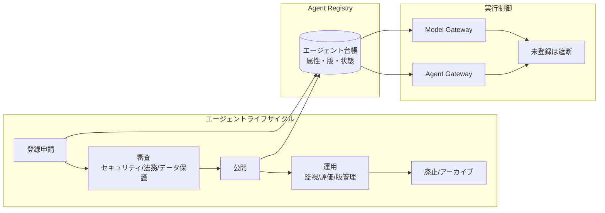

# GV-1 Enterprise Agent Control Plane（レジストリ／ライフサイクル）

## 概要

社内の全エージェントを登録・所有者明示・審査・版管理・廃止まで一元統制する制御プレーン。未登録（シャドーAI）は実行基盤・モデル GW で遮断する。

## 設計

各エージェントを一級オブジェクトとして定義し、以下の属性を付与して管理する。

| 属性 | 説明 |
|---|---|
| owner / owner_department | 所有者・所有部門 |
| business_purpose | 業務目的 |
| allowed_users / allowed_projects | 利用許可ユーザー・プロジェクト |
| allowed_tools / data_domains | 利用許可ツール・データ領域 |
| risk_tier | リスク階層 |
| approval_policy | 承認ポリシー |
| audit_policy | 監査ポリシー |
| cost_budget | コスト予算 |

新規・変更は審査（セキュリティ・法務・データ保護）を経て公開する。未登録エージェントは実行基盤・モデル GW（[GV-5](gv5-central-model-gateway.md)）で遮断する。

## 解決する企業課題

野良エージェント乱立、責任者不明、部門重複、過剰権限、変更の監査不能。エージェントが3個を超え複数チームが使い始めると、台帳なしでは統制不能になる。

## 向き／不向き

| 向き | 不向き |
|---|---|
| エージェントが3個を超え複数チームが利用 | 個人 PoC・実験段階 |
| 全社基盤として展開する場合 | 単一部門で1-2個のエージェントのみ |
| 監査・コンプライアンス要件がある場合 | 閉域の研究環境 |

## 要素技術・既存システム連携

- **レジストリ**：Agent Registry（カスタム or ServiceNow CMDB 拡張）
- **ポリシー管理**：Policy-as-Code（[ID-7](../id-identity/id7-policy-as-code-guardrail.md)）
- **既存 CMDB**：ServiceNow CMDB、サービスカタログとの統合
- **実行制御**：Model Gateway（[GV-5](gv5-central-model-gateway.md)）との連携で未登録遮断

## 落とし穴／選定の勘所

!!! warning "台帳止まりの罠"
    台帳を作っても実行制御と結びつけなければ形骸化する。登録＝実行許可のゲートにし、未登録は Model Gateway/Agent Gateway で物理的に遮断する。

- エージェントの「所有者」を明示し、インシデント時の一次対応者を常に特定できるようにする。
- 審査プロセスが重すぎると回避される。リスク階層に応じて審査の深さを変える（Tier 0-1 は軽量セルフサービス、Tier 3 以上は法務・セキュリティレビュー）。
- 廃止時はメモリ・権限・トークンの失効まで含めてライフサイクルを閉じる。

## 関連パターン

- [GV-2 Agent Catalog & Marketplace](gv2-agent-catalog-marketplace.md) — レジストリを土台にした社内カタログ
- [GV-5 Central Model Gateway](gv5-central-model-gateway.md) — 未登録エージェントの遮断点
- [GV-8 Cost Quota & Chargeback](gv8-cost-quota-chargeback.md) — エージェント単位のコスト予算管理
- [OB-2 Unified Audit & Lineage](../ob-observability/ob2-unified-audit-lineage.md) — エージェント行為の監査
- [ID-7 Policy-as-Code Guardrail](../id-identity/id7-policy-as-code-guardrail.md) — 登録時のポリシー適用
