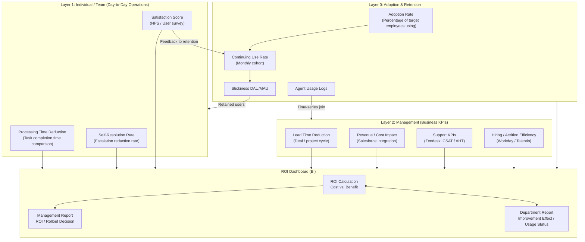
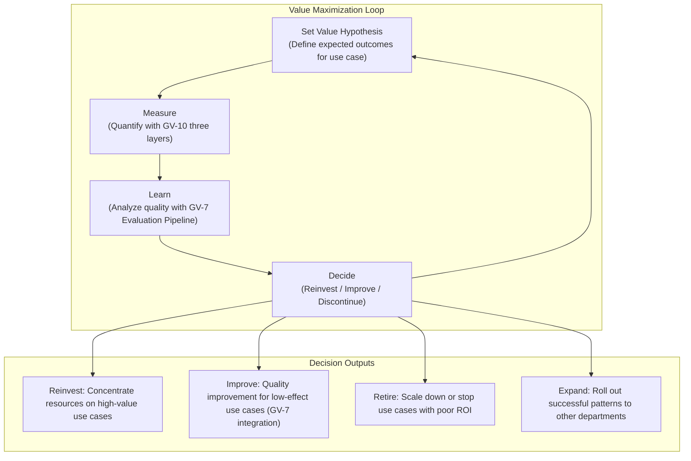

# GV-10 Three-Layer Value Measurement (Adoption & Retention × Productivity × Business KPIs)

## Overview

"We deployed agents — how do we explain the impact?" Answering that question requires three layers. **Layer 0 (Adoption & Retention)** measures "are they actually being used?" Adoption rate, continuing-use rate, and stickiness (DAU/MAU) belong here. **Layer 1 (Individual / Team)** measures "how much has processing time shrunk," "self-resolution rate," and "satisfaction score." **Layer 2 (Management)** measures "lead time reduction," "impact on revenue," and "changes in hiring/attrition efficiency." The three layers are connected in a causal chain — usage rate → efficiency → business outcomes — and usage logs are joined with data from business systems (Salesforce, Zendesk, Workday, etc.) to reveal true ROI that "token count" alone cannot show.

## Enterprise Problem Solved

After deploying agents, the technical team reports token counts, latency, and uptime, but management asks "how much did revenue increase or costs decrease?" The disconnect between these two perspectives frequently causes enterprise-wide rollout to stall because management approval cannot be obtained. "We deployed it but can't explain the value, and the rollout has stopped" is caused by technical success and business evaluation being siloed. At a stage where multiple agents are running in parallel, an objective comparison axis is also needed to decide where to concentrate investment. Reporting token consumption and usage counts does not constitute the return-on-investment explanation that management requires.

!!! tip "Minimum Viable Requirements (MVP)"
    Match one business metric (e.g., task completion time) against agent usage logs and visualize the pre/post deployment difference in BI. Linking to management KPIs can be built out later, but "one dashboard where usage and outcomes are paired" is the minimal starting point.

## Value Hypothesis

Measuring at two layers — business outcomes and management KPIs — objectifies the decision to continue, expand, or discontinue AI investment. Visualizing ROI accelerates management approval and increases the speed of enterprise-wide rollout.

## Solution and Design

Measurement is designed in a three-layer structure. Layer 0 (adoption and retention) quantifies the prerequisites of usage, Layer 1 (individual/team) quantifies the improvement effect on day-to-day operations, and Layer 2 (management) quantifies contribution to business KPIs. Connecting the three layers is the causal chain "usage rate → efficiency → business outcomes" and the join of agent usage logs with business system data (Salesforce, Zendesk, Workday, etc.).



!!! warning "ROI Without Adoption Data Is an Illusion"
    Layer 2 management KPIs (revenue impact, cost reduction) are determined by Layer 0 adoption rate × Layer 1 effect size. Even high effect size produces small overall impact if adoption rate is low. Layer 0 visualizes the "denominator" of ROI.

Combining usage logs with cost measurement data from GV-8 (Cost Chargeback) enables calculation of "business outcomes per unit cost." Aggregate by department, agent, and use case in BI tools, and use the results as input for rollout priority decisions.

## Fit / Not a Fit

| Fit | Not a Fit |
|---|---|
| Enterprise-wide rollout phase requiring management approval — when ROI must be demonstrated to secure budget | Early PoC or proof-of-concept stage; a simple survey and time measurement are sufficient when trying out a single agent |
| Enterprises in general that need to justify AI investment to business units | Use cases where linking to business outcomes is structurally difficult (e.g., pure information-retrieval assistance) |
| Time when multiple agents are running in parallel and prioritization of investment concentration is needed | — |

## Component Technologies and System Integrations

- Salesforce: Source of sales KPIs measuring deal lead time and revenue contribution. Compare figures before and after the agent adoption period.
- Zendesk: Source of support KPIs (CSAT, AHT, ticket resolution time). Measure the difference with and without agent assistance.
- Workday / Talentio: Source of HR KPIs such as time-to-hire, attrition rate, and training cost reduction. Used to measure the effect of HR agents.
- BI tools: Build management-facing ROI dashboards and department-facing improvement-effect reports using Looker, Tableau, Power BI, etc.
- Agent usage logs: Traces and session logs accumulated by OB-1 (Observability Lake), joined with business system KPIs in a time series.
- GV-8 (Cost Chargeback): Cost measurement data used as the denominator in ROI calculations.

## Pitfalls / Selection Considerations

!!! warning "Reporting Success Through Technical Metrics Alone"
    Composing a success report with metrics like "monthly token count exceeded 100 million," "response time 0.5 seconds," "uptime 99.9%" does not help management understand "what actually changed," and expansion approval cannot be obtained. Technical metrics are merely prerequisites; they must be reported together with outcome metrics (revenue, cost, lead time, attrition) to be meaningful.

!!! warning "Measurement Period Too Short"
    Immediately after agent deployment, adoption rates are low and outcome metrics show no significant difference. Secure at least 3 months of measurement time and compare figures after adoption has stabilized. Early discontinuation after "no effect in one month" is a classic anti-pattern.

!!! warning "Confusing Causation with Correlation"
    Even when agent adoption and business improvement happen simultaneously, proving causation is difficult. Consider the composite effects of market conditions, organizational changes, and other initiatives, and design in advance a comparison with a control group (departments or teams not using the agent).

!!! warning "Cost Measurement Without GV-8"
    Without understanding the cost that forms the ROI denominator, ROI cannot be calculated. Having GV-8 (Cost Chargeback) measure per-agent and per-department costs is a prerequisite for GV-10. Building an ROI dashboard without cost measurement produces an incomplete metric with a missing denominator.

## Value → Measurement → Learning → Reinvestment Loop

GV-10 does not stop at "measuring." Maintaining an operational loop that feeds measurement results back into "how to generate the next round of value" enables continuous maximization of AI investment value.



### Loop Operating Cadence

| Frequency | Activity | Related Patterns |
|---|---|---|
| Weekly | Monitoring team-level KPIs (processing time, adoption rate) and anomaly detection | OB-1 |
| Monthly | Aggregating management-level KPIs and comparing per-use-case ROI | GV-8 |
| Quarterly | Reviewing investment allocation (reinvest, improve, or discontinue decisions) | GV-7 |
| Semi-annually | Formulating new use case value hypotheses and cross-department expansion plans | GV-2 |

### Connection with GV-7 (Evaluation Pipeline)

Where GV-10 measures "what happened (outcomes)," GV-7 evaluates "why it happened (quality)." Connecting the two enables:

- **Identifying root causes of ROI decline**: GV-10 detects degradation in management KPIs → GV-7 checks quality metrics (answer accuracy, hallucination rate) → distinguishes whether the cause is model degradation or a change in usage patterns
- **Quantifying improvement impact**: GV-7 implements quality improvement → GV-10 measures propagation to business outcomes → proves the ROI of the improvement investment

### Layer 0 (Adoption & Retention) Operations

Layer 0 metrics (adoption rate, continuing-use rate, stickiness) work in conjunction with change management initiatives described in [Adoption & Change Management](../../integration/adoption.md). Distinguishing whether "value isn't emerging" is caused by "agent quality issues (Layer 1 degradation)" or "not being used in the first place (Layer 0 stagnation)" is the starting point for improvement. The Adoption & Change Management section covers operational initiatives for improving Layer 0 metrics (onboarding, champion programs, feedback channels), while GV-10 serves as the canonical measurement system that consolidates all three layers.

## Interfaces

The following are the key interfaces for implementing this pattern. Coding agents can generate stub code from these definitions.

```yaml
interfaces:
  - name: Layer 0 Adoption Metrics
    description: "Tracks adoption rate, monthly cohort retention, and DAU/MAU stickiness from agent usage logs; feeds change management decisions."
    input:
      request: object
    output:
      response: object
    errors:
      - code: GENERAL_ERROR
        description: "Error occurred during Layer 0 Adoption Metrics processing"
    protocol: "REST / gRPC"
    implementation_hints:
      - "See the Solution and Design section for details"
    code_examples:
      typescript: |
        interface Layer0AdoptionMetricsRequest {
          startDate: Date;
          endDate: Date;
          agentIds: string[];
        }
        interface Layer0AdoptionMetricsResponse {
          adoptionRate: number;
          dauMau: number;
          cohortRetention: number;
        }
        interface Layer0AdoptionMetrics {
          layer0AdoptionMetrics(req: Layer0AdoptionMetricsRequest): Promise<Layer0AdoptionMetricsResponse>;
        }
      python: |
        @dataclass
        class Layer0AdoptionMetricsRequest:
            start_date: datetime
            end_date: datetime
            agent_ids: list[str]
        
        @dataclass
        class Layer0AdoptionMetricsResponse:
            adoption_rate: float
            dau_mau: float
            cohort_retention: float
        
        class Layer0AdoptionMetrics(Protocol):
            async def layer_0_adoption_metrics(self, req: Layer0AdoptionMetricsRequest) -> Layer0AdoptionMetricsResponse: ...
  - name: Layer 1 & 2 Business KPI Joiner
    description: "Time-series joins agent usage logs with Salesforce lead time, Zendesk CSAT/AHT, and Workday HR KPIs to compute business impact."
    input:
      request: object
    output:
      response: object
    errors:
      - code: GENERAL_ERROR
        description: "Error occurred during Layer 1 & 2 Business KPI Joiner processing"
    protocol: "REST / gRPC"
    implementation_hints:
      - "See the Solution and Design section for details"
    code_examples:
      typescript: |
        interface Layer12BusinessKpiJoinerRequest {
          agentId: string;
          period: string;
          kpiSources: string[];
        }
        interface Layer12BusinessKpiJoinerResponse {
          businessKpis: object;
          timeSavedHours: number;
          impactScore: number;
        }
        interface Layer12BusinessKpiJoiner {
          layer12BusinessKpiJoiner(req: Layer12BusinessKpiJoinerRequest): Promise<Layer12BusinessKpiJoinerResponse>;
        }
      python: |
        @dataclass
        class Layer12BusinessKpiJoinerRequest:
            agent_id: str
            period: str
            kpi_sources: list[str]
        
        @dataclass
        class Layer12BusinessKpiJoinerResponse:
            business_kpis: dict
            time_saved_hours: float
            impact_score: float
        
        class Layer12BusinessKpiJoiner(Protocol):
            async def layer_1_2_business_kpi_joiner(self, req: Layer12BusinessKpiJoinerRequest) -> Layer12BusinessKpiJoinerResponse: ...
  - name: ROI Dashboard
    description: "Executive-facing report combining cost (GV-8) as denominator and business outcomes as numerator; supports investment expand/improve/retire decisions."
    input:
      request: object
    output:
      response: object
    errors:
      - code: GENERAL_ERROR
        description: "Error occurred during ROI Dashboard processing"
    protocol: "REST / gRPC"
    implementation_hints:
      - "See the Solution and Design section for details"
    code_examples:
      typescript: |
        interface RoiDashboardRequest {
          userId: string;
          period: string;
        }
        interface RoiDashboardResponse {
          timeSavedMinutes: number;
          taskCount: number;
          weeklyTrend: object;
        }
        interface RoiDashboard {
          roiDashboard(req: RoiDashboardRequest): Promise<RoiDashboardResponse>;
        }
      python: |
        @dataclass
        class RoiDashboardRequest:
            user_id: str
            period: str
        
        @dataclass
        class RoiDashboardResponse:
            time_saved_minutes: float
            task_count: int
            weekly_trend: dict
        
        class RoiDashboard(Protocol):
            async def roi_dashboard(self, req: RoiDashboardRequest) -> RoiDashboardResponse: ...
```

## Related Patterns

- [GV-8 Cost Quota & Chargeback](gv8-cost-quota-chargeback.md) — Complement: the prerequisite pattern that handles cost measurement forming the denominator of ROI calculations
- [OB-1 Observability Lake](../ob-observability/ob1-observability-lake.md) — Complement: provides trace data that forms the foundation for time-series joining of usage logs and business outcomes
- [GV-7 Evaluation & Governance Pipeline](gv7-evaluation-governance-pipeline.md) — Complement: handles the "learning" phase of the value → measurement → learning → reinvestment loop through quality measurement
- [Adoption & Change Management](../../integration/adoption.md) — Complement: adoption rate and stickiness are prerequisites for ROI calculations and are measured as a third group of metrics
