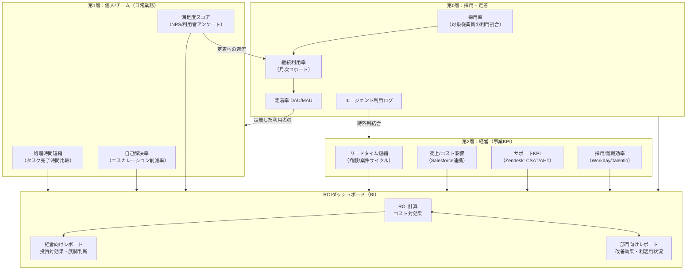
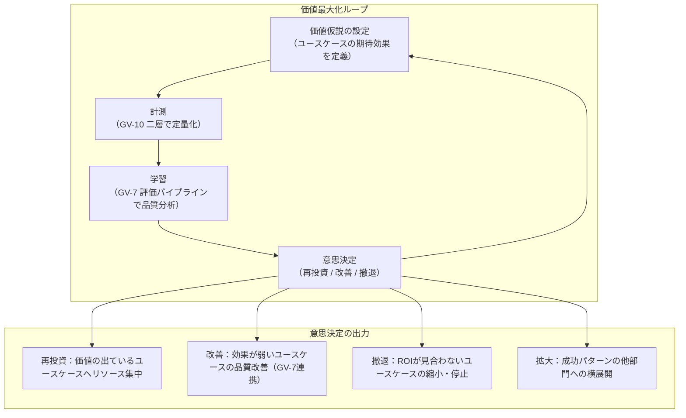

# GV-10 Three-Layer Value Measurement（採用定着×生産性×経営KPI）

## 概要

「エージェントを入れたけど、効果をどう説明すればいい？」——この問いに答えるには3つの層が要る。**第0層（採用・定着）** は「そもそも使われているか」を計測する。採用率・継続利用率・定着率（DAU/MAU）がここに属する。**第1層（個人/チーム）** は「処理時間がどれだけ縮んだか」「自己解決率」「満足度」を計測する。**第2層（経営）** は「リードタイム短縮」「売上への影響」「採用/離職効率の変化」を計測する。3層を「利用率→効率→事業成果」の因果連鎖で接続し、Salesforce の売上データや Zendesk の解決率と利用ログを紐づけることで、「トークン数」だけでは見えない本当の ROI を示す。

## 解決する企業課題

エージェントを導入したあと、技術チームはトークン数・レイテンシ・稼働率を報告するが、経営陣は「それで売上がいくら増えたか、コストがいくら減ったか」を問う。この二つが噛み合わないため、経営承認が得られず全社展開が止まるケースが多い。「導入したが価値を説明できない」という状態は、技術的な成功と事業的な評価が分断していることが原因だ。複数のエージェントが並走する段階では、どれに投資を集中すべきかを判断するための客観的な比較軸も必要になる。トークン消費量や利用回数を報告するだけでは、経営が求める投資対効果の説明にならない。

!!! tip "最小成立条件（MVP）"
    1つの業務指標（例：タスク完了時間）をエージェント利用ログと突合し、導入前後の差分を BI で可視化する。経営 KPI との紐づけは後から拡張できるが、「利用と成果が対になった1枚のダッシュボード」が最小の出発点である。

## 価値仮説

業務成果と経営KPIの二層で計測することで、AI投資の継続・拡大・撤退の意思決定を客観化する。ROIの可視化は経営承認を加速し、全社展開のスピードを上げる。

## 解決策と設計

計測は三層構造で設計する。第0層（採用・定着）は利用の前提条件を、第1層（個人/チーム）は日常業務の改善効果を、第2層（経営）は事業KPIへの貢献を定量化する。3層を繋ぐのは「利用率→効率→事業成果」の因果連鎖と、エージェントの利用ログと業務システム（Salesforce・Zendesk・Workday 等）のデータの結合である。



!!! warning "利用率なきROIは幻想"
    第2層の経営KPI（売上影響・コスト削減）は、第0層の利用率×第1層の効果量で決まる。効果量が高くても利用率が低ければ全社インパクトは小さい。第0層は ROI の「分母」を可視化する。

利用ログを GV-8（コスト配賦）のコスト計測データと組み合わせることで、「単位コストあたりの業務成果」を算出できる。BI ツールで部門別・エージェント別・ユースケース別に集計し、展開優先度の判断材料として活用する。

## 向き／不向き

| 向き | 不向き |
|---|---|
| 経営承認を要する全社展開フェーズ。ROI を示さなければ予算を確保できない段階 | 初期 PoC・実証段階。エージェント 1 本を試している段階では、簡易なアンケートと時間計測で十分 |
| AI 投資を事業部門に正当化する必要があるエンタープライズ全般 | 業務成果との紐づけが構造的に困難なユースケース（純粋な情報検索補助など） |
| 複数のエージェントが並走し、どれに投資を集中するかの優先付けが必要な時期 | — |

## 要素技術・既存システム連携

- Salesforce：商談リードタイム・売上への貢献を計測する営業 KPI のソース。エージェント利用期間前後の数値を比較する。
- Zendesk：サポート KPI（CSAT・AHT・チケット解決時間）のソース。エージェント支援の有無による差分を計測する。
- Workday / Talentio：採用時間・離職率・研修コスト削減等の人事 KPI のソース。HR エージェントの効果測定に使用する。
- BI ツール：Looker・Tableau・Power BI 等で経営向け ROI ダッシュボードと部門向け改善効果レポートを構築する。
- エージェント利用ログ：OB-1（Observability Lake）が蓄積するトレース・セッションログを、業務システムの KPI と時系列で結合する。
- GV-8（コスト配賦）：コスト計測データを ROI 計算の分母として使用する。

## 落とし穴／選定の勘所

!!! warning "技術指標だけで成功を語る"
    「月間トークン数が 1 億を超えた」「レスポンスタイム 0.5 秒」「稼働率 99.9%」という指標で成功レポートを作っても、経営陣は「それで何が変わったか」を理解できず、展開拡大の承認が得られない。技術指標は前提に過ぎず、成果指標（売上・コスト・リードタイム・離職率）とセットで報告することが必要である。

!!! warning "計測期間が短すぎる"
    エージェント導入直後は利用率が低く、成果指標に有意差が出ない。最低でも 3 ヶ月以上の計測期間を確保し、利用が定着した後の数値で比較することが重要だ。「1 ヶ月で効果なし」と判断して展開を止める早期打ち切りが典型的なアンチパターンになっている。

!!! warning "因果と相関の混同"
    エージェント利用と業績改善が同時期に起きても、その因果関係を証明するのは難しい。市場環境・組織変更・その他の施策との複合効果を考慮し、コントロールグループ（エージェントを使わない部門・チーム）との比較設計を事前に検討しておくとよい。

!!! warning "GV-8 なしのコスト計測"
    ROI の分母となるコストを把握していないと ROI は計算できない。GV-8（コスト配賦）でエージェント別・部門別コストを計測していることが GV-10 の前提条件だ。コスト計測なしに ROI ダッシュボードを構築しても、「分母」が抜けた不完全な指標になる。

## 価値→計測→学習→再投資ループ

GV-10 は「測る」だけで終わらせない。計測結果を「次の価値創出にどう還流するか」の運用ループを持つことで、AI投資の価値最大化を継続的に実現する。



### ループの運用サイクル

| 頻度 | 活動 | 関連パターン |
|---|---|---|
| 週次 | チーム層KPI（処理時間・利用率）のモニタリングと異常検知 | OB-1 |
| 月次 | 経営層KPIの集計とユースケース別ROI比較 | GV-8 |
| 四半期 | 投資配分の見直し（再投資・改善・撤退の判断） | GV-7 |
| 半期 | 新規ユースケースの価値仮説策定と横展開計画 | GV-2 |

### GV-7（評価パイプライン）との接続

GV-10 が「何が起きたか（結果）」を計測するのに対し、GV-7 は「なぜそうなったか（品質）」を評価する。両者を接続することで、以下が可能になる。

- **ROI低下の原因特定**：GV-10で経営KPIの悪化を検知 → GV-7で品質指標（回答精度・ハルシネーション率）を確認 → 原因がモデル劣化か利用パターン変化かを切り分け
- **改善効果の定量化**：GV-7で品質改善を実施 → GV-10で業務成果への波及を計測 → 改善投資のROIを証明

### 第0層（採用・定着）の運用

第0層の指標（採用率・継続利用率・定着率）は[定着・アダプション](../../integration/adoption.md)のチェンジマネジメント施策と連動する。「価値が出ない」原因が「エージェントの品質問題（第1層の劣化）」なのか「そもそも使われていない定着問題（第0層の低迷）」なのかを切り分けることが、改善の起点になる。定着・アダプション章は第0層の指標を引き上げるための運用施策（オンボーディング・チャンピオン制度・フィードバック導線）を担い、GV-10 は計測の正本として3層すべてを統合管理する。

## Interfaces

以下はこのパターンを実装する際の主要インターフェイスである。コーディングエージェントはこの定義からスタブコードを生成できる。

```yaml
interfaces:
  - name: Layer 0 Adoption Metrics
    description: "Tracks adoption rate, monthly cohort retention, and DAU/MAU stickiness from agent usage logs; feeds change management decisions."
    input:
      request: object
    output:
      response: object
    errors:
      - code: GENERAL_ERROR
        description: "Layer 0 Adoption Metrics の処理中にエラーが発生"
    protocol: "REST / gRPC"
    implementation_hints:
      - "詳細は本文の「解決策と設計」節を参照"
  - name: Layer 1 & 2 Business KPI Joiner
    description: "Time-series joins agent usage logs with Salesforce lead time, Zendesk CSAT/AHT, and Workday HR KPIs to compute business impact."
    input:
      request: object
    output:
      response: object
    errors:
      - code: GENERAL_ERROR
        description: "Layer 1 & 2 Business KPI Joiner の処理中にエラーが発生"
    protocol: "REST / gRPC"
    implementation_hints:
      - "詳細は本文の「解決策と設計」節を参照"
  - name: ROI Dashboard
    description: "Executive-facing report combining cost (GV-8) as denominator and business outcomes as numerator; supports investment expand/improve/retire decisions."
    input:
      request: object
    output:
      response: object
    errors:
      - code: GENERAL_ERROR
        description: "ROI Dashboard の処理中にエラーが発生"
    protocol: "REST / gRPC"
    implementation_hints:
      - "詳細は本文の「解決策と設計」節を参照"
```

## 関連パターン

- [GV-8 Cost Quota & Chargeback（コスト配賦）](gv8-cost-quota-chargeback.md) — 補完：ROI 計算の分母となるコスト計測を担う前提パターン
- [OB-1 Observability Lake（オブザーバビリティ基盤）](../ob-observability/ob1-observability-lake.md) — 補完：利用ログと業務成果の時系列結合の基盤となるトレースデータを提供する
- [GV-7 Evaluation & Governance Pipeline（評価CI/CD）](gv7-evaluation-governance-pipeline.md) — 補完：品質計測を通じて価値→計測→学習→再投資ループの「学習」段階を担う
- [定着・アダプション](../../integration/adoption.md) — 補完：利用率・定着率はROI計算の前提条件であり、第3の指標群として計測する
