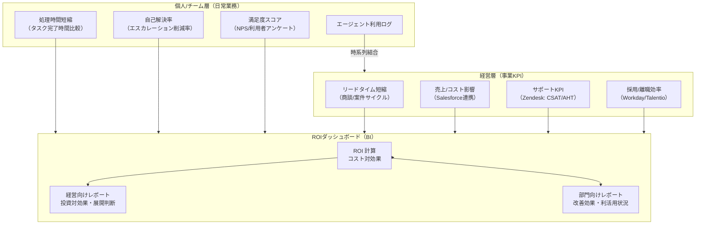

# GV-10 Two-Layer Value Measurement（生産性×経営KPI）

## 概要

「エージェントを入れたけど、効果をどう説明すればいい？」——現場の従業員と経営層では聞きたいことが違う。このパターンは、個人・チーム層では「処理時間がどれだけ縮んだか」「自己解決率」「満足度」を、経営層では「リードタイム短縮」「売上への影響」「採用/離職効率の変化」を別々に計測する。Salesforce の売上データや Zendesk の解決率と利用ログを紐づけることで、「トークン数」だけでは見えない本当の ROI を示す。

## 解決する企業課題

エージェントを導入したあと、技術チームはトークン数・レイテンシ・稼働率を報告するが、経営陣は「それで売上がいくら増えたか、コストがいくら減ったか」を問う。この二つの問いが噛み合わないため、経営承認が得られず全社展開が止まるケースが多い。「導入したが価値を説明できず展開が止まる」という状態は、技術的な成功と事業的な評価が分断していることが原因である。また、複数のエージェントが並走する段階では、どれに投資を集中すべきかを判断するための客観的な比較軸が必要になる。単にトークン消費量や利用回数を報告するだけでは、経営が求める投資対効果の説明にならない。

## 解決策と設計

計測は二層構造で設計する。個人/チーム層は日常業務の改善効果を定量化し、経営層は事業 KPI への貢献を定量化する。両層を紐づけるのはエージェントの利用ログと業務システム（Salesforce・Zendesk・Workday 等）のデータの結合である。

利用ログは GV-8（コスト配賦）のコスト計測データと組み合わせることで、「単位コストあたりの業務成果」を算出できる。BI ツールで部門別・エージェント別・ユースケース別に集計し、展開優先度の判断材料として活用する。

## 向き／不向き

**向いている条件**

- 経営承認を要する全社展開フェーズ。ROI を示さなければ予算を確保できない段階。
- AI 投資を事業部門に正当化する必要があるエンタープライズ全般。
- 複数のエージェントが並走し、どれに投資を集中するかの優先付けが必要な時期。

**向いていない条件**

- 初期 PoC・実証段階。エージェント 1 本を試している段階では、簡易なアンケートと時間計測で十分。
- 業務成果との紐づけが構造的に困難なユースケース（純粋な情報検索補助など）。

## 要素技術・既存システム連携

- Salesforce：商談リードタイム・売上への貢献を計測する営業 KPI のソース。エージェント利用期間前後の数値を比較する。
- Zendesk：サポート KPI（CSAT・AHT・チケット解決時間）のソース。エージェント支援の有無による差分を計測する。
- Workday / Talentio：採用時間・離職率・研修コスト削減等の人事 KPI のソース。HR エージェントの効果測定に使用する。
- BI ツール：Looker・Tableau・Power BI 等で経営向け ROI ダッシュボードと部門向け改善効果レポートを構築する。
- エージェント利用ログ：OB-1（Observability Lake）が蓄積するトレース・セッションログを、業務システムの KPI と時系列で結合する。
- GV-8（コスト配賦）：コスト計測データを ROI 計算の分母として使用する。

## 落とし穴／選定の勘所

!!! warning "技術指標だけで成功を語る"
    「月間トークン数が 1 億を超えた」「レスポンスタイム 0.5 秒」「稼働率 99.9%」という指標で成功レポートを作ると、経営陣は「それで何が変わったか」を理解できず、展開拡大の承認が得られない。技術指標は前提に過ぎず、成果指標（売上・コスト・リードタイム・離職率）とセットで報告することが必要である。

!!! warning "計測期間が短すぎる"
    エージェント導入直後は利用率が低く、成果指標に有意差が出ない。最低でも 3 ヶ月以上の計測期間を確保し、利用が定着した後の期間で比較することが重要である。「1 ヶ月で効果なし」と判断して展開を止めてしまう早期打ち切りが典型的なアンチパターンである。

!!! warning "因果と相関の混同"
    エージェント利用と業績改善が同時期に起きても、その因果関係を証明するのは難しい。市場環境・組織変更・その他の施策との複合効果を考慮し、コントロールグループ（エージェントを使わない部門・チーム）との比較設計を事前に検討することが望ましい。

!!! warning "GV-8 なしのコスト計測"
    ROI の分母となるコストを把握していないと ROI を計算できない。GV-8（コスト配賦）でエージェント別・部門別コストを計測していることが GV-10 の前提条件である。コスト計測なしに ROI ダッシュボードを構築しても、成果の「分母」が抜けた不完全な指標になる。

## 関連パターン

- [GV-8 Cost Quota & Chargeback（コスト配賦）](gv8-cost-quota-chargeback.md) — 補完：ROI 計算の分母となるコスト計測を担う前提パターン
- [OB-1 Observability Lake（オブザーバビリティ基盤）](../ob-observability/ob1-observability-lake.md) — 補完：利用ログと業務成果の時系列結合の基盤となるトレースデータを提供する
- [GV-7 Evaluation & Governance Pipeline（評価CI/CD）](gv7-evaluation-governance-pipeline.md) — 類似：品質の継続計測という観点で補完し合い、技術品質と業務価値を両輪で測る
