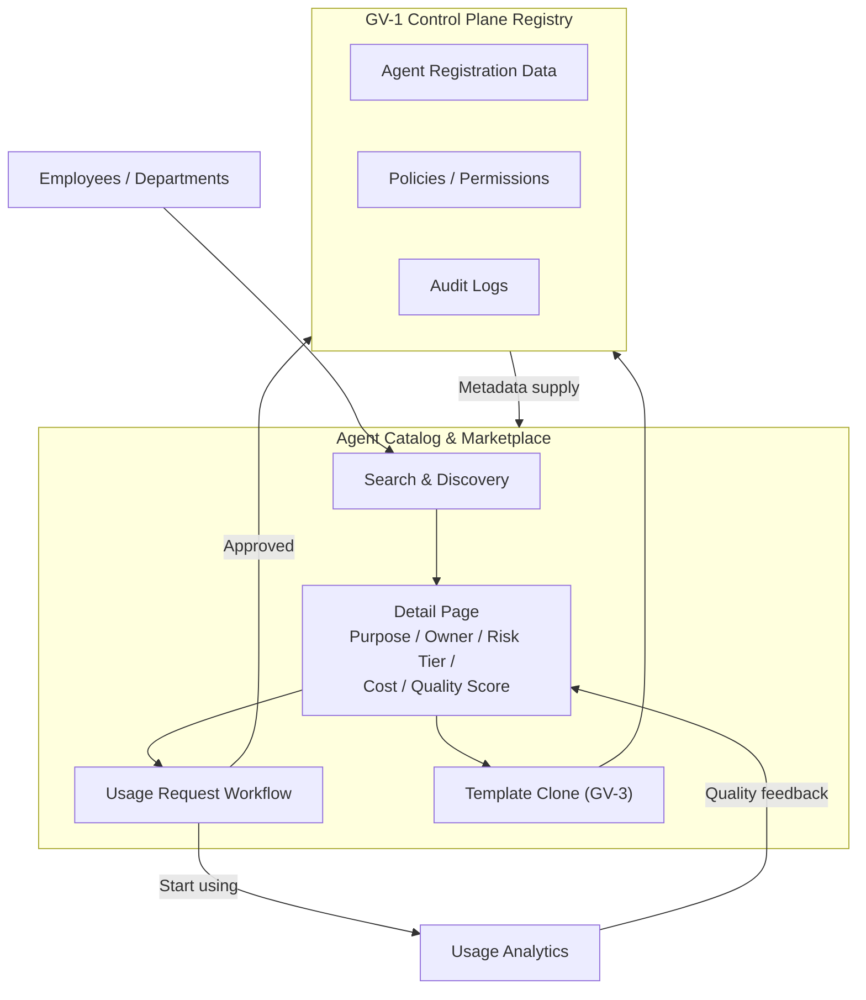

# GV-2 Agent Catalog & Marketplace (Internal Catalog)

## Overview

Like a smartphone app store, this is an internal catalog where employees can browse available agents, skills, and tools, review their purpose, owner, risk level, cost, and quality score, and then submit a usage request. "I don't know what agents exist," "the team next door is building the same thing," "people just start using things without any review" — these problems are resolved through a single, consolidated path from discovery to onboarding.

## Enterprise Problem Solved

As agents multiply in an organization, a discovery problem emerges: "I have no idea what agents exist." Departments independently build equivalent capabilities, unreviewed agents get used, and access requests are handled through informal channels — verbal agreements, emails, individual relationships. Unclear access paths to agents are a direct cause of governance gaps: if you can't track which agents are being used, cost management and audit responses become impossible. GV-2 introduces the catalog as a single front door, simultaneously suppressing redundant development, steering users toward reviewed agents, and standardizing the request process.

!!! tip "Minimum Viable Requirements (MVP)"
    Create a read-only catalog page that displays the GV-1 registry information in a list, plus a simple request form that records the intended use and expiry date. Quality scores and usage analytics can be added later.

## Value Hypothesis

Cataloging reusable agents eliminates redundant development across departments and improves development productivity. Enabling users to instantly find the best agent for their needs accelerates the overall pace of business automation adoption.

## Solution and Design

The catalog is a UI/API layer built on top of the GV-1 registry. Each entry carries purpose, owner, data types accessed, risk tier, estimated cost, quality score, version, and approval status. Departments can derive agents from catalog templates (GV-3) rather than building from scratch, acquiring safe agents without starting from zero. The usage request workflow is linked to access grant and revoke actions, and records the approver, expiry date, and intended use.



When a usage request is approved, the Control Plane grants access and records it in the audit log. Usage Analytics aggregates usage patterns, error rates, and costs, which feed back into quality score updates. Quality scores are calculated by combining rubric assessments, user ratings, and results from the GV-7 evaluation pipeline.

## Fit / Not a Fit

| Fit | Not a Fit |
|---|---|
| Organizations deploying agents across multiple departments | Small-scale setups where a single team operates a single agent internally — the catalog maintenance cost exceeds the value |
| Stage where growing agent counts have made discovery, duplication, and unreviewed usage a problem | PoC stage with only a handful of agents; the GV-1 registry alone is often sufficient |
| Platform teams that want to centrally manage usage requests, approvals, and access grants | — |

## Component Technologies and System Integrations

- Catalog UI/API: Often integrated into an internal portal or an internal developer portal (e.g., Backstage).
- Usage request workflow: Integrated with existing access request platforms (ServiceNow, Jira Service Management, etc.) to reuse approval flows.
- Usage Analytics: Aggregates execution logs, token consumption, and error rates to update quality scores. Integrating with GV-8 (Cost Chargeback) also enables per-department cost visibility.
- Quality rating: Pulls in scores from GV-7 (Evaluation CI/CD) and combines them with manual reviews and user feedback.
- GV-1 Control Plane: Acts as the catalog backend, providing access grants, policy enforcement, and audit logs.

## Pitfalls / Selection Considerations

!!! warning "Review Criteria Becoming Meaningless"
    As the number of agents grows, the temptation is to bypass the review bottleneck and adopt a "just publish it" approach. Weakening review criteria leads to varying quality and safety within the catalog, which destroys trust in the catalog itself. Automating review (by embedding it in the GV-7 evaluation pipeline) is key to balancing speed and quality.

!!! warning "Stale Quality Scores"
    Quality scores assigned at registration time can become outdated if never refreshed. Even if an agent's behavior degrades due to model or external API changes, users continue relying on the stale score. Use GV-6 (Version Registry) to track model and prompt changes, and design the system to automatically trigger re-evaluation on every change.

!!! warning "Request Log Becoming Meaningless"
    Even with a usage request flow in place, if approvers rubber-stamp requests without reading them, the original purpose — recording who is using which agent and for what — is lost. Make purpose, expiry, and data access scope required fields in the request form, and establish clear accountability for approvers.

## Interfaces

The following are the key interfaces for implementing this pattern. Coding agents can generate stub code from these definitions.

```yaml
interfaces:
  - name: Catalog UI/API
    description: "Search and detail view exposing purpose, owner, risk tier, cost estimate, quality score, version, and approval status for each agent."
    input:
      request: object
    output:
      response: object
    errors:
      - code: GENERAL_ERROR
        description: "Error occurred during Catalog UI/API processing"
    protocol: "REST / gRPC"
    implementation_hints:
      - "See the Solution and Design section for details"
    code_examples:
      typescript: |
        interface CatalogUiApiRequest {
          query: string;
          filters: object;
          page: number;
        }
        interface CatalogUiApiResponse {
          agents: object[];
          total: number;
          pageSize: number;
        }
        interface CatalogUiApi {
          catalogUiApi(req: CatalogUiApiRequest): Promise<CatalogUiApiResponse>;
        }
      python: |
        @dataclass
        class CatalogUiApiRequest:
            query: str
            filters: dict
            page: int
        
        @dataclass
        class CatalogUiApiResponse:
            agents: list[dict]
            total: int
            page_size: int
        
        class CatalogUiApi(Protocol):
            async def catalog_ui_api(self, req: CatalogUiApiRequest) -> CatalogUiApiResponse: ...
  - name: Access Request Workflow
    description: "Structured access request requiring purpose, expiry, and data access scope; integrates with existing approval systems (ServiceNow, Jira SM)."
    input:
      request: object
    output:
      response: object
    errors:
      - code: GENERAL_ERROR
        description: "Error occurred during Access Request Workflow processing"
    protocol: "REST / gRPC"
    implementation_hints:
      - "See the Solution and Design section for details"
    code_examples:
      typescript: |
        interface AccessRequestWorkflowRequest {
          agentId: string;
          requesterId: string;
          purpose: string;
          expiry: Date;
          dataAccessScope: string[];
        }
        interface AccessRequestWorkflowResponse {
          requestId: string;
          status: string;
          approvalUrl: string;
        }
        interface AccessRequestWorkflow {
          accessRequestWorkflow(req: AccessRequestWorkflowRequest): Promise<AccessRequestWorkflowResponse>;
        }
      python: |
        @dataclass
        class AccessRequestWorkflowRequest:
            agent_id: str
            requester_id: str
            purpose: str
            expiry: datetime
            data_access_scope: list[str]
        
        @dataclass
        class AccessRequestWorkflowResponse:
            request_id: str
            status: str
            approval_url: str
        
        class AccessRequestWorkflow(Protocol):
            async def access_request_workflow(self, req: AccessRequestWorkflowRequest) -> AccessRequestWorkflowResponse: ...
  - name: Usage Analytics & Quality Score
    description: "Aggregates execution logs, token consumption, and error rates into a quality score updated on each GV-7 evaluation run."
    input:
      request: object
    output:
      response: object
    errors:
      - code: GENERAL_ERROR
        description: "Error occurred during Usage Analytics & Quality Score processing"
    protocol: "REST / gRPC"
    implementation_hints:
      - "See the Solution and Design section for details"
    code_examples:
      typescript: |
        interface UsageAnalyticsQualityScoreRequest {
          agentId: string;
          evaluationRunId: string;
        }
        interface UsageAnalyticsQualityScoreResponse {
          qualityScore: number;
          tokenUsage: number;
          errorRate: number;
        }
        interface UsageAnalyticsQualityScore {
          usageAnalyticsQualityScore(req: UsageAnalyticsQualityScoreRequest): Promise<UsageAnalyticsQualityScoreResponse>;
        }
      python: |
        @dataclass
        class UsageAnalyticsQualityScoreRequest:
            agent_id: str
            evaluation_run_id: str
        
        @dataclass
        class UsageAnalyticsQualityScoreResponse:
            quality_score: float
            token_usage: int
            error_rate: float
        
        class UsageAnalyticsQualityScore(Protocol):
            async def usage_analytics_quality_score(self, req: UsageAnalyticsQualityScoreRequest) -> UsageAnalyticsQualityScoreResponse: ...
```

## Related Patterns

- [GV-1 Agent Control Plane](gv1-agent-control-plane.md) — Complement: serves as the catalog backend, providing registration data, permissions, and auditing
- [GV-3 Department Agent Factory](gv3-department-agent-factory.md) — Complement: factory capability for departments to derive agents from catalog templates
- [GV-7 Evaluation & Governance Pipeline](gv7-evaluation-governance-pipeline.md) — Complement: drives automated quality score updates and review automation
- [GV-8 Cost Quota & Chargeback](gv8-cost-quota-chargeback.md) — Complement: links catalog usage requests to cost budget management
