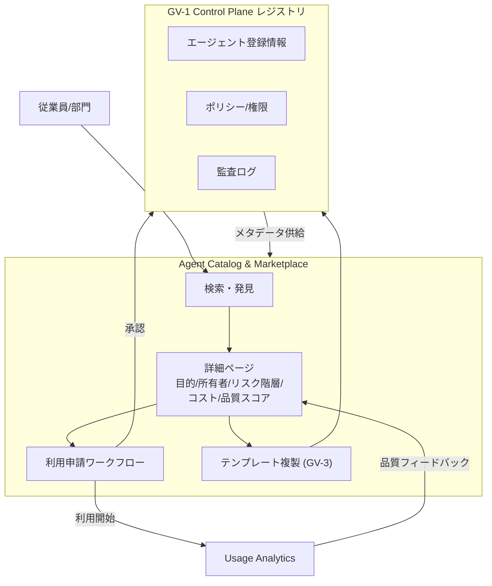

# GV-2 Agent Catalog & Marketplace（社内カタログ）

## 概要

スマートフォンのアプリストアのように、社内で使えるエージェント・スキル・ツールを一覧し、目的・所有者・リスク・コスト・品質スコアを確認してから利用申請できる社内カタログです。「どんなエージェントがあるか分からない」「隣の部門が同じものを作っている」「誰の審査も受けずに使い始めてしまう」——こうした問題を、発見から利用開始までの一本化された経路で解消します。

## 解決する企業課題

組織でエージェントが増えてくると、「どんなエージェントが存在するか分からない」という発見の問題が生じます。各部門が同等の機能を重複開発し、無審査のエージェントが使われ、利用申請が口頭・メール・属人的経路で処理されるようになります。エージェントへのアクセス経路が不明確なこと自体、ガバナンスの空白を生む直接的な原因にもなります。どのエージェントが使われているか追跡できなければ、コスト管理も監査対応も機能しません。GV-2 はカタログという単一窓口を置くことで、重複開発の抑制・審査済みエージェントへの誘導・申請プロセスの標準化を一度に実現できます。

!!! tip "最小成立条件（MVP）"
    GV-1 レジストリの情報を一覧表示する読み取り専用のカタログページと、用途・期限を記録する簡易申請フォームを1つ用意します。品質スコアや利用分析は後から追加すればよいです。

## 価値仮説

再利用可能なエージェントのカタログ化により、部門間の重複開発を排除して開発生産性を高めます。利用者が最適なエージェントを即座に発見できるため、全社の業務自動化率が加速します。

## 解決策と設計

カタログは GV-1 レジストリ上に構築される UI/API 層です。各エントリには目的・所有者・アクセスデータ種別・リスク階層・推定コスト・品質スコア・バージョン・承認状態が付与されます。部門はカタログ内のテンプレート（GV-3）から派生することで、ゼロから開発せずに安全なエージェントを調達できます。利用申請ワークフローはアクセス権の付与・剥奪と連動し、承認者・期限・用途を記録に残します。



利用申請が承認されると Control Plane がアクセス権を付与し、監査ログに記録します。Usage Analytics は利用状況・エラー率・コストを集計して品質スコアへ反映します。品質スコアはルーブリック・利用者評価・GV-7 の評価パイプライン結果を組み合わせて算出するため、登録後も継続的に更新されます。

## 向き／不向き

| 向き | 不向き |
|---|---|
| 複数部門にまたがってエージェントを展開する組織 | 単一チームが単一目的のエージェントを内部運用するだけの小規模構成。カタログの維持コストが価値を上回る段階 |
| エージェント数が増加し発見・重複・未審査利用が問題化している段階 | エージェントが数件しか存在しない PoC 段階。GV-1 のレジストリのみで十分な場合が多い |
| 利用申請・承認・権限付与を一元管理したいプラットフォームチームが存在する | — |

## 要素技術・既存システム連携

- カタログ UI/API：内製ポータルまたは社内開発者ポータル（Backstage 等）に統合する形態が多いです。
- 利用申請ワークフロー：既存のアクセス申請基盤（ServiceNow、Jira Service Management 等）と連携し承認フローを再利用します。
- Usage Analytics：実行ログ・トークン消費・エラー率を集計し品質スコアに反映します。GV-8（コスト配賦）と連携することで部門別コストも可視化します。
- 品質レーティング：GV-7（評価 CI/CD）のスコアを取り込み、手動レビューや利用者フィードバックと組み合わせます。
- GV-1 Control Plane：カタログのバックエンドとして機能し、権限付与・ポリシー適用・監査ログを提供します。

## 落とし穴／選定の勘所

!!! warning "審査基準の形骸化"
    エージェント数が増えると、審査のボトルネックを嫌って「とりあえず公開」運用に流れやすいです。審査基準を緩めると品質・安全性がカタログ内でばらつき、カタログへの信頼が失われます。GV-7 の評価パイプラインに審査を組み込んで自動化することで、速度と品質の両立が図れます。

!!! warning "品質スコアの固定化"
    登録時の品質スコアが更新されず陳腐化するケースがあります。モデルや外部 API の変更でエージェントの挙動が劣化しても、利用者はスコアを信じて使い続けてしまいます。GV-6（Version Registry）でモデル・プロンプトの変更を追跡し、変更のたびに再評価を自動でトリガーする設計が求められます。

!!! warning "申請ログの形骸化"
    利用申請フローを設けても、承認者が内容を確認せず機械的に承認するだけでは、本来の目的（誰が何のためにどのエージェントを使うかの記録）が失われます。申請フォームで目的・期限・データアクセス範囲を必須入力にし、承認者の説明責任を明確化しておくことが望ましいです。

## Interfaces

以下はこのパターンを実装する際の主要インターフェイスです。コーディングエージェントはこの定義からスタブコードを生成できます。

```yaml
interfaces:
  - name: Catalog UI/API
    description: "Search and detail view exposing purpose, owner, risk tier, cost estimate, quality score, version, and approval status for each agent."
    input:
      request: object
    output:
      response: object
    errors:
      - code: GENERAL_ERROR
        description: "Catalog UI/API の処理中にエラーが発生"
    protocol: "REST / gRPC"
    implementation_hints:
      - "詳細は本文の「解決策と設計」節を参照"
    code_examples:
      typescript: |
        interface CatalogUiApiRequest {
          query: string;
          filters: object;
          page: number;
        }
        interface CatalogUiApiResponse {
          agents: object[];
          total: number;
          pageSize: number;
        }
        interface CatalogUiApi {
          catalogUiApi(req: CatalogUiApiRequest): Promise<CatalogUiApiResponse>;
        }
      python: |
        @dataclass
        class CatalogUiApiRequest:
            query: str
            filters: dict
            page: int
        
        @dataclass
        class CatalogUiApiResponse:
            agents: list[dict]
            total: int
            page_size: int
        
        class CatalogUiApi(Protocol):
            async def catalog_ui_api(self, req: CatalogUiApiRequest) -> CatalogUiApiResponse: ...
  - name: Access Request Workflow
    description: "Structured access request requiring purpose, expiry, and data access scope; integrates with existing approval systems (ServiceNow, Jira SM)."
    input:
      request: object
    output:
      response: object
    errors:
      - code: GENERAL_ERROR
        description: "Access Request Workflow の処理中にエラーが発生"
    protocol: "REST / gRPC"
    implementation_hints:
      - "詳細は本文の「解決策と設計」節を参照"
    code_examples:
      typescript: |
        interface AccessRequestWorkflowRequest {
          agentId: string;
          requesterId: string;
          purpose: string;
          expiry: Date;
          dataAccessScope: string[];
        }
        interface AccessRequestWorkflowResponse {
          requestId: string;
          status: string;
          approvalUrl: string;
        }
        interface AccessRequestWorkflow {
          accessRequestWorkflow(req: AccessRequestWorkflowRequest): Promise<AccessRequestWorkflowResponse>;
        }
      python: |
        @dataclass
        class AccessRequestWorkflowRequest:
            agent_id: str
            requester_id: str
            purpose: str
            expiry: datetime
            data_access_scope: list[str]
        
        @dataclass
        class AccessRequestWorkflowResponse:
            request_id: str
            status: str
            approval_url: str
        
        class AccessRequestWorkflow(Protocol):
            async def access_request_workflow(self, req: AccessRequestWorkflowRequest) -> AccessRequestWorkflowResponse: ...
  - name: Usage Analytics & Quality Score
    description: "Aggregates execution logs, token consumption, and error rates into a quality score updated on each GV-7 evaluation run."
    input:
      request: object
    output:
      response: object
    errors:
      - code: GENERAL_ERROR
        description: "Usage Analytics & Quality Score の処理中にエラーが発生"
    protocol: "REST / gRPC"
    implementation_hints:
      - "詳細は本文の「解決策と設計」節を参照"
    code_examples:
      typescript: |
        interface UsageAnalyticsQualityScoreRequest {
          agentId: string;
          evaluationRunId: string;
        }
        interface UsageAnalyticsQualityScoreResponse {
          qualityScore: number;
          tokenUsage: number;
          errorRate: number;
        }
        interface UsageAnalyticsQualityScore {
          usageAnalyticsQualityScore(req: UsageAnalyticsQualityScoreRequest): Promise<UsageAnalyticsQualityScoreResponse>;
        }
      python: |
        @dataclass
        class UsageAnalyticsQualityScoreRequest:
            agent_id: str
            evaluation_run_id: str
        
        @dataclass
        class UsageAnalyticsQualityScoreResponse:
            quality_score: float
            token_usage: int
            error_rate: float
        
        class UsageAnalyticsQualityScore(Protocol):
            async def usage_analytics_quality_score(self, req: UsageAnalyticsQualityScoreRequest) -> UsageAnalyticsQualityScoreResponse: ...
```

## 関連パターン

- [GV-1 Agent Control Plane（エージェント制御プレーン）](gv1-agent-control-plane.md) — 補完：カタログのバックエンドとして登録情報・権限・監査を提供する
- [GV-3 Department Agent Factory（役割テンプレート工場）](gv3-department-agent-factory.md) — 補完：カタログ内のテンプレートを部門が派生するための工場機能
- [GV-7 Evaluation & Governance Pipeline（評価CI/CD）](gv7-evaluation-governance-pipeline.md) — 補完：品質スコアの自動更新と審査の自動化に連動する
- [GV-8 Cost Quota & Chargeback（コスト配賦）](gv8-cost-quota-chargeback.md) — 補完：カタログの利用申請とコスト予算管理を対応づける

## Decision Summary

```yaml
decision_summary:
  pattern: GV-2
  participates_in:
    - decision: TO-8
      role: enabler
  recommended_if:
    - "部門横断でエージェントを共有・再利用したい"
    - "シャドーAI（未承認エージェント）を防止したい"
  avoid_if:
    - "エージェント数が少なく一覧化不要"
  combines_with: [GV-1, GV-3, GV-6]
  conflicts_with: []
  value_outcome:
    drivers: [employee_efficiency, automation]
    kpis: [カタログ掲載エージェント数, 再利用率]
  mvp: "社内カタログUIに承認済みエージェント一覧を掲載"
  cost: S
```
