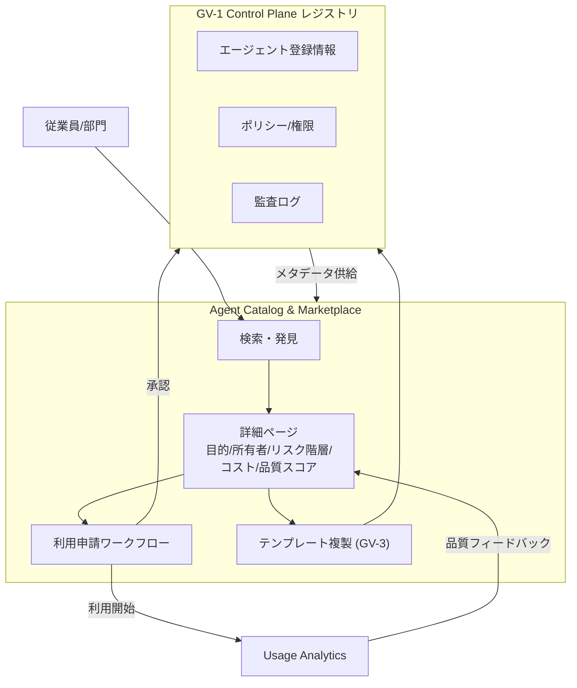

# GV-2 Agent Catalog & Marketplace（社内カタログ）

## 概要

スマートフォンのアプリストアのように、社内で使えるエージェント・スキル・ツールを一覧し、目的・所有者・リスク・コスト・品質スコアを確認してから利用申請できる社内カタログである。「どんなエージェントがあるか分からない」「隣の部門が同じものを作っている」「誰の審査も受けずに使い始めてしまう」——こうした問題を、発見から利用開始までの統一された経路で解消する。

## 解決する企業課題

組織でエージェントが増加すると「どんなエージェントが存在するか分からない」という発見問題が生じる。その結果、各部門が同等の機能を重複開発し、無審査のエージェントが使われ、利用申請が口頭・メール・属人的経路で処理されるようになる。エージェントへのアクセス経路が不明確であることは、ガバナンスの空白を生む直接的な原因でもある——どのエージェントが使われているか追跡できなければ、コスト管理も監査対応も機能しない。GV-2 はカタログという単一窓口を置くことで、重複開発の抑制・審査済みエージェントへの誘導・申請プロセスの標準化を同時に実現する。

## 解決策と設計

カタログは GV-1 レジストリ上に構築される UI/API 層である。各エントリには目的・所有者・アクセスデータ種別・リスク階層・推定コスト・品質スコア・バージョン・承認状態が付与される。部門はカタログ内のテンプレート（GV-3）から派生することで、ゼロから開発せずに安全なエージェントを調達できる。利用申請ワークフローはアクセス権の付与・剥奪と連動し、承認者・期限・用途を記録する。

利用申請が承認されると、Control Plane がアクセス権を付与し監査ログに記録する。Usage Analytics は利用状況・エラー率・コストを集計し品質スコアの更新に反映する。品質スコアはルーブリック・利用者評価・GV-7 の評価パイプライン結果を組み合わせて算出する。

## 向き／不向き

**向いている条件**

- 複数部門にまたがってエージェントを展開する組織。
- エージェント数が増加し発見・重複・未審査利用が問題化している段階。
- 利用申請・承認・権限付与を一元管理したいプラットフォームチームが存在する。

**向いていない条件**

- 単一チームが単一目的のエージェントを内部運用するだけの小規模構成。カタログの維持コストが価値を上回る。
- まだエージェントが数件しか存在しない PoC 段階。GV-1 のレジストリのみで十分な場合が多い。

## 要素技術・既存システム連携

- カタログ UI/API：内製ポータルまたは社内開発者ポータル（Backstage 等）に統合する形態が多い。
- 利用申請ワークフロー：既存のアクセス申請基盤（ServiceNow、Jira Service Management 等）と連携し承認フローを再利用する。
- Usage Analytics：実行ログ・トークン消費・エラー率を集計し品質スコアに反映する。GV-8（コスト配賦）と連携することで部門別コストも可視化する。
- 品質レーティング：GV-7（評価 CI/CD）のスコアを取り込み、手動レビューや利用者フィードバックと組み合わせる。
- GV-1 Control Plane：カタログのバックエンドとして機能し、権限付与・ポリシー適用・監査ログを提供する。

## 落とし穴／選定の勘所

!!! warning "審査基準の形骸化"
    エージェント数が増えるにつれ、審査のボトルネックを嫌って「とりあえず公開」運用に流れやすい。審査基準を緩めると品質・安全性がカタログ内でばらつき、カタログへの信頼が失われる。審査を自動化（GV-7 の評価パイプラインへの組み込み）して速度と品質を両立することが重要である。

!!! warning "品質スコアの固定化"
    登録時の品質スコアが更新されず陳腐化するケースがある。モデルや外部 API の変更でエージェントの挙動が劣化しても、利用者はスコアを信じて使い続ける。GV-6（Version Registry）でモデル・プロンプトの変更を追跡し、変更ごとに再評価を自動トリガーする設計が必要である。

!!! warning "申請ログの形骸化"
    利用申請フローを設けても、承認者が内容を確認せずに機械的に承認するだけになると、本来の目的（誰が何のためにどのエージェントを使うかの記録）が失われる。申請フォームで目的・期限・データアクセス範囲を必須入力とし、承認者の説明責任を明確化することが望ましい。

## 関連パターン

- [GV-1 Agent Control Plane（エージェント制御プレーン）](gv1-agent-control-plane.md) — 補完：カタログのバックエンドとして登録情報・権限・監査を提供する
- [GV-3 Department Agent Factory（役割テンプレート工場）](gv3-department-agent-factory.md) — 補完：カタログ内のテンプレートを部門が派生するための工場機能
- [GV-7 Evaluation & Governance Pipeline（評価CI/CD）](gv7-evaluation-governance-pipeline.md) — 補完：品質スコアの自動更新と審査の自動化に連動する
- [GV-8 Cost Quota & Chargeback（コスト配賦）](gv8-cost-quota-chargeback.md) — 補完：カタログの利用申請とコスト予算管理を対応づける
